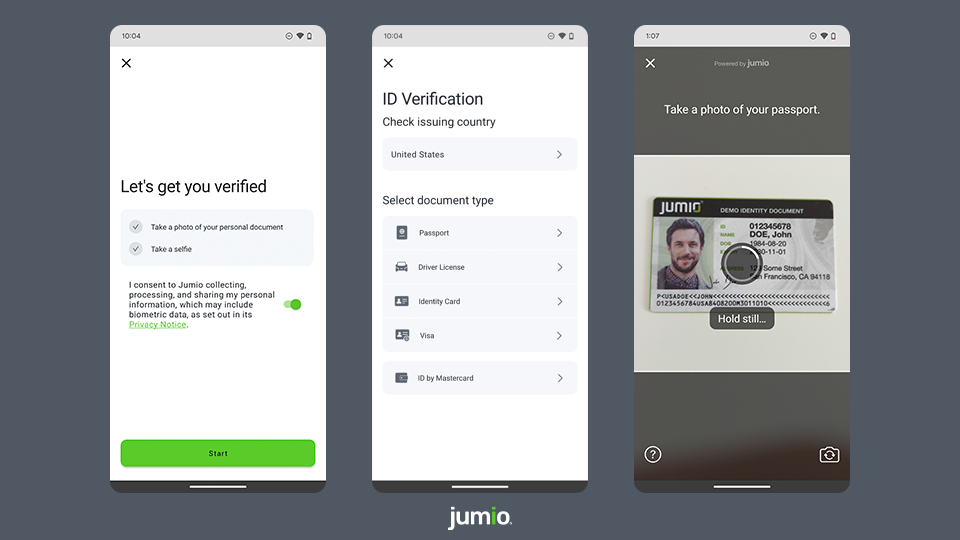

[](#release-notes)
[](https://jumio.github.io/mobile-sdk-android/)
[](#copyright)
[](#general-requirements)
[](#general-requirements)
[](#integration)

# Table of Contents
- [Overview](#overview)
- [Get Started](#get-started)
  - [Jumio SDK Integration](#jumio-sdk-integration)
  - [Code Documentation](#code-documentation)
  - [FAQ](#faq)
  - [Known Issues](#known-issues)
- [Quickstart](#quickstart)
- [Basics](#basics)
  - [General Requirements](#general-requirements)
  - [Authentication and Encryption](#authentication-and-encryption)
  - [Permissions](#permissions)
  - [Integration](#integration)
  - [Proguard](#proguard)
  - [Language Localization](#language-localization)
- [Document Verification](#document-verification)
- [Digital Identity](#digital-identity)
- [Analytics With Datadog](#analytics-with-datadog)
- [Security](#security)
- [Release Notes](#release-notes)
- [Maintenance and Support](#maintenance-and-support)
  - [Two-factor Authentication](#two-factor-authentication)
  - [Licenses](#licenses)
  - [Contact](#contact)
  - [Copyright](#copyright)

# Overview
The Jumio Software Development Kit (SDK) provides you with a set of tools and UIs (default or custom) to develop an Android application perfectly fitted to your specific needs.

Onboard new users and easily verify their digital identities by making sure the IDs they provide are valid and authentic. Extract data from ID documents completely automatically and within seconds. Confirm that users really are who they say they are by having them take a quick selfie and match it to their respective documents. Jumio uses cutting-edge biometric technology such as 3D face mapping to make sure there is an actual, real-life person in front of the screen.



Using the Jumio SDK will allow you to create the best possible solution for your individual needs, providing you with a range of different services to choose from.

-----

# Get Started
Please note that [basic setup](#basics) is required before continuing with the integration of any of the following services.

## Jumio SDK Integration
Jumio KYX platform and related services are a secure and easy solution that allows you to establish the genuine identity of your users in your mobile application, by verifying their passports, government-issued IDs and actual liveness in real-time. Very user-friendly and highly customizable, it makes onboarding new customers quick and simple.

:arrow_right:&nbsp;&nbsp;[SDK INTEGRATION GUIDE](docs/integration_guide.md)    
:arrow_right:&nbsp;&nbsp;[Changelog](docs/changelog.md)   
:arrow_right:&nbsp;&nbsp;[Transition Guide](docs/transition_guide.md)   

### Previous SDK Versions
If you need information on older SDK versions, please refer to:    
- [3.9.2](https://github.com/Jumio/mobile-sdk-android/tree/v3.9.2)
- [3.9.1](https://github.com/Jumio/mobile-sdk-android/tree/v3.9.1)
- [3.9.0](https://github.com/Jumio/mobile-sdk-android/tree/v3.9.0)

## Code Documentation
Full API documentation for the Jumio Android SDK can be found [here](https://jumio.github.io/mobile-sdk-android).

## FAQ
Link to Jumio Android SDK FAQ can be found [here](docs/integration_faq.md).

## Known Issues
List of known issues can be found [here](docs/known_issues.md).

-----

# Quickstart
This section provides a quick overview on how to get started with the [Android sample application](sample) that can be found here on Github. You will need a __commercial Jumio License__ to successfully run any of our examples; for details, contact sales@jumio.com. You will also need an up-to-date Android Studio version to open and try out the sample project.

Start by downloading the [Android sample application](sample) from the Jumio Github repo. You can either clone the repository (using SSH or HTTPS) to your local device or simply download everything as a ZIP.

Once you’ve got the sample application downloaded and unzipped, open Android Studio. Choose __Import project__ and navigate to where you’ve saved your sample application. Select the __JumioMobileSample folder__ and open it.

Android Studio will now start to import the project. This might take a bit of time. Make sure to wait until the Gradle Build has finished and the application is properly installed!

The Android sample application contains the package `com.jumio.sample`, which consists of:
* `MainActivity.kt`
* `customui/`
  * `CustomUIActivity.kt`
  * `adapter/`
    * `CustomConsentAdapter.kt`
    * `CustomCountryAdapter.kt`
    * `CustomDocumentAdapter.kt`

To use the Jumio Sample Application you need an SDK Token. If you haven't done so already, please refer to the [Authentication and Encryption section](#authentication-and-encryption) for more details on how to obtain your SDK token.
To add your individual SDK token to the application copy/paste it to the token input field once the application is started.

⚠️&nbsp;&nbsp;__Note:__ We strongly recommend not storing any credentials inside your app! We suggest loading them during runtime from your server-side implementation.

Once you start up the sample application, you'll be given the option of trying out the Jumio SDK. The sample application needs camera permissions, which will be prompted for automatically once you try to start the SDK via one of the buttons. If you deny camera permissions, you won't be able to use the SDK.

-----

# Basics

## General Requirements
⚠️&nbsp;&nbsp;__Android Deprecation Notice__  
Please be aware that the upcoming SDK 4.7.0 will be the last SDK version supporting Android 5.0 (API level 21).
All subsequent SDK versions will require at least Android 6.0 "Marshmallow" (API level 23).

The minimum requirements for the SDK are:
* Android 5.0 "Lollipop" (API level 21) or higher
* Internet connection
* Jumio KYX

The following architectures are supported in the SDK:
*	ARMv7 processor with Neon
*	ARM64-v8a

ℹ️&nbsp;&nbsp;__Note:__ Currently, x86 and x86_64 are *not* supported. You get an *UnsatisfiedLinkError* if app and CPU architecture do not match or the CPU architecture is not supported.

You will need a __commercial Jumio License__ to run any of our examples. For details, contact sales@jumio.com.

## Authentication and Encryption
ℹ️&nbsp;&nbsp;__As of version 4.0.0 and onward, the SDK can only be used in combination with Jumio KYX. API v2 as well as using API token and secret to authenticate against the SDK will no longer be compatible.__

Before starting a session in our SDK, an SDK token has to be obtained. Please refer to out [API Guide](https://docs.jumio.com/production/Content/Integration/Integration%20Guide.htm) for further details. To authenticate against the API calls, an OAuth2 access token needs to be retrieved from the Customer Portal.

Within the response of the [Account Creation or Account Update](https://docs.jumio.com/production/Content/Integration/Creating%20or%20Updatng%20Account/Creating%20or%20Updating%20Accounts.htm) API, a SDK token is returned, which needs to be applied to initiate the mobile SDK.

### Basic Authentication (Deprecated)
Previously, Basic Auth credentials were constructed using your API token as the User ID and your API secret as the password. You still can manage API token and secret in the Customer Portal under:
* __Settings > API credentials > API Users__

### Authentication with OAuth2
Your OAuth2 credentials are constructed using your API token as the Client ID and your API secret as the Client secret. You can view and manage your API token and secret in the Customer Portal under:
* __Settings > API credentials > OAuth2 Clients__

Client ID and Client secret are used to generate an OAuth2 access token. OAuth2 has to be activated for your account. Contact your Jumio Account Manager for activation.

#### Access Token URL (OAuth2)
* US: `https://auth.amer-1.jumio.ai/oauth2/token`
* EU: `https://auth.emea-1.jumio.ai/oauth2/token`
* SG: `https://auth.apac-1.jumio.ai/oauth2/token`

The [TLS Protocol](https://tools.ietf.org/html/rfc5246) is required to securely transmit your data, and we strongly recommend using the latest version. For information on cipher suites supported by Jumio during the TLS handshake see [supported cipher suites](https://docs.jumio.com/production/Content/Integration/API%20Authorization/Supported%20Cipher%20Suites.htm?Highlight=cipher).

ℹ️&nbsp;&nbsp;__Note:__ Calls with missing, incorrect or suspicious headers or parameter values will result in HTTP status code __400 Bad Request Error__ or __403 Forbidden__.

#### Request Access Token (OAuth2)

```bash
curl --request POST --location 'https://auth.amer-1.jumio.ai/oauth2/token' \
    --header 'Accept: application/json' \
    --header 'Content-Type: application/x-www-form-urlencoded' \
    --data-raw 'grant_type=client_credentials' \
    --basic --user CLIENT_ID:CLIENT_SECRET
```

#### Response Access Token (OAuth2)

```json
{
  "access_token": "YOUR_ACCESS_TOKEN",
  "expires_in": 3600,
  "token_type": "Bearer"
}
```

#### Access Token Timeout (OAuth2)
Your OAuth2 access token is valid for 60 minutes. After the token lifetime is expired, it is necessary to generate a new access token.

### Workflow Transaction Token Timeout
The token lifetime is set to 30 minutes per default. It can be configured via the [Jumio Customer Portal](https://docs.jumio.com/production/Content/Settings/Identity%20Verification/Application%20Settings.htm) and can be overwritten using the API call (`tokenLifetime`). Within this token lifetime the token can be used to initialize the SDK.

As soon as the workflow (transaction) starts, a 15 minutes session timeout is triggered. For each action performed (capture image, upload image) the session timeout will reset, and the 15 minutes will start again.

After creating/updating a new account you will receive a `sdk.token` (JWT) for initializing the SDK. Use this SDK token with your Android code:

```kotlin
sdk = JumioSDK(context: Context).apply {
  token = "YOUR_SDK_TOKEN"
  dataCenter = "YOUR_DATACENTER"
}
```

## Permissions
The following permission is optional:

```xml
<uses-permission android:name="android.permission.VIBRATE"/>
```

ℹ️&nbsp;&nbsp;__Note:__ On devices running Android Marshmallow (6.0) and above, you need to acquire `android.permissions.CAMERA` dynamically before initializing the SDK.

Use `JumioSDK.hasAllRequiredPermissions(context: Context)` to make sure the Jumio SDK has all required permissions. In case this method returns `false`, use the method `JumioSDK.getMissingPermissions(context: Context)`, which will return an array list containing String values of all missing permissions. Request any missing permissions using the `ActivityCompat.requestPermissions()` method.

## Integration
Use the SDK in your application by including the Maven repositories with the following `build.gradle` configuration in Android Studio:

```groovy
repositories {
	google()
	mavenCentral()
	exclusiveContent {
		forRepository {
			maven {
				url 'https://repo.mobile.jumio.ai'
			}
		}
		filter {
			includeGroup "com.jumio.android"
			includeGroup "com.iproov.sdk"
		}
	}
}
```

Check the Android Studio [sample projects](sample/JumioMobileSample/) to learn the most common use.

## Proguard

### Mandatory
The following Proguard Keep rules have to be added to the Jumio Mobile SDK:

```text
-keep class com.jumio.** { *; }
-keep class jumio.** { *; }
```

### Optional
The following Proguard Keep rules have to be added to the Jumio Mobile SDK if the corresponding dependencies have been added:

```text
#Tensorflow
-keep class org.tensorflow.** { *; }
-keep class org.tensorflow.**$* { *; }
-dontwarn org.tensorflow.**

#IProov
-keep public class com.iproov.sdk.IProov {public *; }
-keep class com.iproov.** { *; }
-keep class com.iproov.**$* { *; }
-keep class com.google.protobuf.** { *; }
-keep class com.google.protobuf.**$* { *; }
-dontwarn com.google.protobuf.**
-dontwarn com.tinder.**
-dontwarn okhttp3.**
-dontwarn okio.**

#Datadog
-keep class com.datadog.** { *; }
-keep class com.datadog.**$* { *; }

#JMRTD
-keep class org.jmrtd.** { *; }
-keep class net.sf.scuba.** {*;}
-keep class org.bouncycastle.** {*;}
-keep class org.ejbca.** {*;}
-dontwarn java.nio.**
-dontwarn org.codehaus.**
-dontwarn org.ejbca.**
-dontwarn org.bouncycastle.**
-dontwarn module-info
```

Most of the Proguard settings are applied automatically, as they are defined as consumer Proguard rules within the SDK. The current rules can also be found in the [Sample app](sample/JumioMobileSample/proguard-rules.pro).

## Language Localization
Our SDK supports [default Android localization features](https://developer.android.com/training/basics/supporting-devices/languages.html) for different languages. All label texts and button titles in the SDK can be changed and localized by adding the required Strings you want to change in a `strings.xml` file in a `values` directory for the language and culture preference that you want to support. You can check out strings that are modifiable [within our Sample application](sample/JumioMobileSample/src/main/res/values/strings-jumio-sdk.xml).

Jumio SDK products support the following languages:

_Afrikaans, Arabic, Bulgarian, Chinese(Simplified), Chinese(Traditional), Croatian, Czech, Danish, Dutch, Estonian, English, Finnish, French, German, Greek, Hindi, Hungarian, Indonesian, Italian, Japanese, Khmer, Korean, Latvian, Lithuanian, Maltese, Norwegian, Polish, Portuguese, Romanian, Russian, Slovak, Slovenian, Spanish, Swedish, Thai, Turkish, Vietnamese, Zulu_

Our SDK supports accessibility features. Visually impaired users can now enable __TalkBack__ or increase the __text size__ on their device. The accessibility strings that are used by TalkBack contain *accessibility* in their key and can be also modified in `strings.xml`.

# Document Verification
As of Android SDK 4.3.0, Document Verification functionality is available.
This functionality allows users to submit a number of different document types (e.g. a utility bill or bank statement) in digital form and verify the validity and authenticity of this document.

Documents can be submitted using one of two ways: Taking a photo of the document or uploading a PDF file.
For more details, please refer to our [integration guide](docs/integration_guide.md#jumio-document-credential).

### Supported Documents:
* BC (Birth certificate)
* BS (Bank statement)
* CAAP (Cash advance application)
* CB (Council bill)
* CC (Credit card)
* CCS (Credit card statement)
* CRC (Corporate resolution certificate)
* CUSTOM
* HCC (Health care card)
* IC (Insurance card)
* LAG (Lease agreement)
* LOAP (Loan application)
* MEDC (Medicare card)
* MOAP (Mortgage application)
* PB (Phone bill)
* SEL (School enrollment letter)
* SENC (Seniors card)
* SS (Superannuation statement)
* SSC (Social security card)
* STUC (Student card)
* TAC (Trade association card)
* TR (Tax return)
* UB (Utility bill)
* VC (Voided check)
* VT (Vehicle title)
* WWCC (Working with children check)

ℹ️&nbsp;&nbsp;__Note:__ To enable the use of this feature, please contact [Jumio support](#support).

# Digital Identity
As of Jumio Android SDK 4.5.0, users may use their Digital Identity to verify their identity.
For now 'ID by Mastercard' is the only Digital Identity provider currently supported by our SDK.

If you want to enable Digital Identity verification for your account please [contact us](https://support.jumio.com).
In case you are already set up to use Digital Identity verification within your app, check out the integration steps explained [here](docs/integration_guide.md#digital-identity-did).

# Analytics With Datadog
Analytic feedback and diagnostics enable us to continually improve our SDK and its performance, as well as investigate potential issues. With the Jumio SDK, we use [Datadog](https://github.com/DataDog/dd-sdk-android) as an optional tool to collect diagnostic information. Data collected includes specific SDK information like version numbers, started and finished SDK instances and scan workflows, thrown exceptions and error information, as well as other mobile events. Please note that gathering analytics data requires user consent due to legal regulations such as GDPR. The consent is granted when our MLA is accepted.

To benefit from Datadog, add the following dependency to your `build.gradle` file:

```groovy
implementation "com.jumio.android:datadog:${SDK_VERSION}"
```

----

# Security
All SDK related traffic is sent over HTTPS using TLS and public key pinning. Additionally, the information itself within the transmission is also encrypted utilizing __Application Layer Encryption__ (ALE). ALE is a Jumio custom-designed security protocol that utilizes RSA-OAEP and AES-256 to ensure that the data cannot be read or manipulated even if the traffic was captured.

----

# Release Notes
See our [Change Log](docs/changelog.md) for more information about our current SDK version and further details.

# Maintenance and Support
Please refer to our [SDK maintenance and support policy](docs/maintenance_policy.md) for more information about Mobile SDK maintenance and support.

## Two-factor Authentication
If you want to enable two-factor authentication for your Jumio Customer Portal, [contact us](https://support.jumio.com). Once enabled, users will be guided through the setup upon their first login to obtain a security code using the Google Authenticator app.

## Licenses
The software contains third-party open source software. For more information, see [licenses](licenses).

This software is based in part on the work of the Independent JPEG Group.

## Contact
If you have any questions regarding our implementation guide please contact Jumio Customer Service at support@jumio.com. The [Jumio online helpdesk](https://support.jumio.com) contains a wealth of information regarding our services including demo videos, product descriptions, FAQs, and other resources that can help to get you started with Jumio.

## Copyright
&copy; Jumio Corporation, 395 Page Mill Road, Suite 150, Palo Alto, CA 94306

The source code and software available on this website (“Software”) is provided by Jumio Corp. or its affiliated group companies (“Jumio”) "as is” and any express or implied warranties, including, but not limited to, the implied warranties of merchantability and fitness for a particular purpose are disclaimed. In no event shall Jumio be liable for any direct, indirect, incidental, special, exemplary, or consequential damages (including but not limited to procurement of substitute goods or services, loss of use, data, profits, or business interruption) however caused and on any theory of liability, whether in contract, strict liability, or tort (including negligence or otherwise) arising in any way out of the use of this Software, even if advised of the possibility of such damage.
In any case, your use of this Software is subject to the terms and conditions that apply to your contractual relationship with Jumio. As regards Jumio’s privacy practices, please see our privacy notice available here: [Privacy Policy](https://www.jumio.com/legal-information/privacy-policy/).
