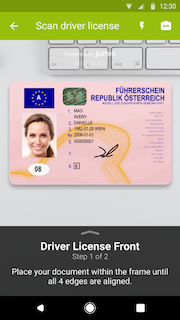
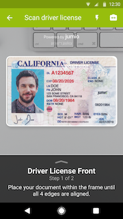
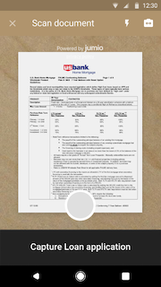

[](#release-notes)
[](#copyright)
[](#general-requirements)
[](#integration)
[](#general-requirements)

# Table of Contents
- [Overview](#overview)
- [Get Started](#get-started)
    - [ID Verification & Fastfill SDK](docs/integration_id-verification-fastfill.md)
    - [Authentication SDK](docs/integration_authentication.md)
    - [Document Verification SDK](docs/integration_document-verification.md)
    - [BAM Checkout SDK](docs/integration_bam-checkout.md)
- [Quickstart](#quickstart)
- [Basics](#basics)
    - [General Requirements](#general-requirements)
    - [Permissions](#permissions)
    - [Integration](#integration)
    - [Proguard](#proguard)
    - [Language Localization](#language-localization)
- [Security](#security)
- [Release Notes](#release-notes)
- [Support](#support)
- [Javadoc](https://jumio.github.io/mobile-sdk-android/)
- [FAQ](docs/integration_faq.md)
- [Known Issues](docs/known_issues.md)

# Overview
The Jumio Software Development Kit (SDK) provides you with a set of tools and UIs (default or custom) to develop an Android application perfectly fitted to your specific needs.

Onboard new users and easily verify their digital identities by making sure the IDs they provide are valid and authentic. Extract data from IDs and credit cards completely automatically and within seconds. Confirm that users really are who they say they are by having them take a quick selfie and match it to their respective documents. Jumio uses cutting-edge biometric technology such as 3D face mapping to make sure there is an actual, real-life person in front of the screen.

    

Using the Jumio SDK will allow you to create the best possible solution for your individual needs, providing you with a range of different services to choose from.

# Get Started
Please note that [basic setup](#basics) is required before continuing with the integration of any of the following services.

## Jumio ID Verification & Fastfill
ID Verification (formerly known as Netverify) is a secure and easy solution that allows you to establish the genuine identity of your users in your mobile application by verifying their passports and other government-issued IDs in real time. Very user-friendly and highly customizable, it makes onboarding new customers quick and simple.

- [Integration ID Verification & Fastfill SDK](docs/integration_id-verification-fastfill.md)

## Jumio Authentication
Authentication is a cutting-edge, biometric-based service that establishes digital identities of your users simply by taking a selfie. Advanced 3D face-mapping technology quickly and securely authenticates users and their digital identities.

- [Integration Authentication SDK](docs/integration_authentication.md)

## Jumio Document Verification
Document Verification is a powerful solution that allows users to scan various types of documents quickly and easily in your mobile application. Data extraction is already supported for various document types, such as bank statements.

- [Integration Document Verification SDK](docs/integration_document-verification.md)

## Jumio BAM Checkout
BAM Checkout enables you to extract data from your customer's credit card and/or ID in your mobile application within seconds. Every checkout flow is fully automated, with no manual input necessary!

- [Integration BAM Checkout SDK](docs/integration_bam-checkout.md)

# Quickstart
This section provides a quick overview of getting started with the [Android sample application](sample) that can be found here on Github. You will need a __commercial Jumio License__ to successfully run any of our examples; for details, contact sales@jumio.com. You will also need a current Android Studio version to open and try out the sample project.

Start by downloading the [Android sample application](sample) from the Jumio Github repo. You can either clone the repository (using SSH or HTTPS) to your local device or simply download everything as a ZIP.

Once you’ve got the sample application downloaded and unzipped, open Android Studio. Choose __Import project__ and navigate to where you’ve saved your sample application. Select the __JumioMobileSample folder__ and open it.

Android Studio will now start to import the project. This might take a bit of time. Make sure to wait until the Gradle Build has finished and the application is properly installed!

The Android sample application contains the packages `com.jumio.sample.java` and `com.jumio.sample.kotlin`. These packages contain the same sample but in Java and Kotlin respectively. If you'd like to switch between them, you'll have to switch the `<intent-filter>` in the `AndroidManifest.xml` from one `MainActivity` to the other. By default, the filter is set for Kotlin:

```
<!-- KOTLIN -->
<activity
    android:name="com.jumio.sample.kotlin.MainActivity"
    android:configChanges="orientation|screenSize|screenLayout|keyboardHidden|uiMode|layoutDirection"
    android:label="@string/app_name"
    android:theme="@style/AppTheme">

    <intent-filter>
        <action android:name="android.intent.action.MAIN"/>
        <category android:name="android.intent.category.LAUNCHER"/>
    </intent-filter>

</activity>
```

Both the Java and Kotlin packages contain:
* `MainActivity`
* `authentication`
* `bam`
* `document-verification`
* `netverify`
    * `customui`

Each of these folders contains a corresponding fragment. In each fragment, the most important methods for this service are shown and quickly outlined. If you’re interested in seeing how the ID Verification Custom UI works, check out the `customui` folder inside `netverify`, which shows an example of how a custom implementation could be done and what it could look like.

Right at the top of the `MainActivity` you’ll find the following empty parameters:

`private static String NETVERIFY_API_TOKEN`
`private static String NETVERIFY_API_SECRET`

If you haven’t done so yet, log into your Jumio Customer Portal. You can find your customer API token and API secret on the __Settings__ page under the __API credentials__ tab. Add your individual key and token instead of the placeholder `""`. The default setting for the data center is `JumioDataCenter.US`. If you're using [BAM Checkout](docs/integration_bam-checkout.md), you'll need to use the BAM API token and BAM API secret.

__Note:__ We strongly recommend storing all credentials outside of your app! We suggest not to hardcode them within your application but to load them during runtime from your server-side implementation.

Once you start up the sample application, you'll be given the option of trying out ID Verification. Click the hamburger menu in the top left corner to try out something else. Your application will also need camera permissions, which will be prompted for automatically once you try to start any of the services. If you deny camera permissions, you won't be able to use any of the services.

### Tutorials
The following tutorials show you how to get started and the fundamentals of using the SDK:
* [Getting started (Video):](https://share.vidyard.com/watch/oAUXU1EWXco1mPUePz7Ue6) How to clone the repository and configure your Jumio credentials
* [Introduction (Video):](https://share.vidyard.com/watch/nqUmPAaqG4bMy4Wh5wb9Kn) How to initialize the SDK, run the sample on your Android device, and test the identity verification user journey
* [Configuring behavior (Video):](https://share.vidyard.com/watch/BPT2jB51oUgkvRaAuKVb3q) How to configure the behavior of the app using SDK parameters
* [Customizing appearance (Video):](https://share.vidyard.com/watch/rEkMfyhjRXb1G7ffYUioLK) How to customize the look and feel of your application using the Jumio Surface tool

# Basics

## General Requirements
The minimum requirements for the SDK are:
*	Android 4.4 (API level 19) or higher
*	Internet connection

The following architectures are supported in the SDK:
*	ARMv7 processor with Neon
*	ARM64-v8a

__Note:__ Currently, x86 and x86_64 are *not* supported. You get an *UnsatisfiedLinkError* if app and CPU architecture do not match or the CPU architecture is not supported.

You will need a __commercial Jumio License__ to run any of our examples. For details, contact sales@jumio.com.

## Permissions
Required permissions are linked automatically by the SDK.

The following permissions are optional:
```
<uses-permission android:name="android.permission.VIBRATE"/>
<uses-feature android:name="android.hardware.camera" android:required="false"/>
```

__Note:__ On devices running Android Marshmallow (6.0) and above, you need to acquire `android.permissions.CAMERA` dynamically before initializing the SDK.

Use `getRequiredPermissions()` to get a list of all required permissions.
```
public static String[] getRequiredPermissions();
```

## Integration
Use the SDK in your application by including the Maven repositories with the following `build.gradle` configuration in Android Studio:

```
repositories {
	google()
	jcenter()
	maven { url 'https://mobile-sdk.jumio.com' }
}
```
Check the Android Studio [sample projects](sample/JumioMobileSample/) to learn the most common use.


## Proguard
The following Proguard keep rules have to be added to the Jumio Mobile SDK:
```
-keep class com.jumio.** { *; }
-keep public class com.iproov.sdk.IProov {public *; }
```
Most of the Proguard settings are applied automatically as they are defined as consumer Proguard rules within the SDK. The current rules can also be found in the [Sample app](sample/JumioMobileSample/).

## Language Localization
Our SDK supports the [default Android localization features](https://developer.android.com/training/basics/supporting-devices/languages.html) for different languages. All label texts and button titles in the SDK can be changed and localized by adding the required Strings you want to change in a `strings.xml` file in a `values` directory for the language and culture preference that you want to support. You can check out strings that are modifiable [within our Sample application](sample/JumioMobileSample/src/main/res/values/strings-jumio-sdk.xml).

For the ID Verification, Fastfill, Authentication, and Document Verification products we support the following languages:

_Afrikaans, Arabic, Bulgarian, Chinese(Simplified), Chinese(Traditional), Croatian, Czech, Danish, Dutch, Estonian, English, Finnish, French, German, Greek, Hindi, Hungarian, Indonesian, Italian, Japanese, Khmer, Korean, Latvian, Lithuanian, Maltese, Norwegian, Polish, Portuguese, Romanian, Russian, Slovak, Slovenian, Spanish, Swedish, Thai, Turkish, Vietnamese, Zulu_

Our SDK supports accessibility features. Visually impaired users can now enable __TalkBack__ or increase the __text size__ on their device. The accessibility strings that are used by TalkBack contain *accessibility* in their key and can be also modified in `strings.xml`.

# Security
All SDK related traffic is sent over HTTPS using TLS and public key pinning. Additionally, the information itself within the transmission is also encrypted utilizing __Application Layer Encryption__ (ALE). ALE is a Jumio custom-designed security protocol that utilizes RSA-OAEP and AES-256 to ensure that the data cannot be read or manipulated even if the traffic was captured.

# Release Notes
See our [Change Log](docs/changelog.md) for more information about our current SDK version and further details.

# Support

## Previous Version
The previous release version 3.8.0 of the Jumio Mobile SDK is supported until 2021-06-05.

When the support period has expired, bug fixes and technical support will no longer be provided. Current bugs are typically fixed in the upcoming versions. Older SDK versions will keep functioning with our server until further notice, but we highly recommend that you always update to the latest version to benefit from SDK improvements and bug fixes.

## Two-factor Authentication
If you want to enable two-factor authentication for your Jumio Customer Portal, [contact us](https://support.jumio.com). Once enabled, users will be guided through the setup upon their first login to obtain a security code using the Google Authenticator app.

## Licenses
The software contains third-party open source software. For more information, see [licenses](licenses).

This software is based in part on the work of the Independent JPEG Group.

## Contact
If you have any questions regarding our implementation guide please contact Jumio Customer Service at support@jumio.com. The [Jumio online helpdesk](https://support.jumio.com) contains a wealth of information regarding our services including demo videos, product descriptions, FAQs, and other resources that can help to get you started with Jumio.

## Copyright
&copy; Jumio Corporation, 395 Page Mill Road, Suite 150, Palo Alto, CA 94306

The source code and software available on this website (“Software”) is provided by Jumio Corp. or its affiliated group companies (“Jumio”) "as is” and any express or implied warranties, including, but not limited to, the implied warranties of merchantability and fitness for a particular purpose are disclaimed. In no event shall Jumio be liable for any direct, indirect, incidental, special, exemplary, or consequential damages (including but not limited to procurement of substitute goods or services, loss of use, data, profits, or business interruption) however caused and on any theory of liability, whether in contract, strict liability, or tort (including negligence or otherwise) arising in any way out of the use of this Software, even if advised of the possibility of such damage.
In any case, your use of this Software is subject to the terms and conditions that apply to your contractual relationship with Jumio. As regards Jumio’s privacy practices, please see our privacy notice available here: [Privacy Policy](https://www.jumio.com/legal-information/privacy-policy/).
