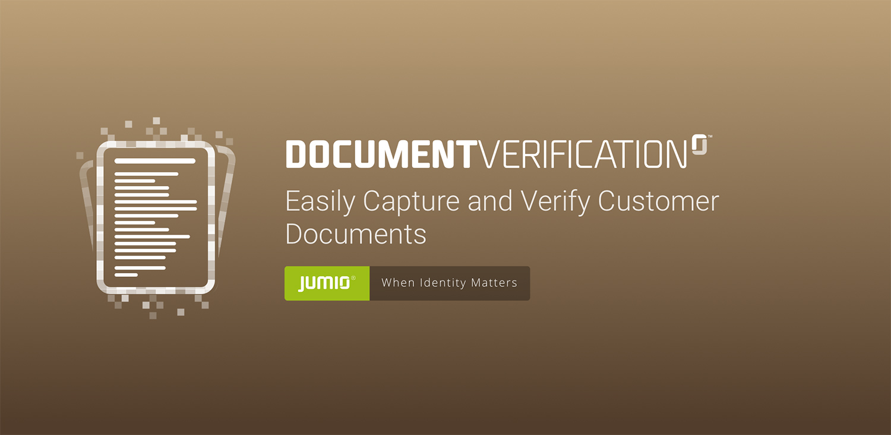

# Document Verification SDK for Android
Document Verification is a powerful solution to enable scanning various types (Utility Bill, Bank statement and many others) of your customer's documents in your mobile application within seconds, also supporting data extraction on documents like Utility Bills and Bank Statements (see [Supported documents for data extraction](https://github.com/Jumio/implementation-guides/blob/master/netverify/document-verification.md#supported-documents))

## Table of Content

- [Release notes](#release-notes)
- [Setup](#setup)
- [Integration](#integration)
- [Configuration](#configuration)
- [Customization](#customization)
- [SDK Workflow](#sdk-workflow)
- [Callback](#callback)
- [Javadoc](https://jumio.github.io/mobile-sdk-android/)

## Release notes
For technical changes, please read our [transition guide](transition-guide_document-verification.md) SDK version: 3.6.1

## Setup
The [basic setup](../README.md#basic-setup) is required before continuing with the following setup for DocumentVerification.

Using the SDK requires an activity declaration in your AndroidManifest.xml.

```
<activity
  android:name="com.jumio.dv.DocumentVerificationActivity"
	android:theme="@style/Theme.DocumentVerification"
	android:hardwareAccelerated="true"
	android:configChanges="orientation|screenSize|screenLayout|keyboardHidden"/>
```

You can specify your own theme (see [Customization](#customizing-look-and-feel) chapter). The orientation can be sensor based or locked with the attribute `android:screenOrientation`.


## Integration

### Dependencies

| Dependency        | Mandatory           | Description       | Size (Jumio libs only) |
| ----------------- |:-------------------:|:------------------|:-------------------:|
| com.jumio.android:core:3.6.1@aar                    | x | Jumio Core library            | 4.09 MB |
| com.jumio.android:dv:3.6.1@aar                      | x | Document Verification library | 134.72 KB |
| androidx.appcompat:appcompat:1.1.0                   | x | Android appcompat library        | - |
|com.google.android.material:material:1.1.0           | x | Android material design library	          | - |
|androidx.localbroadcastmanager:localbroadcastmanager:1.0.0 | x | Android local broadcast manager library  	| - |
|androidx.room:room-runtime:2.2.3			              | x | Android database object mapping library	| - |
| com.jumio.android:javadoc:3.6.1                     |   | Jumio SDK Javadoc             | - |

If an optional module is not linked, the scan method is not available but the library size is reduced.

Applications implementing the SDK shall not run on rooted devices. Use either the below method or a self-devised check to prevent usage of SDK scanning functionality on rooted devices.
```
DocumentVerificationSDK.isRooted(Context context);
```

Call the method `isSupportedPlatform` to check if the device is supported.
```
DocumentVerificationSDK.isSupportedPlatform();
```

Check the Android Studio sample projects to learn the most common use.

## Initialization
To create an instance for the SDK, perform the following call as soon as your activity is initialized.

```
private static String YOURAPITOKEN = ""; 
private static String YOURAPISECRET = "";

DocumentVerificationSDK documentVerificationSDK = DocumentVerificationSDK.create(yourActivity, YOURAPITOKEN, YOURAPISECRET, JumioDataCenter.US);
```
Make sure that your customer API token and API secret are correct, specify an instance
of your activity and provide a reference to identify the scans in your reports (max. 100 characters or `null`). If your customer account is in the EU data center, use `JumioDataCenter.EU` instead.

__Note:__ Log into your Jumio customer portal, and you can find your customer API token and API secret on the "Settings" page under "API credentials". We strongly recommend you to store credentials outside your app.

## Configuration

### Document type
Use `setType` to pass the document type.
```
documentVerificationSDK.setType("DOCUMENTTYPE");
```

Possible types:

*  BC (Birth certificate)
*  BS (Bank statement)
*  CAAP (Cash advance application)
*  CB (Council bill)
*  CC (Credit card)
*  CCS (Credit card statement)
*  CRC (Corporate resolution certificate)
*  HCC (Health care card)
*  IC (Insurance card)
*  LAG (Lease agreement)
*  LOAP (Loan application)
*  MEDC (Medicare card)
*  MOAP (Mortgage application)
*  PB (Phone bill)
*  SEL (School enrolment letter)
*  SENC (Seniors card)
*  SS (Superannuation statement)
*  SSC (Social security card)
*  STUC (Student card)
*  TAC (Trade association card)
*  TR (Tax return)
*  UB (Utility bill)
*  VC (Voided check)
*  VT (Vehicle title)
*  WWCC (Working with children check)
*  CUSTOM (Custom document type)

#### Custom Document Type
Use the following method to pass your custom document code. Maintain your custom document code within your Jumio customer portal under "Settings" - "Multi Document" - "Custom".
```
documentVerificationSDK.setCustomDocumentCode("YOURCUSTOMDOCUMENTCODE");
```

### Country
The country needs to be in format [ISO-3166-1 alpha 3](http://en.wikipedia.org/wiki/ISO_3166-1_alpha-3) or XKX for Kosovo.
```
documentVerificationSDK.setCountry("USA");
```

### Transaction identifiers

Use the following property to identify the scan in your reports (max. 100 characters).
```
documentVerificationSDK.setReportingCriteria("YOURREPORTINGCRITERIA");
```

A callback URL can be specified for individual transactions constraints see chapter [Callback URL](#callback-url)). This setting overrides your Jumio customer settings.
```
documentVerificationSDK.setCallbackUrl("YOURCALLBACKURL");
```

### Data Extraction

Data extraction is automatically enabled when it is activated for your account. Use the following setting to disable the extraction on a transaction level:

```
documentVerificationSDK.setEnableExtraction(false);
```

__Note:__ If you want to enable extraction for your account in general, please contact your Account Manager, or reach out to Jumio Support.

### Miscellaneous
Use the following property to identify the scan in your reports (max. 100 characters).
```
documentVerificationSDK.setCustomerInternalReference("YOURSCANREFERENCE");
```

You can also set a user reference (max. 100 characters).
```
documentVerificationSDK.setUserReference("USERREFERENCE");
```

__Note:__ The user reference and customer internal reference must not contain sensitive data like PII (Personally Identifiable Information) or account login.

Use setCameraPosition to configure the default camera (front or back).
```
documentVerificationSDK.setCameraPosition(JumioCameraPosition.FRONT);
```

Use setDocumentName to override the document label on Help screen.
```
documentVerificationSDK.setDocumentName(“YOURDOCNAME”);
```

## Customization

### Customizing look and feel
The SDK can be customized to fit your application’s look and feel by specifying `Theme.DocumentVerification` as a parent style of your own custom theme. Click on the element `Theme.DocumentVerification` in the manifest while holding Ctrl and Android Studio will display the available items.
Change the colors of the styles attributes to fit your requirements.

### Customize look and feel
There are 2 possibilities for applying the customized theme that was explained in the previous chapter:
* Customizing theme in AndroidManifest
* Customizing theme at runtime

#### Customizing theme in AndroidManifest
Apply the your custom theme DocumentVerification with the  that you defined before by replacing `Theme.DocumentVerification` in the AndroidManifest.xml:
```
<activity
            android:name="com.jumio.dv.DocumentVerificationActivity"
            android:theme="@style/CustomDocumentVerificationTheme"
						... />
```

### Customizing theme at runtime

To customize the theme at runtime, overwrite the theme that is used for Netverify in the manifest by adding the line of code below. Use the resource id of a customized theme that uses `Theme.Netverify` as parent.
```
documentVerificationSDK.setCustomTheme(CUSTOMTHEME);
```

## SDK Workflow

### Starting the SDK

To show the SDK, call the respective method below within your activity or fragment.

Activity: `DocumentVerificationSDK.start();` <br/>
Fragment: `startActivityForResult(documentVerificationSDK.getIntent(),DocumentVerificationSDK.REQUEST_CODE);`

__Note:__ The default request code is 300. To use another code, override the public static variable `DocumentVerificationSDK.REQUEST_CODE` before displaying the SDK.

### Retrieving information

Implement the standard `onActivityResult` method in your activity or fragment for successful scans (`Activity.RESULT_OK`) and user cancellation notifications (`Activity.RESULT_CANCELED`). Call `documentVerificationSDK.destroy()` once you received the result.

```
protected void onActivityResult(int requestCode, int resultCode, Intent data) {
	if (requestCode == DocumentVerificationSDK.REQUEST_CODE) {
		if (resultCode == Activity.RESULT_OK) {
			// OBTAIN PARAMETERS HERE
			// YOURCODE
		} else if (resultCode == Activity.RESULT_CANCELED) {
			String scanReference = data.getStringExtra(DocumentVerificationSDK.EXTRA_SCAN_REFERENCE);
			String errorMessage = data.getStringExtra(DocumentVerificationSDK.EXTRA_ERROR_MESSAGE);
			String errorCode = data.getStringExtra(DocumentVerificationSDK.EXTRA_ERROR_CODE);
			// YOURCODE
		}
        // CLEANUP THE SDK AFTER RECEIVING THE RESULT
         if (documentVerificationSDK != null) {
           documentVerificationSDK.destroy();
           documentVerificationSDK = null;
         }
	}
}
```

#### Error codes

|Code        			| Message   | Description    |
| :--------------:|:----------|:---------------|
|A[x][yyyy]| We have encountered a network communication problem | Retry possible, user decided to cancel |
|B[x][yyyy]| Authentication failed | Secure connection could not be established, retry impossible |
|C[x]0401| Authentication failed | API credentials invalid, retry impossible |
|E[x]0000| No Internet connection available | Retry possible, user decided to cancel |
|F00000| Scanning not available this time, please contact the app vendor | Resources cannot be loaded, retry impossible |
|G00000| Cancelled by end-user | No error occurred |
|H00000| The camera is currently not available | Camera cannot be initialized, retry impossible |
|I00000| Certificate not valid anymore. Please update your application | End-to-end encryption key not valid anymore, retry impossible |
|K10400| Unsupported document code defined. Please contact Jumio support | An unsupported document code has been set, retry impossible |

The first letter (A-K) represents the error case. The remaining characters are represented by numbers that contain information helping us understand the problem situation([x][yyyy]). Please always include the whole code when filing an error related issue to our support team.

## Callback
To get information about callbacks, Netverify Retrieval API, Netverify Delete API and Global Netverify settings and more, please read our [page with server related information](https://github.com/Jumio/implementation-guides/blob/master/netverify/callback.md).
