# FAQ

## Table of Contents
- [Improve User Experience and Reduce Drop-off Rate](#improve-user-experience-and-reduce-drop-off-rate)
- [Managing Errors](#managing-errors)
    - [Ad blockers or Firewall](#ad-blockers-or-firewall)
- [Reducing the Size of Your App](#reducing-the-size-of-your-app)
    - [Strip Unused Modules](#strip-unused-modules)
    - [App Bundles](#app-bundles)
    - [Architectures - ABI Filters & Splitting](#arch)
- [Jumio Authentication Workflow Integration](#jumio-authentication-workflow-integration)
- [Language Localization](#language-localization)
    - [String Updates](#string-updates)
- [ZoOm Customization](#zoom-customization)
- [Glossary of Commonly Used Abbreviations](#glossary)
- [Jumio Support](#jumio-support)

## Improve User Experience and Reduce Drop-off Rate
When evaluating user flows, one of the most commonly used metrics is the rate of drop-offs. At Jumio, we see considerable variance in drop-off rates across industries and customer implementations. For some implementations and industries, we see a higher rate of drop-offs on the first screens when compared with the average.
Scanning an ID with sensitive personal data printed on it naturally creates a high barrier for participation on the part of the end user. Therefore, conversion rates can be significantly influenced when the application establishes a sense of trust and ensures that users feel secure sharing their information.

One pattern that is recognizable throughout all of our customers’ SDK implementations: the more seamless the SDK integration, and the better job is done of setting user expectations prior to the SDK journey, the lower the drop-off rate becomes.

Our SDK provides a variety of [customization options](integration_id-verification-fastfill.md#customization) to help customers achieve a seamless integration. For customers using the standard SDK workflow, our [Surface tool](https://jumio.github.io/surface-android/) provides an easy-to-use WYSIWYG interface to see simple customization options that can be incorporated with minimal effort and generate the code necessary to implement them. For customers who want to have more granular control over look and feel, our SDK offers the [CustomUI](integration_id-verification-fastfill.md#custom-ui) option, which allows you to customize the entire user interface.

### Example of a Non-Ideal SDK integration:

- Default SDK UI is used and is presented on one of the first screens during onboarding. The user is unprepared for the next steps and might not understand the intention behind the request to show their ID.

### Suggested Improvements with Additional Customization:

 - Host application has an explanatory help screen that explains what will happen next and why this information is needed.
 - SDK is either customized to have a more embedded appearance or [CustomUI](integration_id-verification-fastfill.md#custom-ui) is used to create a completely seamless integration in the UX of our customers.
 - Also after the Jumio workflow that shows the displayed results and/or a message that the ID is currently verified, which might take some minutes.

## Managing Errors
Not every error that is returned from the SDK should be treated the same. The error codes listed for [ID Verification](integration_id-verification-fastfill.md#error-codes) should be handled specifically.

The following table highlights the most common error codes which are returned from the SDK and explains how to handle them appropriately in your application.

|Code | Cause | Recommended Handling |
|:---:|:------|:---------------------|
| A[x][yyyy] | Caused by temporary network issues like a slow connection. | Advise to check the signal and retry the SDK journey. |
| E[x][yyyy] | Flight mode is activated or no connection available. | The user should be asked to disable flight mode or to verify if the phone has proper signal. Advise to connect to WIFI and retry the SDK journey afterwards. |
| G[0][0000] | The user pressed back or X to exit the SDK while no error view was presented. | Reasons for this could be manyfold. Often it might be due to the fact that the user didn't have his identity document at hand. Give the user the option to retry. |
| J[x][yyyy] | The SDK journey was not completed within the session's max. lifetime. (The default is 15 minutes.) | The user should be informed about the timeout and be directed to start a new Jumio SDK session. |

### Ad blockers or Firewall
End users might face the situation where they are connected to a network that can't reach our Jumio endpoints.
Possible reasons for this might be ad blockers on the device, network wide ad blockers or network specific firewall settings.
In these cases the SDK will return a specific error code: A10900. If this error is received we suggest to add a screen where the user is advised to switch network and/or turn off possible ad blockers.

## Reducing the Size of Your App
The Netverify SDK contains a wide range of different scanning methods. The SDK is able to capture identity documents and extract information on the device using enhanced machine learning and computer vision technologies.
The current download size of the [sample application](../sample/JumioMobileSample/) containing all products is around **17 MB** as mentioned in the [ID Verification guide](integration_id-verification-fastfill.md).
If you want to reduce the size of the SDK within your application, there are several ways to achieve this:

### Strip Unused Modules
Depending on your specific needs, you may want to strip out unused functionality. As most of our modules can be linked optionally, you can reduce file size by adapting your [Jumio dependencies](integration_id-verification-fastfill.md#dependencies) in your build.gradle.

The following table shows a range of different product configurations with the size and modules that are linked for it. These measurements reflect the extra size that Jumio components add to your app download size and are based on our [sample application](../sample/JumioMobileSample/).

|Product Configuration      | Size   | Modules   |
|:--------------------------|:------:|:----------|
|ID Verification + Authentication                            | 12.7 MB    | core, nv, nv-mrz, nv-ocr, nv-nfc, nv-barcode, auth, face, zoom-authentication |
|ID Verification w/o NFC                                     | 11.7 MB    | core, nv, nv-mrz, nv-ocr, nv-barcode, face, zoom-authentication |
|ID Verification w/o 3D liveness                             | 7.0 MB  | core, nv, nv-mrz, nv-ocr, nv-nfc, nv-barcode |
|ID Verification w/o 3D liveness, Barcode                    | 5.9 MB   | core, nv, nv-mrz, nv-ocr |
|ID Verification w/o 3D liveness, Barcode, OCR               | 5.3 MB   | core, nv, nv-mrz |
|ID Verification minimum                                     | 2.3 MB   | core, nv |
|BAM Checkout                                          | 4.7 MB   | core, bam |
|Document verification                                 | 2.0 MB   | core, dv  |

__Note:__  The size values in the table above depict the decompressed install size required on a device and are comparable to the estimated Play Store files size. The size value might vary by a few percent, depending on the actual device used. All sizes are calculated based on a build of our sample application using arm64 architecture, english translations and xxhdpi screen resolution.

### App Bundles
Android offers a way to reduce the size of a customer's built application using [App bundles](https://developer.android.com/guide/app-bundle/)
Google Play’s new app serving model uses the *App bundle* to generate and serve optimized APKs for each user’s device configuration, so they download only the code and resources they need to run your app.

### Architectures - ABI Filters & Splitting
The SDK supports *armeabi-v7a* and *arm64-v8a* architecture. You can filter which architecture to use by specifying the abiFilters. That way, you could manually filter for *armeabi-v7a* as *arm64-v8a*.

__Be aware:__ As of August 2019, Google Play Console will require that new apps and app updates with native libraries provide 64-bit versions in addition to their 32-bit versions, as mentioned in the [Android developers blog.](https://android-developers.googleblog.com/2017/12/improving-app-security-and-performance.html).

__Note:__ The abiFilters command in the ndk closure affects the Google Play Store filtering.

```
defaultConfig {
	ndk {
		abiFilters armeabi-v7a","arm64-v8a","x86","x86_64"
	}
}
```

It's also possible to manually provide a splitted apk on Google Play. The apk can be split based on the architecture if multiple apks should be uploaded to the Google Play Store. Google Play Store manages to deliver the appropriate apk for the device.
```
splits {
	abi {
		enable true
		reset()
		include armeabi-v7a","arm64-v8a","x86","x86_64"
		universalApk false
	}
}
```

## Jumio Authentication Workflow Integration
Jumio Authentication can be used for any use case in which you want your end-users to confirm their identities. As a result of the Authentication journey you get a success or failed result back from the SDK or from our server (callback or retrieval).

In case of a __successful result__ you can grant the user access to your service or let him proceed with the user flow. In case of a __failed result__, a proper retry handling within your workflow is necessary. A failure could occur because of the following reasons:
* The user presenting their face is a different one than the user who owns the account
* An imposter is trying to spoof the liveness check
* User does not want to show their face at all, but is still trying to complete the onboarding
* User does not look straight into the camera
* User does not finish the first or second step of Zoom
* User has bad lighting conditions (too dark, too bright, reflections on face, not enough contrast, …)
* User is covering (parts) of their face with a scarf, hat or something similar
* A different person is using Zoom in the second step than in the first one
* User is not able to align his face with the oval presented during scanning

In case an Authentication fail is returned, we recommend to allow the user between 3-5 Authentication attempts to prove their identity, before you lock the user from performing the action. This approach makes the most sense, as you don't want to lock out possible valid users who might not have completed the face capture task successfully for a legitimate reason. Don't worry about offering a potential fraudster more attempts to gain access to your system - our bullet proof liveness check does not allow them to get a successful result.

## Language Localization
Our SDK supports the [default Android localization features](https://developer.android.com/training/basics/supporting-devices/languages.html) for different languages and cultures.
All label texts and button titles in the SDK can be changed and localized by adding the required Strings you want to change in a `strings.xml` file in a `values` directory for the language and culture preference that you want to support. You can check out strings that are modifiable [within our Sample application](../sample/JumioMobileSample/src/main/res/values/strings-jumio-sdk.xml).

Currently, the following languages are automatically supported for your convenience: [supported languages](../README.md#language-localization)

Runtime language changes *within* the SDK or separate language support (meaning the SDK language differs from the overall device languages) is not possible. All of the used string values can be found in the [sample project resource folder](../sample/JumioMobileSample/src/main/res). If you want to [manage certain strings individually](https://developer.android.com/guide/topics/resources/localization#managing-strings), please access them in the __values-xx__ folder that corresponds to the language.

__Note:__ The last two letters of the values folder (marked "xx" above) refer to the [ISO alpha-2 country code](https://en.wikipedia.org/wiki/ISO_3166-1_alpha-2), which has to be used for the localization to work automatically. Please refer to the country list if you have trouble determining which string file contains to which language.

### Accessibility
Our SDK supports accessibility features. Visually impaired users can now enable __TalkBack__ or increase the __text size__ on their device. The accessibility-strings that are used by TalkBack contain *accessibility* in their key and can be also modified in the `strings.xml`.

### String Updates
For an overview of all updates and changes of SDK string keys please refer to [the revision history](https://github.com/Jumio/mobile-sdk-android/blame/master/sample/JumioMobileSample/src/main/res/values/strings.xml) on Github.

### Overview of Scanning Methods

#### Linefinder:
Uses edge detection, fallback option in default UI.

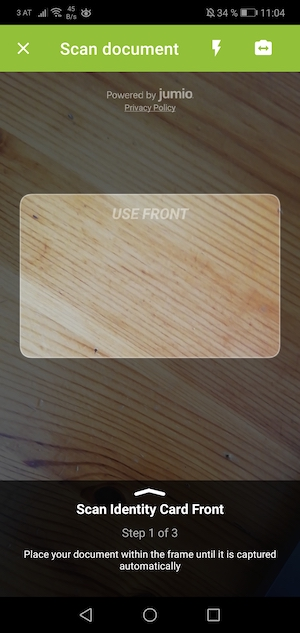  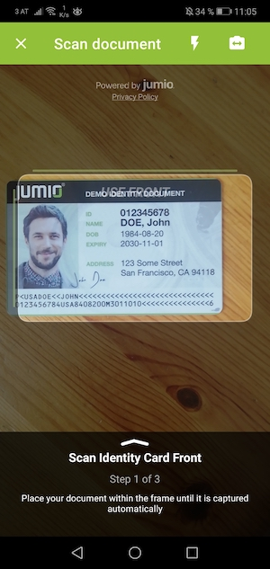

#### MRZ:
Used for passports, some identity cards and some visas.

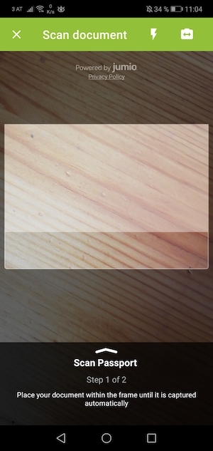  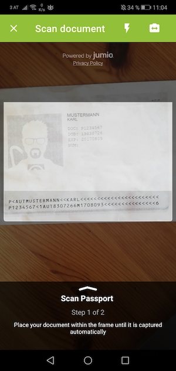

#### Barcode:
Used for PDF417 barcode, for example US and CAN driver licenses.

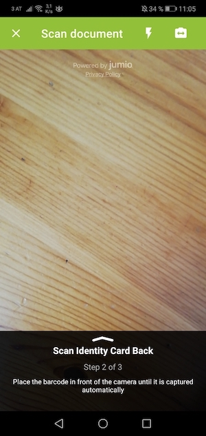  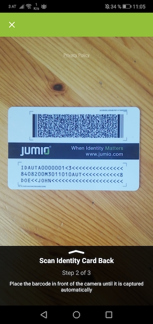

#### Manual Capture:
Manual scanning (taking a picture) with shutterbutton.

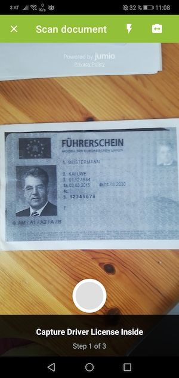

#### NFC:
Used for extraction from eMRTD documents, for example passports.

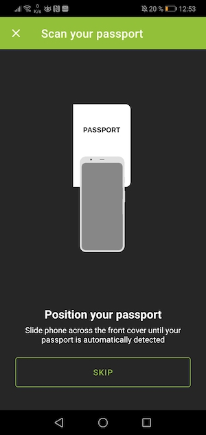  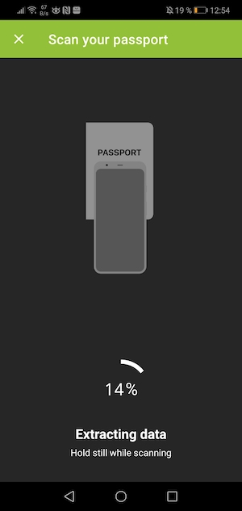

#### OCR Template:
Used for automatic scanning of some driver licenses.

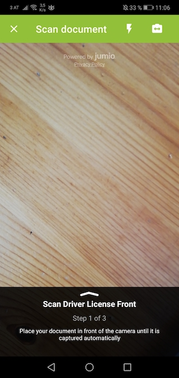  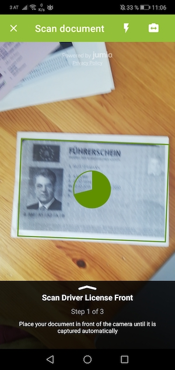

## ZoOm Customization
Starting with 3.8.0 we added a more granular customization for all the ZoOm screens in the SDK. It is possible to create a customization for normal light condition and for low light ones. The customization can also easily be done with our [Surface tool](https://jumio.github.io/surface-android/).

__Please notice__: If you decide to not use ZoOm and you do not link the face dependency, then you also need to remove the customizations. Otherwise build erros will occur due to missing attribute definitions.

### Overwrite Default Styles
The custom styles need to be generated with the default styles as parent
```
<style name="CustomZoom" parent="Zoom.Customization">
    ...
</style>
<style name="CustomZoomLowLight" parent="Zoom.Customization.Lowlight">
    ...
</style>
```

### Set the Customized Attributes
Both of these styles can include the same set of attributes
```
    <item name="zoom_frameBackground">@color/jumio_black</item>
    <item name="zoom_overlayBackground">@color/jumio_black</item>

    <item name="zoom_scanOverlayFeedbackText">@color/jumio_white</item>
    <item name="zoom_scanOverlayFeedbackBackground">@color/jumio_primary</item>
    <item name="zoom_scanOverlayProgress">@color/jumio_primary</item>
    <item name="zoom_scanOverlayOval">@color/jumio_white</item>

    <item name="zoom_resultBackground">@color/jumio_black</item>
    <item name="zoom_resultForeground">@color/jumio_primary</item>
    <item name="zoom_resultActivityIndicator">@color/jumio_primary</item>
    <item name="zoom_resultAnimationBackground">@color/jumio_white</item>
    <item name="zoom_resultAnimationForeground">@color/jumio_primary</item>
    <item name="zoom_uploadProgressTrack">@color/jumio_primary</item>
    <item name="zoom_uploadProgressFill">@color/jumio_white</item>

    <item name="zoom_guidanceBackground">@color/jumio_black</item>
    <item name="zoom_guidanceForeground">@color/jumio_white</item>
    <item name="zoom_guidanceButtonTextNormal">@color/jumio_white</item>
    <item name="zoom_guidanceButtonTextHighlight">@color/jumio_white</item>
    <item name="zoom_guidanceButtonTextDisabled">@color/jumio_white</item>
    <item name="zoom_guidanceButtonBackgroundNormal">@color/jumio_primary</item>
    <item name="zoom_guidanceButtonBackgroundHighlight">@color/jumio_primary_light</item>
    <item name="zoom_guidanceButtonBackgroundDisabled">@color/jumio_grey500</item>
    <item name="zoom_guidanceButtonBorder">@android:color/transparent</item>
    <item name="zoom_guidanceReadyScreenOvalFill">@android:color/transparent</item>
    <item name="zoom_guidanceRetryScreenOvalStroke">@color/jumio_white</item>
    <item name="zoom_guidanceReadyScreenTextBackground">@color/jumio_black</item>
    <item name="zoom_guidanceRetryScreenImageBorder">@color/jumio_primary</item>

    <item name="zoom_close_button_resource">@drawable/zoom_close_white</item>
```
The SDK comes with two close button resources - zoom_close_white and zoom_close_black - please decide based on the zoom_overlayBackground color which one makes more sense. The low light style will ignore the values in zoom_frameBackground and zoom_overlayBackground and will always use white instead.

### Reference the New Styles
After that, the new styles can be referenced from the Netverify or Authentication style
```
<style name="CustomNetverifyTheme" parent="Theme.Netverify">
    ...
    <item name="zoom_customization">@style/CustomZoom</item>
    <item name="zoom_customization_lowlight">@style/CustomZoomLowLight</item>
    ...
</style>
<style name="CustomAuthenticationTheme" parent="Theme.Authentication">
    ...
    <item name="zoom_customization">@style/CustomZoom</item>
    <item name="zoom_customization_lowlight">@style/CustomZoomLowLight</item>
    ...
</style>
```

### Custom UI
If you integrate custom ui you can also adjust the position of the close button in your style
```
<style name="AppTheme" parent="Theme.AppCompat.Light.DarkActionBar">
    ...
    <item name="zoom_close_button_top">16dp</item>
    <item name="zoom_close_button_left">16dp</item>
    <item name="zoom_close_button_width">12dp</item>
    <item name="zoom_close_button_height">12dp</item>
    ...
</style>
```

## Glossary
A [quick guide to commonly used abbreviations](integration_glossary.md) throughout the documentation which may not be all that familiar.

## Jumio Support
The Jumio development team is constantly striving to optimize the size of our frameworks while increasing functionality, to improve your KYC and to fight fraud. If you have any further questions, please reach out to our [support team](mailto:support@jumio.com).
