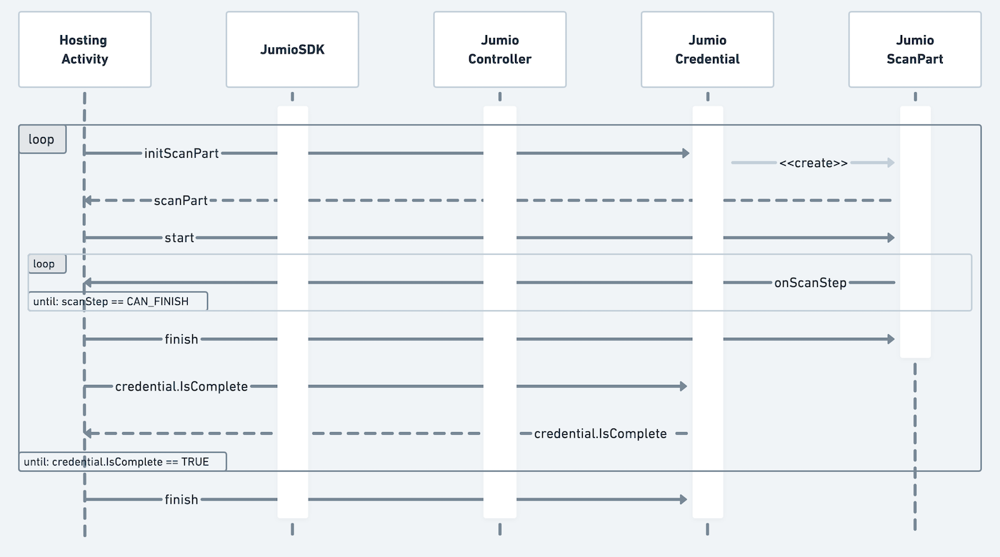

# Integration Guide for Android SDK

Jumio’s products allow businesses to establish the genuine identity of their users by verifying government-issued IDs in real-time. ID Verification, Selfie Verification and other services are used by financial service organizations and other leading brands to create trust for safe onboarding, money transfers and user authentication.

## Table of Contents

- [Release Notes](#release-notes)
- [Code Documentation](#code-documentation)
- [Setup](#setup)
	- [Dependencies](#dependencies)
		- [Autocapture](#autocapture)
		- [Certified Face Liveness](#certified-face-liveness)
		- [Barcode Scanning](#barcode-scanning)
		- [NFC Scanning](#nfc-scanning)
	- [SDK Version Check](#sdk-version-check)
	- [Root Detection](#root-detection)
	- [Device Supported Check](#device-supported-check)
	- [Privacy Notice](#privacy-notice)
	- [Digital Identity (DID)](#digital-identity--did-)
	- [Risk Signal: Device Risk](#risk-signal--device-risk)
- [ML Models](#ml-models)
	- [Bundling models in the app](#bundling-models-in-the-app)
	- [Preloading models](#preloading-models)
- [Initialization](#initialization)
	- [Requesting a Token (via OAuth2)](#requesting-a-token--via-oauth2-)
	- [Initializing the Jumio SDK](#initializing-the-jumio-sdk)
- [Configuration](#configuration)
	- [Worfklow Selection](#worfklow-selection)
	- [Transaction Identifiers](#transaction-identifiers)
	- [Preselection](#preselection)
	- [Miscellaneous](#miscellaneous)
- [SDK Workflow](#sdk-workflow)
	- [Retrieving Information](#retrieving-information)
- [Default UI](#default-ui)
- [Custom UI](#custom-ui)
	- [Controller Handling](#controller-handling)
	- [Credential Handling](#credential-handling)
	- [ScanPart Handling](#scanpart-handling)
	- [Result and Error Handling](#result-and-error-handling)
	- [Instant Feedback](#instant-feedback)
- [Customization](#customization)
	- [Customization Tool](#customization-tool)
	- [Default UI customization](#default-ui-customization)
	- [Custom UI customization](#custom-ui-customization)

## Release Notes

Please refer to our [Change Log](changelog.md) for more information. Current SDK version: **4.14.0**

For technical changes that should be considered when updating the SDK, please read our [Transition Guide](transition_guide.md).

## Code Documentation

Full API documentation for the Jumio Android SDK can be found [here](https://jumio.github.io/mobile-sdk-android/).

## Setup

The [basic setup](../README.md#basics) is required before continuing with the following setup for the Jumio SDK. If you are updating your SDK to a newer version, please also refer to:

:arrow_right:&nbsp;&nbsp;[Changelog](changelog.md)  
:arrow_right:&nbsp;&nbsp;[Transition Guide](transition_guide.md)

### Dependencies

The [SDK Setup Tool](https://jumio.github.io/mobile-configuration-tool/out/) is a web tool that helps determine available product combinations and corresponding dependencies for the Jumio SDK, as well as an export feature to easily import the applied changes straight into your codebase.

[](https://jumio.github.io/mobile-configuration-tool/out/)

Below you can find a list of dependencies that can be added to your application to enable different functionality of the Jumio SDK. Some modules are mandatory, others are optional.

If an optional module is **not linked**, some functionalities may not be available, but the library size will be reduced. The [Sample app](../sample/JumioMobileSample/) apk size is currently around **13.63 MB**.

```groovy
// [Mandatory] Jumio Core library
dependencies {
	implementation "com.jumio.android:core:4.14.0"               
	...
}

// [Optional] Extraction methods
dependencies {
	implementation "com.jumio.android:docfinder:4.14.0"          // Autocapture library, includes all previous scanning methods
	implementation "com.jumio.android:barcode-mlkit:4.14.0"      // Barcode scanning library, assists Autocapture
	implementation "com.jumio.android:nfc:4.14.0"                // NFC scanning library, assists Autocapture
	implementation "com.jumio.android:iproov:4.14.0"             // Face Liveness library
	implementation "com.jumio.android:liveness:4.14.0"           // Face Liveness library
	implementation "com.jumio.android:digital-identity:4.14.0"   // Digital Identity verification library
  	...
}

// [Optional] Jumio Default UI
dependencies {
	implementation "com.jumio.android:defaultui:4.14.0"
	...
}

// [Optional] Additional functionality
dependencies {
	implementation "com.jumio.android:camerax:4.14.0"         // CameraX library 
  	...
}
```

In addition to specifying individual dependencies, you can also use a BOM (Bill of Materials) to manage all the dependency versions at once. By using BOM, you ensure that all the dependencies are automatically aligned to the correct versions, reducing the need to manually update version numbers across your dependencies.

```groovy
dependencies {
		implementation platform("com.jumio.android:bom:4.14.0")
		implementation "com.jumio.android:core"
		implementation "com.jumio.android:barcode-mlkit"
		implementation "com.jumio.android:camerax"
		implementation "com.jumio.android:defaultui"
		implementation "com.jumio.android:digital-identity"
		implementation "com.jumio.android:docfinder"
		implementation "com.jumio.android:iproov"
		implementation "com.jumio.android:liveness"
		implementation "com.jumio.android:nfc"
}
```

#### Autocapture

The module `com.jumio.android:docfinder` offers one generic scanning method across all ID documents, providing a more seamless capture experience for the end user. The SDK will automatically detect which type of ID document is presented by the user and guide them through the capturing process with live feedback.
The models can be bundled with the app directly to save time on the download during the SDK runtime. Please see section [ML Models](#ml-models) for more information.

#### Certified Face Liveness

Jumio uses Certified Liveness technology to determine liveness. Link `com.jumio.android:liveness` and  `com.jumio.android:iproov` modules in order to use Jumio Liveness.
Please note: `com.jumio.android:camerax` will be linked transitively when `com.jumio.android:liveness` is linked.
If necessary, the iProov SDK version can be overwritten with a more recent one:

```groovy
implementation "com.jumio.android:iproov:4.14.0"
implementation("com.iproov.sdk:iproov:9.1.2") {
	exclude group: 'org.json', module: 'json'
}
```

#### Barcode Scanning
In order to benefit from barcode scanning functionality included in the `com.jumio.android:docfinder` dependency, please add `com.jumio.android:barcode-mlkit` to your `build-gradle` file.

This dependency includes `com.google.android.gms:play-services-mlkit-barcode-scanning` library - if your application includes **other Google ML-kit libraries**, it might be necessary to override meta-data specified in the application tag of the `play-services-mlkit-barcode-scanning` manifest by [merging multiple manifests](https://developer.android.com/studio/build/manage-manifests#merge-manifests):

```xml
<meta-data
  android:name="com.google.android.gms.vision.DEPENDENCIES"
  android:value="barcode"
  tools:replace="android:value" />
```

#### NFC Scanning
In order to benefit from NFC scanning functionality included in the `com.jumio.android:docfinder` dependency, please add `com.jumio.android:nfc` to your `build-gradle` file.

### SDK Version Check

Use `JumioSDK.sdkVersion` to check which SDK version is being used.

### Root Detection

For security reasons, applications implementing the SDK should not run on rooted devices. Use either the below method or a self-devised check to prevent usage of SDK scanning functionality on rooted devices.
```
JumioSDK.isRooted(context: Context)
```

⚠️&nbsp;&nbsp;__Note:__ Please be aware that the JumioSDK root check uses various mechanisms for detection, but doesn't guarantee to detect 100% of all rooted devices.

### Device Supported Check

Use the method below to check if the current device platform is supported by the SDK.

```
JumioSDK.isSupportedPlatform(context: Context)
```

### Privacy Notice
If you submit your app to the Google Play Store a [Prominent Disclosure](https://support.google.com/googleplay/android-developer/answer/11150561) explaining the collected [User Data](https://support.google.com/googleplay/android-developer/answer/10144311) is required. The collected user data also needs to be declared in your [Data Safety Form](https://play.google.com/console/developers/app/app-content/data-privacy-security) and the [Privacy Policy](https://play.google.com/console/developers/app/app-content/privacy-policy) related to your application.

Other stores might require something similar - please check before submitting your app to the store.

Please see the [Jumio Privacy Policy for Online Services](https://www.jumio.com/legal-information/privacy-notices/jumio-corp-privacy-policy-for-online-services/) for further information.

### Digital Identity (DID)
In case Digital Identity Verification has been enabled for your account you can add the `com.jumio.android:digital-identity` dependency to your application. This will enable you to make use of DID verification within the SDK.

Over the course of DID verification the SDK will launch an according third party application representing your Digital Identity. Communication between both applications (your integrating application and the Digital Identity application) is done via a so-called "deep link". For more information on deep link handling on Android please check out their [official guide](https://developer.android.com/training/app-links).

#### Deep Link Setup
To enable your app specific deep link, our support team has to setup an according scheme of your choice for you. This scheme will be used by the SDK to identify your application while returning from the DID provider's application. For the scheme basically any string can be used, however it is recommended that it is unique to your application in some way. A suggestion would be your company name.

Following snippet shows how the deep link needs to be setup in your application's `AndroidManifest.xml` file:

```xml
<activity
	android:name="com.jumio.app.HostingActivity"
	android:exported="true"
	android:launchMode="singleTask"
	android:theme="@style/Theme.Jumio">
	<intent-filter>
		<action android:name="android.intent.action.VIEW" />

		<category android:name="android.intent.category.DEFAULT" />
		<category android:name="android.intent.category.BROWSABLE" />

		<data android:scheme="<your-app-scheme>" />
	</intent-filter>
</activity>
```

Please note that the properties `android:exported="true"` and `android:launchMode="singleTask"` need to be specified as well. The first parameter basically tells the Android system that your `Activity` can be found by the system and other applications. By specifying `launchMode="singleTask"` any already running task for this `Activity` will be resumed (instead of creating a new instance). Both are requirements so that the SDK can handle the according deep link correctly.

In case you are using Jumio's Default UI in your app (see section [Default UI](#default-ui)) you also need to specify `tools:replace="android:exported"` to `JumioActivity`'s `<activity>` tag like so:

```xml
<activity
	android:name="com.jumio.defaultui.JumioActivity"
	android:exported="true"
	android:launchMode="singleTask"
	tools:replace="android:exported">
	<intent-filter>
		...
	</intent-filter>
</activity>
```

As deep link handling happens on `Activity` level, the according data needs to be forwarded to the SDK via `Activity.onNewIntent()`. The following code snippet shows how this can be achieved. **If you're using Jumio's Default UI you can ignore this step**.

```kotlin
override fun onNewIntent(intent: Intent) {
	super.onNewIntent(intent)

	intent.data?.let { deepLink ->
		val activeScanPart = scanPart ?: return

		JumioDeepLinkHandler.consumeForScanPart(deepLink, activeScanPart)
	}
}
```

### Risk Signal: Device Risk
If you want to include risk signals into your application, please check our [Risk Signal guide](https://docs.jumio.com/production/Content/References/Risk%20Signals/Device%20Risk.htm).

#### Iovation setup
To integrate the device risk vendor Iovation into your application, please follow the [Iovation integration guide](https://github.com/iovation/deviceprint-SDK-android).

#### API call
To provide Jumio with the generated Device Risk blackbox, please follow the [Device Risk API guide](https://docs.jumio.com/production/Content/Integration/Integration%20Channels/REST%20APIs.htm).

## ML Models
By default, required models get downloaded by the SDK if not provided via the assets folder or preloaded.

### Bundling models in the app
You can download our encrypted models and add them to your assets folder for the following modules.

⚠️&nbsp;&nbsp;__Note:__ Make sure not to alter the downloaded models (name or content) before adding them to your assets folder.

#### DocFinder
If you are using the `com.jumio.android:docfinder` module, find the required models [here](https://cdn.mobile.jumio.ai/android/model/normalized_ensemble_passports_v2_float16_quant.enc) and [here](https://cdn.mobile.jumio.ai/android/model/classifierOnDeviceV2.enc).

#### Liveness
If you are using the `com.jumio.android:liveness` module, find the required model [here](https://cdn.mobile.jumio.ai/android/model/liveness_sdk_assets_v_1_1_5.enc).

### Preloading models
In version `4.9.0` we introduced the [`JumioPreloader`][jumiopreloader]. It provides functionality to preload models without the JumioSDK being initialized. To do so call:

```Kotlin
with(JumioPreloader) {
	init(<Your Context>) // init with Context
	preloadIfNeeded()
}
```

The [`JumioPreloader`][jumiopreloader] will identify which models are required based on your configuration.

Preloaded models are cached so they will not be downloaded again. To clean the models call:

```Kotlin
with(JumioPreloader) {
	init(<Your Context>) // init with Context
	clean()
}
```

⚠️&nbsp;&nbsp;__Note:__ `clean` should never be called while the SDK is running!

To get notified that preloading has finished, you can implement [`JumioPreloadCallback`][jumiopreloadcallback] methods and set the callback as follows:

```Kotlin
with(JumioPreloader) {
	init(<Your Context>) // init with Context
	setCallback(<Your callback>)
	...
	// followed by preloadIfNeeded() for example
}
```

## Initialization

### Requesting a Token (via OAuth2)

Your OAuth2 credentials are constructed using your API token as the Client ID and your API secret as the Client secret. You can view and manage your Client ID and secret in the Customer Portal under:

- **Settings > API credentials > OAuth2 Clients**

Client ID and Client secret are used to generate an OAuth2 access token. Send a workflow request using the acquired OAuth2 access token to receive the SDK token necessary to initialize the Jumio SDK.

OAuth2 has to be activated for your account. Contact your Jumio Account Manager for activation. For more details, please refer to [Authentication and Encryption](../README.md#authentication-and-encryption).

### Initializing the Jumio SDK

Use your aquired SDK token and your according datacenter to initialize the `JumioSDK`:

```kotlin
const val YOUR_SDK_TOKEN = ""
const val YOUR_DATACENTER = ""

sdk = JumioSDK(context: Context).apply {
	token = "YOUR_SDK_TOKEN"
	datacenter = "YOUR_DATACENTER"
}
```

Data center is set to `"US"` by default. If your customer account is in the EU data center, use `"EU"` instead. Alternatively, use `"SG"` for Singapore.

⚠️&nbsp;&nbsp;**Note:** We strongly recommend storing all credentials outside of your app! We suggest loading them during runtime from your server-side implementation.

## Configuration

Every Jumio SDK instance is initialized using a specific [`sdk.token`][token]. This token contains information about the workflow, credentials, transaction identifiers and other parameters. Configuration of this token allows you to provide your own internal tracking information for the user and their transaction, specify what user information is captured and by which method, as well as preset options to enhance the user journey. Values configured within the [`sdk.token`][token] during your API request will override any corresponding settings configured in the Jumio Portal.

### Worfklow Selection

Use ID verification callback to receive a verification status and verified data positions (see [Callback section](https://docs.jumio.com/production/Content/Integration/Callback.htm)). Make sure that your customer account is enabled to use this feature. A callback URL can be specified for individual transactions (for URL constraints see chapter __Jumio Callback IP Addresses__). This setting overrides any callback URL you have set in the Jumio Portal. Your callback URL must not contain sensitive data like PII (Personally Identifiable Information) or account login. Set your callback URL using the `callbackUrl` parameter.

Use the correct [workflow definition key](https://docs.jumio.com/production/Content/References/Workflows/Standard%20Services.htm) in order to request a specific workflow. Set your key using the `workflowDefinition.key` parameter.

```json
{
  "customerInternalReference": "CUSTOMER_REFERENCE",
  "workflowDefinition": {
	"key": "X"
  },
  "callbackUrl": "YOUR_CALLBACK_URL"
}
```

For more details, please refer to our [Workflow Description Guide](https://support.jumio.com/hc/en-us/articles/4408958923803-KYX-Workflows-User-Guide).

ℹ️&nbsp;&nbsp;**Note:** Selfie Verification requires portrait orientation in your app.

### Transaction Identifiers

There are several options in order to uniquely identify specific transactions. `customerInternalReference` allows you to specify your own unique identifier for a certain scan (max. 100 characters). Use `reportingCriteria`, to identify the scan in your reports (max. 100 characters). You can also set a unique identifier for each user using `userReference` (max. 100 characters).

For more details, please refer to the __Account Request__ section in our [KYX Guide](https://docs.jumio.com/production/Content/Integration/Creating%20or%20Updatng%20Account/Creating%20or%20Updating%20Accounts.htm).

```json
{
  "customerInternalReference": "CUSTOMER_REFERENCE",
  "workflowDefinition": {
	"key": "X"
  },
  "reportingCriteria": "YOUR_REPORTING_CRITERIA",
  "userReference": "YOUR_USER_REFERENCE"
}
```

⚠️&nbsp;&nbsp;**Note:** Transaction identifiers must not contain sensitive data like PII (Personally Identifiable Information) or account login.

### Preselection

You can specify issuing country using [ISO 3166-1 alpha-3](https://en.wikipedia.org/wiki/ISO_3166-1_alpha-3) country codes, as well as ID types to skip selection during the scanning process. In the example down below, Austria ("AUT") and the USA ("USA") have been preselected. PASSPORT and DRIVER_LICENSE have been chosen as preselected document types. If all parameters are preselected and valid and there is only one given combination (one country and one document type), the document selection screen in the SDK can be skipped entirely.

For more details, please refer to the __Account Request__ section in our [KYX Guide](https://docs.jumio.com/production/Content/Integration/Creating%20or%20Updatng%20Account/Creating%20or%20Updating%20Accounts.htm).

⚠️&nbsp;&nbsp;**Note:** "Digital Identity" document type can not be preselected!

```json
{
  "customerInternalReference": "CUSTOMER_REFERENCE",
  "workflowDefinition": {
	"key": X,
	"credentials": [
	  {
		"category": "ID",
		"type": {
		  "values": [
			"DRIVING_LICENSE",
			"PASSPORT"
		  ]
		},
		"country": {
		  "values": [
			"AUT",
			"USA"
		  ]
		}
	  }
	]
  }
}
```

### Miscellaneous

Use [`cameraFacing`][camerafacing] attribute of [`JumioScanView`][jumioscanview] to configure the default camera and set it to `FRONT` or `BACK`.

```kotlin
scanView.cameraFacing = JumioCameraFacing.FRONT
```

## SDK Workflow

### Retrieving Information

The SDK returns a [`JumioResult`][jumioresult] object which contains the result of the finished workflow. Extracted ID data will not be returned by default - please contact **Jumio Customer Service** at [support@jumio.com](mailto:support@jumio.com) in case this is needed.

The following tables give information on the specification of all data parameters and errors:

- [`JumioIDResult`][jumioidresult]
- [`JumioFaceResult`][jumiofaceresult]
- [`JumioRejectReason`][jumiorejectreason]
- [`JumioError`][jumioerror]

#### Class **_JumioIDResult_**

| Parameter        | Type                         | Max. length | Description                                                                                                                                                            |
|:-----------------|:-----------------------------| :---------- |:-----------------------------------------------------------------------------------------------------------------------------------------------------------------------|
| issuingCountry   | String                       | 3           | Country of issue as [ISO 3166-1 alpha-3](https://en.wikipedia.org/wiki/ISO_3166-1_alpha-3) country code                                                                |
| idType           | String                       |             | PASSPORT, DRIVER_LICENSE, IDENTITY_CARD or VISA as provided or selected                                                                                                |
| idSubType        | String                       |             | Sub type of the scanned ID                                                                                                                                             |
| firstName        | String                       | 100         | First name of the customer                                                                                                                                             |
| lastName         | String                       | 100         | Last name of the customer                                                                                                                                              |
| dateOfBirth      | String                       |             | Date of birth                                                                                                                                                          |
| issuingDate      | String                       |             | Date of issue                                                                                                                                                          |
| expiryDate       | String                       |             | Date of expiry                                                                                                                                                         |
| documentNumber   | String                       | 100         | Identification number of the document                                                                                                                                  |
| personalNumber   | String                       |             | Personal number of the document                                                                                                                                        |
| gender           | String                       |             | Gender M, F or X                                                                                                                                                       |
| nationality      | String                       |             | Nationality of the customer                                                                                                                                            |
| placeOfBirth     | String                       | 255         | Place of birth                                                                                                                                                         |
| country          | String                       |             | Country of residence                                                                                                                                                   |
| address          | String                       | 64          | Street name of residence                                                                                                                                               |
| city             | String                       | 64          | City of residence                                                                                                                                                      |
| subdivision      | String                       | 3           | Last three characters of [ISO 3166-2:US](https://en.wikipedia.org/wiki/ISO_3166-2:US) or [ISO 3166-2:CA](https://en.wikipedia.org/wiki/ISO_3166-2:CA) subdivision code |
| postalCode       | String                       | 15          | Postal code of residence                                                                                                                                               |
| mrzLine1         | String                       | 50          | MRZ line 1                                                                                                                                                             |
| mrzLine2         | String                       | 50          | MRZ line 2                                                                                                                                                             |
| mrzLine3         | String                       | 50          | MRZ line 3                                                                                                                                                             |
| curp             | String                       |             | The Clave Única de Registro de Población (CURP) identity code for Mexican documents.                                                                                   |
| extractionMethod | JumioScanMode[jumioscanmode] |             | Extraction method used during scanning                                                                                                                                 |
| imageData        | JumioImageData               |             | Wrapper class for accessing image data of all credential parts from an ID verification session. This feature has to be enabled by your account manager.                |

#### Class **_JumioFaceResult_**

| Parameter        | Type                         | Max. length | Description                                                                                                                                             |
| :--------------- |:-----------------------------| :---------- |:--------------------------------------------------------------------------------------------------------------------------------------------------------|
| passed           | Boolean                      |             |
| extractionMethod | JumioScanMode[jumioscanmode] |             | Extraction method used during scanning (FACE_MANUAL, FACE_IPROOV, JUMIO_LIVENESS)                                                                       |
| imageData        | JumioImageData               |             | Wrapper class for accessing image data of all credential parts from an ID verification session. This feature has to be enabled by your account manager. |

#### Class **_JumioRejectReason_**

List of all possible **_reject reasons_** the SDK could return if Instant Feedback is used:
⚠️&nbsp;&nbsp;**Note:** Please be aware that the list of reject reasons that get returned depends on server-side configuration for every individual merchant.

| Code | Message              | Description                                        | 
|:-----|:---------------------|:---------------------------------------------------|
| 102  | BLACK_WHITE_COPY     | Document appears to be a black and white photocopy |
| 103  | COLOR_PHOTOCOPY      | Document appears to be a colored photocopy         |
| 104  | DIGITAL_COPY         | Document appears to be a digital copy              |
| 200  | NOT_READABLE         | Document is not readable                           |
| 201  | NO_DOC               | No document could be detected                      |
| 206  | MISSING_BACK         | Backside of the document is missing                |
| 214  | MISSING_FRONT        | Frontside of the document is missing               |
| 401  | UNSUPPORTED_DOCUMENT | Document is not supported                          |
| 501  | INVALID_CERTIFICATE  | Document certificate could not be validated        |
| 2001 | BLURRY               | Document image is unusable because it is blurry    |
| 2003 | MISSING_PART_DOC     | Part of the document is missing                    |
| 2004 | HIDDEN_PART_DOC      | Part of the document is hidden                     |
| 2005 | DAMAGED_DOCUMENT     | Document appears to be damaged                     |
| 2006 | GLARE                | Document image is unusable because of glare        |

#### Error Codes

List of all **_error codes_** that are available via the `code` and `message` properties of the [`JumioError`][jumioerror] object. The first letter (A-J) represents the error case. The remaining characters are represented by numbers that contain information helping us understand the problem situation (format: [xx][yyyy]).

|    Code     | Message                                                            | Description                                                   |
|:-----------:|:-------------------------------------------------------------------|:--------------------------------------------------------------|
| A[xx][yyyy] | We have encountered a network communication problem                | Retry possible, user decided to cancel                        |
| B[xx][yyyy] | Authentication failed                                              | Secure connection could not be established, retry impossible  |
|  C[xx]0401  | Authentication failed                                              | API credentials invalid, retry impossible                     |
|  E[xx]0000  | Connection error                                                   | Retry possible, user decided to cancel                        |
|  F[xx]0000  | Scanning not available at this time, please contact the app vendor | Resources cannot be loaded, retry impossible                  |
|  G[xx]0000  | Cancelled by end-user                                              | No error occurred                                             |
|  H[xx]0000  | The camera is currently not available                              | Camera cannot be initialized, retry impossible                |
|  I[xx]0000  | Certificate not valid anymore. Please update your application      | End-to-end encryption key not valid anymore, retry impossible |
|  J[xx]0000  | Transaction already finished                                       | User did not complete SDK journey within session lifetime     |
|  N[xx]0000  | Scanning not available at this time, please contact the app vendor | Required images are missing to finalize the acquisition       |

⚠️&nbsp;&nbsp;**Note:** Please always include error code and message when filing an error related issue to our support team.

## Default UI

In case you're using Jumio's Default UI module (see [Dependencies](#dependencies)) you may declare the `JumioActivity` in your `AndroidManifest.xml`. With this you can use Jumio's default theme or specify a custom theme (see [Customization](#customization) for details). Also you can set the orientation to be sensor based or locked by using the attribute `android:screenOrientation`. Please note though that some screens in Jumio SDK launch in portrait mode only.

```xml
<activity
  android:theme="@style/Theme.Jumio"
  android:hardwareAccelerated="true"
  android:name="com.jumio.defaultui.JumioActivity"
  android:configChanges="orientation|screenSize|screenLayout|keyboardHidden" />
```

## Custom UI

ID Verification can be also implemented as a **custom scan view.** This means that only the scan view (including the scan overlays) are provided by the SDK.
The handling of the lifecycle, document selection, readability confirmation, intermediate callbacks, and all other steps necessary to complete a scan have to be handled by the client application that implements the SDK.

The following sequence diagram outlines components, callbacks and methods for a basic ID Verification workflow:


⚠️&nbsp;&nbsp;**Note:** The new 3D face liveness capturing technology is not optimized for tablets. When using Selfie Verification, the face scanner will fallback to a simple face capturing functionality instead. Portrait orientation support is required in your app.

CustomUI enables you to use a custom scan view with a plain scanning user interface. Initialize the Jumio SDK and set [`token`][token] and [`datacenter`][datacenter].

```kotlin
sdk = JumioSDK(context: Context).apply {
	token = "YOUR_SDK_TOKEN"
	datacenter = JumioDataCenter.YOUR_DATACENTER
}
```

- [`JumioDataCenter`][datacenter] values: `US`, `EU`, `SG`

### Controller Handling

Start the SDK by passing `context` and an instance of your class that implements [`JumioControllerInterface`][jumiocontrollerinterface]. You will receive a [`JumioController`][jumiocontroller] object in return:

```kotlin
val jumioController: JumioController = sdk.start(context, jumioControllerInterface)
```

When the `jumioController` is initialized, the following callback will be triggered:

```kotlin
onInitialized(credentials: List<JumioCredentialInfo>, consentItems: List<JumioConsentItems>?)
```

#### Consent Handling
To support compliance with various data protection laws, if a user’s consent is required the parameter `consentItems` will provide a list of [`JumioConsentItems`][jumioconsentitem]. Each consent item contains a text, a consent type and an URL that will redirect the user to Jumio’s consent details. Each [`JumioConsentItem`][jumioconsentitem] also provides a method `spannedTextWithLinkColor(color: Int)` that will return a spanned string containing the consent text and the link holder. If no color is specified, the link portion of the spanned string will only be underlined.

If no consent is required, the parameter `consentItems` will be `null`.

Each consent item can be one of two types:
* [`JumioConsentType.ACTIVE`][jumioconsenttype]
* [`JumioConsentType.PASSIVE`][jumioconsenttype]

For `ACTIVE` types, the user needs to accept the consent items explicitly, e.g. by enabling a UI switch or checking a checkbox for each consent item. For `PASSIVE` types, it is enough to present the consent text and URL to the user. The user implicitly accepts the passive consent items by continuing with the journey. For details please check out consent handling [(1)](https://github.com/Jumio/mobile-sdk-android/blob/master/sample/JumioMobileSample/src/main/java/com/jumio/sample/customui/CustomUiActivity.kt#L218-L234) [(2)](https://github.com/Jumio/mobile-sdk-android/blob/master/sample/JumioMobileSample/src/main/java/com/jumio/sample/customui/CustomUiActivity.kt#L252-L260) and [consent adapter](https://github.com/Jumio/mobile-sdk-android/blob/master/sample/JumioMobileSample/src/main/java/com/jumio/sample/customui/adapter/CustomConsentAdapter.kt) in our sample app.

The user can open and continue to the provided consent link if they choose to do so. If the user consents to Jumio's policy, [`jumioController.userConsented(consentItem: JumioConsentItem, userConsent: Boolean)`][userconsented] is required to be called internally before any credential can be initialized and the user journey can continue. If no consent is required, the list of [`JumioConsentItems`][jumioconsentitem] will be `null`. If the user does not consent or if [`jumioController.userConsented(consentItem: JumioConsentItem, userConsent: Boolean)`][userconsented] is not called for all the items inside the `consentItems` list, the user will not be able to continue the user journey.

⚠️&nbsp;&nbsp;**Note:** Please be aware that in cases where the list of `consentItems` is not `null`, the user **must consent** to Jumio's processing of personal information, including biometric data, and be provided a link to Jumio's Privacy Notice. Do not accept automatically without showing the user any terms.

### Credential Handling

Obtain an instance of [`JumioCredential`][jumiocredential] which will contain all necessary information about the verification process by calling `start` on the `JumioController`.

For ID verification you will receive a [`JumioIDCredential`][jumioidcredential], for Selfie Verification a [`JumioFaceCredential`][jumiofacecredential], and so on. Call [`isConfigured`][isconfigured] to check if the credential is already pre-configured. If so, it can be started right away.

```kotlin
val currentCredentialInfo = ...

val currentCredential = jumioController.start(currentCredentialInfo)
if (currentCredential?.isConfigured == true) {
	// credential can be started
}
```

If the credential is not configured yet, it needs some more configuration before scan parts can be initialized. Details on how to configure each credential and retrieve the first [scan part][jumioscanpart] can be found below.

- [`JumioCredentialCategory`][jumiocredentialcategory] values: `ID`, `FACE`, `DOCUMENT`, `DATA`

#### Jumio ID Credential

In case of [`JumioIDCredential`][jumioidcredential], you can retrieve all available countries from [`supportedCountries`][supportedcountries]. After selecting a specific country from that list, you can query available documents for that country by either calling [`getPhysicalDocumentsForCountry`][getphysicaldocuments] or [`getDigitalDocumentsForCountry`][getdigitaldocuments]. To configure the [`JumioIDCredential`][jumioidcredential], pass your desired document as well as the country to [`setConfiguration()`][setidconfiguration].

Retrieve the supported countries:
```kotlin
idCredential = ... // Credential received via jumioController.start

val countries: List<String> = idCredential.countries

val country = countries.first { ... } // Select your desired country
```

Query available physical documents (e.g. passports or driving licenses):

```kotlin
val jumioDocuments = idCredential.getPhysicalDocumentsForCountry(country)

val document = jumioDocuments.first { it.type == JumioDocumentType.PASSPORT }
```

Query available digital documents ("Digital Identities"):

```kotlin
val jumioDocuments = idCredential.getDigitalDocumentsForCountry(country)

val document = jumioDocuments.first()
```

Set a valid country / document configuration:

```kotlin
idCredential.setConfiguration(country, document)
```

- [`JumioPhysicalDocument`][jumiophysicaldocument] represents a single `JumioDocumentType` and `JumioDocumentVariant` combination

	- [`JumioDocumentType`][jumiodocumenttype] values: `PASSPORT`, `VISA`, `DRIVING_LICENSE`, `ID_CARD`

	- [`JumioDocumentVariant`][jumiodocumentvariant] values: `PAPER`, `PLASTIC`

- [`JumioDigitalDocument`][jumiodigitaldocument] represents a digital document ("Digital Identity")

Once the credential is configured, it is ready to initialize it's first scan part and start the verification process:

```kotlin
val credentialPart = idCredential.credentialParts.first()
idCredential.initScanPart(credentialPart, yourScanPartInterface)
```

#### Jumio Face Credential

In case of [`JumioFaceCredential`][jumiofacecredential], Jumio uses Certified Liveness technology to determine liveness. The mode can be detected by checking the [`JumioScanMode`][jumioscanmode] of the [`JumioScanPart`][jumioscanpart]. Make sure to also implement `FACE_MANUAL` as a fallback, in case `JUMIO_LIVENESS` or `FACE_IPROOV` is not available.

Retrieve the credential part of the credential to start the scanning process by calling:

```kotlin
val credentialPart = currentCredential?.credentialParts?.first()
val scanPart = currentCredential?.initScanPart(credentialPart, yourScanPartInterface)
```

or use the convenience method

```kotlin
val scanPart = currentCredential?.initScanPart(yourScanPartInterface)
```

#### Jumio Document Credential

In case of [`JumioDocumentCredential`][jumiodocumentcredential], there is the option to either acquire the image using the camera or selecting a PDF file from the device. Call `setConfiguration` with a [`JumioAcquireMode`][acquiremode] to select the preferred mode as described in the code documentation.

- [`JumioAcquireMode`][acquiremode] values: `CAMERA`, `FILE`

```kotlin
val acquireModes: List<JumioAcquireMode> = (credential as JumioDocumentCredential).availableAcquireModes

(currentCredential as JumioDocumentCredential).setConfiguration(acquireModes[0])
```

Retrieve the credential part of the credential to start the scanning process by calling:

```kotlin
val credentialPart = currentCredential?.credentialParts?.first()
val scanPart = currentCredential?.initScanPart(credentialPart, yourScanPartInterface)
```

or use the convenience method

```kotlin
val scanPart = currentCredential?.initScanPart(yourScanPartInterface)
```

If [`JumioAcquireMode`][acquiremode] `FILE` is used, the [`JumioFileAttacher`][jumiofileattacher] needs to be utilized
to add a File or FileDescriptor for the selected [`JumioScanPart`][jumioscanpart].

```kotlin
val fileAttacher = JumioFileAttacher()
fileAttacher.attach(scanPart)

val file = File("/path/to/your/file.pdf")
fileAttacher.setFile(file)
```

#### Jumio Data Credential

⚠️&nbsp;&nbsp;__Note:__ `JumioDataCredential` is only available from SDK version `4.2.0` to `4.8.1` (inclusively).

[`JumioDataCredential`][jumiodatacredential] is used for the device fingerprinting. There are some optional configurations you can do to enhance it's behavior.

1. Add the following Android permissions to your `AndroidManifest.xml`, if not already added:

```xml
<manifest>
	<!--Get user's GPS Location.-->
	<uses-permission android:name="android.permission.ACCESS_COARSE_LOCATION" />
	<uses-permission android:name="android.permission.ACCESS_FINE_LOCATION" />

	<!--Get User's Wifi name and Status.-->
	<uses-permission android:name="android.permission.ACCESS_WIFI_STATE" />

	<!--Get User's Network information and State.-->
	<uses-permission android:name="android.permission.ACCESS_NETWORK_STATE" />

	<!--Get Phone and Network information (MNC, MCC, IMEI, Phone Number, Phone Type (GSM/CDMA), SIM Number, etc).-->
	<uses-permission android:name="android.permission.READ_PHONE_STATE" />

	<!--Get user's Biometric authentication settings (Face or Fingerprint authentication).-->
	<uses-permission android:name="android.permission.USE_BIOMETRIC" />

	<!--Get user's Biometric authentication settings (Face or Fingerprint authentication).-->
	<uses-permission android:name="android.permission.USE_FINGERPRINT" />

	<!--Write data into device to check re-installation behavior.-->
	<uses-permission android:name="android.permission.WRITE_EXTERNAL_STORAGE" />

	<!--Get External storage status, total size, free size, etc.-->
	<uses-permission android:name="android.permission.READ_EXTERNAL_STORAGE" />

	<!--Get GSFID (Google Services Id) for accurate identification for unique users.-->
	<uses-permission android:name="com.google.android.providers.gsf.permission.READ_GSERVICES" />
</manifest>
```

ℹ️&nbsp;&nbsp;**Note:**

- The reason for the requirement of the given permission is added as inline comment.
- Some of them are `dangerous` permissions, and you have to ask for the permission from the user. More information about permissions can be found in the official [Android documentation](https://developer.android.com/guide/topics/permissions/overview)
- The above permissions imply to add some features to your manifest file:

```xml
  <uses-feature
    android:name="android.hardware.location"
    android:required="false"/>

  <uses-feature
    android:name="android.hardware.telephony"
    android:required="false"/>

  <uses-feature
    android:name="android.hardware.wifi"
    android:required="false"/>
```

2. If you use proguard for obfuscation, you have to add some rules to your [`proguard-rules.pro`][proguardrules]
   configuration file:

```text
   -keep com.google.android.gms.*
   -keep com.google.android.gms.tasks.*
   -keep com.google.android.gms.ads.identifier.AdvertisingIdClient
```

### ScanPart Handling

The following sequence diagram outlines an overview of ScanPart handling details:


Start the scanning process by initializing the [`JumioScanPart`][jumioscanpart]. A list of mandatory [`JumioCredentialPart`][jumiocredentialpart]s is retrievable over [`currentCredential?.credentialParts`](credentialPartsList) as soon as the credential is configured. Possible values are:

`currentScanPart = currentCredential?.initScanPart(credentialPart, yourJumioScanPartInterface)`

- [`JumioCredentialPart`][jumiocredentialpart] values: `FRONT`, `BACK`, `MULTIPART`, `FACE`, `DOCUMENT`, `NFC`, `DIGITAL`

Each [`jumioScanPart`][jumioScanPart] has an associated `scanMode`. Depending on the scan mode, you need to provide a different user guidance. The following scan modes are available for the different `JumioCredentialPart`s:

* [`JumioScanMode`][jumioScanMode] values:
	* `FRONT`, `BACK`, `MULTIPART`: `MANUAL`, `BARCODE`, `DOCFINDER`
	* `DIGITAL`: `WEB`, `FILE`
	* `NFC`: `NFC`
	* `FACE`: `FACE_MANUAL`, `FACE_IPROOV`, `JUMIO_LIVENESS`, `JUMIO_PREMIUM`
	* `DOCUMENT`: `MANUAL`, `FILE`

During the scanning process, use the `onUpdate` function of the `JumioScanPartInterface` to check on the scanning progress and update your user guidance accordingly.

`MULTIPART` handles the scanning of multiple sides in one seamless capture experience. When a [`MULTIPART`][jumiomultipart] scan part is started, an additional [`NEXT_PART`][nextpart] step is sent after [`IMAGE_TAKEN`][imagetaken]. This signals that another side of the document should be scanned now. The step returns the [`JumioCredentialPart`][jumiocredentialpart] that should be scanned next. We suggest to actively guide the user to move to the next part, e.g. by showing an animation and by disabling the extraction during the animation. Please also check the new [`NEXT_PART`][nextpart] scan step for this [`JumioCredentialPart`][jumiocredentialpart]

Start the execution of the acquired [`JumioScanPart`][jumioscanpart] by calling [`currentScanPart?.start()`][startscanpart].

When the scanning is done, the parameter [`JumioScanStep.CAN_FINISH`][canfinish] will be received and the scan part can be finished by calling [`currentScanPart?.finish()`][finishscanpart].

Check if the credential is complete by calling [`currentCredential?.isComplete`][iscompletecredential] and finish the current credential by calling [`currentCredential?.finish()`][finishcredential].

Continue that procedure until all needed credentials (e.g. `ID`, `FACE`, `DOCUMENT`) are finished. Check if all credentials are finished with [`jumioController.isComplete`][iscompletecontroller], then call [`jumioController?.finish()`][finishcontroller] to finish the user journey.

The callback [`onFinished()`][onfinished] will be received after the controller has finished:

```kotlin
override fun onFinished(result: JumioResult) {
  log("onFinished")
  sdkResult.value = result
}
```

#### Scan Steps

During the scanning process [`onScanStep()`][onscanstep] will be called as soon as the [`JumioScanPart`][jumioscanpart] needs additional input to continue the scanning journey. The provided [`JumioScanStep`][jumioscanstep] indicates what needs to be done next.

[`JumioScanStep`][jumioscanstep]s cover lifecycle events which require action from the customer to continue the process.

[`JumioScanStep`][jumioscanstep] values: `PREPARE`, `STARTED`, `ATTACH_ACTIVITY`, `ATTACH_FILE`, `SCAN_VIEW`, `NEXT_PART`, `IMAGE_TAKEN`, `PROCESSING`, `CONFIRMATION_VIEW`, `REJECT_VIEW`, `RETRY`, `CAN_FINISH`, `ADDON_SCAN_PART`, `DIGITAL_IDENTITY_VIEW`, `THIRD_PARTY_VERIFICATION`

[`PREPARE`][prepare] is only sent if a scan part requires upfront preparation and the customer should be notified (e.g. by displaying a loading screen):

```kotlin
JumioScanStep.PREPARE -> {
  showLoadingView()
}
```

[`STARTED`][started] is always sent when a scan part is started. If a loading spinner was triggered before, it can now be dismissed:

```kotlin
JumioScanStep.STARTED -> {
  hideLoadingView()
}
```

[`DIGITAL_IDENTITY_VIEW`][digitalidentityview] points out that the current [`JumioScanPart`][jumioscanpart] needs to be attached to a [`JumioDigitalIdentityView`][jumiodiview]. The [`JumioDigitalIdentityView`][jumiodiview] is a custom view that can be placed in your layout.

```kotlin
JumioScanStep.DIGITAL_IDENTITY_VIEW -> {
	currentScanPart?.let {
		jumioDigitalIdentityView.attach(it)
	}
}
```

[`THIRD_PARTY_VERIFICATION`][thirdpartyverification] is triggered in case the current [`JumioScanPart`][jumioscanpart] will switch to a third party's application to continue the verification process (e.g. for Digital Identity verification). As this might take some time, showing a loading indicator is recommended.

```kotlin
JumioScanStep.THIRD_PARTY_VERIFICATION -> {
	showLoadingView()
}
```

[`ATTACH_ACTIVITY`][attachactivity] indicates that an Activity Context is needed. Please see [`JumioActivityAttacher`][jumioactivityattacher] for more information.

```kotlin
JumioScanStep.ATTACH_ACTIVITY -> {
	currentScanPart?.let {
		JumioActivityAttacher(this).attach(it)
	}
}
```

[`ATTACH_FILE`][attachfile] is sent when the user needs to select and upload a file. For this, you should create a [`JumioFileAttacher`][jumiofileattacher], add it to your [`JumioScanPart`][jumioscanpart] and provide the document.
This  step is only sent, when the scan method is `FILE`.

```kotlin
JumioScanStep.ATTACH_FILE -> {
	currentScanPart?.let {
		val jumioFileAttacher = JumioFileAttacher()
		jumioFileAttacher.attach(it)
		// Choose how the file should be attached
		// jumioFileAttacher.setFileDescriptor(<your file descriptor>)
		// jumioFileAttacher.setFile(<your file>)
	}
}
```

[`SCAN_VIEW`][scanview] is sent, when the scan view should be displayed. On this view, the user will capture a photo or a sequence of photos of a document or of a face with the camera.
[`JumioScanView`][jumioscanview] needs to be attached to the [`JumioScanPart`][jumioscanpart]. The [`JumioScanView`][jumioscanview] is a custom view that can be placed in your layout. 
During runtime it just needs to be attached to the [`JumioScanPart`][jumioscanpart]. Make sure to re-attach the scanview from scan steps [`STARTED`][started] or [`NEXT_PART`][nextpart] in case the activity gets recreated and the scanview was attached before.

```kotlin
JumioScanStep.SCAN_VIEW -> {
	currentScanPart?.let {
		jumioScanView.attach(it)
	}
}
```

[`IMAGE_TAKEN`][imagetaken] is triggered as soon as all required images for the current part are captured and uploaded to the Jumio server. This event might be followed by a [`NEXT_PART`][nextpart] event with additional information on which part has to be scanned next (if any).

When all parts are done and background processing is executed, [`JumioScanStep.PROCESSING`][processing] is triggered. The camera preview might be stopped during that step.

If images for confirmation or rejection need to be displayed then [`JumioScanStep.CONFIRMATION_VIEW`][confirmationview] or [`JumioScanStep.REJECT_VIEW`][rejectview] is triggered. Attach the [`JumioConfirmationHandler`][jumioconfirmationhandler] or [`JumioRejectHandler`][jumiorejecthandler] once the steps are triggered and render the available [`JumioCredentialParts`][jumiocredentialpart] in [`JumioConfirmationView`][jumioconfirmationview] or [`JumioRejectView`][jumiorejectview] objects:

```kotlin
JumioScanStep.CONFIRMATION_VIEW -> {
	val confirmationHandler = ConfirmationHandler()
	confirmationHandler.attach(scanPart)
	confirmationHandler.parts.forEach {
		val confirmationView = JumioConfirmationView(context)
		confirmationHandler.renderPart(it, confirmationView)
		...
	}
}
JumioScanStep.REJECT_VIEW -> {
	val rejectHandler = RejectHandler()
	rejectHandler.attach(scanPart)
	rejectHandler.parts.forEach {
		val rejectView = JumioRejectView(context)
		rejectHandler.renderPart(it, rejectView)
		...
	}
}
```

The scan part can be confirmed by calling [`confirmationView.confirm()`][confirm] or retaken by calling [`confirmationView.retake()`][retakeconfirmation] or [`rejectView.retake()`][retakereject].

The retry scan step returns a data object of type [`JumioRetryReason`][jumioretryreason]. On [`RETRY`][retry], a retry should be triggered on the scan part.

```kotlin
JumioScanStep.RETRY -> {
	val reason = data as? JumioRetryReason ?: return

	val retryCode = reason.code
	val retryMessage = reason.message
	...

	currentScanPart?.retry(reason)
}
```

For possible retry codes please checkout [`JumioRetryReasonGeneric`][jumioretrygeneric], [`JumioRetryReasonDocumentVerification`][jumioretrydv], [`JumioRetryReasonNfc`][jumioretrynfc], [`JumioRetryReasonIproov`][jumioretryiproov] and [`JumioRetryReasonDigitalIdentity`][jumioretrydi].

As soon as the scan part has been confirmed and all processing has been completed [`CAN_FINISH`][canfinish] is triggered. [`scanPart.finish()`][finishscanpart] can now be called. During the finish routine the SDK checks if there is an add-on functionality for this part available, e.g. possible NFC scanning after an MRZ scan part. In this case [`ADDON_SCAN_PART`][addonscanpart] will be called.

When an add-on to the current scan part is available, [`JumioScanStep.ADDON_SCAN_PART`][addonscanpart] is sent. The add-on scan part can be retrieved using the method `addonScanPart = currentCredential?.getAddonPart()`.

To see if the finished credential part was the last one of the credential, check `currentCredentialPart == currentCredential?.credentialPart?.last()`. Check if the credential is complete by calling [`currentCredential?.isComplete`][isComplete] and finish the current credential by calling [`currentCredential?.finish()`][credentialFinish].

Continue that procedure until all necessary credentials (e.g. `ID`, `FACE`, `DOCUMENT`, `DATA`) are finished. Check if the last credential is finished, then call [`controller?.finish()`][controllerFinish] to end the user journey.

#### Scan Updates

[`JumioScanUpdates`][jumioscanupdate]s are distributed via the `JumioScanPartInterface` method [`onUpdate()`][onupdate] and cover scan information that is relevant and might need to be displayed during scanning process.     
An optional value `data` of type `Any` can contain additional information for each scan update as described.

[`JumioScanUpdate`][jumioscanupdate] values: `CAMERA_AVAILABLE`, `FALLBACK`, `NFC_EXTRACTION_STARTED`, `NFC_EXTRACTION_PROGRESS`, `NFC_EXTRACTION_FINISHED`, `CENTER_ID`, `HOLD_STRAIGHT`, `MOVE_CLOSER`, `TOO_CLOSE`, `HOLD_STILL`, `MOVE_FACE_CLOSER`, `FACE_TOO_CLOSE`, `NEXT_POSITION`, `FLASH`, `TILT`, `IMAGE_ANALYSIS`

In case of `FALLBACK`, the `scanMode` has changed and you should adapt the user interface to reflect the new scan mode. Check the `JumioScanView`[jumioscanview] method `isShutterEnabled`[isshutterenabled] and see if it returns `true`.
If this is the case, a manual shutter button needs to be displayed for the end user to capture an image.

All possible [`JumioFallbackReason`][fallbackreason] values are sent in the optional `data` value to indicate the reason of the fallback.

`NFC_EXTRACTION_STARTED`, `NFC_EXTRACTION_PROGRESS`, and `NFC_EXTRACTION_FINISHED` make it possible to track the progress of an NFC scan. `NFC_EXTRACTION_PROGRESS` additionally delivers an integer in the data parameter in the range of 0-100 to signal the progress in the current data group.

`NEXT_POSITION` signals that the user needs to take a second image, e.g., needs to move the face in a liveness scan.

For the scanMode `DOCFINDER`, the following scan updates are sent: `CENTER_ID`, `TOO_CLOSE`, `MOVE_CLOSER`, `HOLD_STRAIGHT`, `TILT`, `FLASH`

FOR `ID` scans, a Long representing the time for which the user needs to hold still is sent in the data parameter of `JumioScanPartInterface.onUpdate`, when the extraction state `HOLD_STILL` is returned.

`TILT` signals that during an `ID` scan, the document in front of the camera needs to be tilted. The current angle as well as the target angle are transmitted as [`JumioTiltState`][jumiotiltstate] via the `data` parameter.
A negative current angle indicates that the document needs to be tilted in the other direction. When a tilt update is sent, advise the user to tilt the identity document by e.g. showing an animation or an overlay.

`FLASH` signals the enabling or disabling of the camera flash.

`IMAGE_ANALYSIS` signals that the image is being analyzed.

We suggest to disable orientation changes during the states `FLASH` and `IMAGE_ANALYSIS`. Please note - fallback and camera switch will also not be available during these stages.

We send the following extraction states for the scan modes `JUMIO_LIVENESS` and `JUMIO_PREMIUM`: `CENTER_FACE`, `FACE_TOO_CLOSE`, `MOVE_FACE_CLOSER`, `MOVE_FACE_INTO_FRAME`, `LEVEL_EYES_AND_DEVICE`, `HOLD_STILL`, `TILT_FACE_UP`, `TILT_FACE_DOWN`, `TILT_FACE_LEFT`, `TILT_FACE_RIGHT`

```kotlin
override fun onUpdate(jumioScanUpdate: JumioScanUpdate, data: Any?) {
	when(jumioScanUpdate) {
		JumioScanUpdate.FALLBACK -> handleFallback(data as JumioFallbackReason)
		JumioScanUpdate.FLASH -> handleFlash(data as JumioFlashState)
		JumioScanUpdate.TILT -> handleTilt(data as JumioTiltState)
			... // handle other scan updates
	}
}
```

### Result and Error Handling

Instead of using the standard method `onActivityResult()`, implement the following methods within your [`jumioControllerInterface`][jumiocontrollerinterface] for successful scans and error notifications:

The method `onFinished(result: JumioResult)` has to be implemented to handle data after a successful scan, which will return [`JumioResult`][jumioresult].

```kotlin
override fun onFinished(result: JumioResult) {
	val data = result
	// handle success case
	finish()
}
```

The method `onError(error: JumioError)` has to be implemented to handle data after an unsuccessful scan, which will return [`JumioError`][jumioerror]. Check the parameter [`error.isRetryable`][isretryable] to see if the failed scan attempt can be retried.

```kotlin
override fun onError(error: JumioError) {
	if (error.isRetryable) {
		// retry scan attempt
	} else {
		// handle error case
	}
	log(String.format("onError: %s, %s, %s", error.code, error.message, if (error.isRetryable) "true" else "false"))
}
```

If an error is retryable, [`jumioController.retry()`][retrycontroller] should be called to execute a retry.

### Instant Feedback

The use of Instant Feedback provides immediate end user feedback by performing a usability check on any image the user took and prompting them to provide a new image immediately if this image is not usable, for example because it is too blurry. Please refer to the [JumioRejectReason table](#class-jumiorejectreason) for a list of all reject possibilities.

## Customization

The Jumio SDK provides various options to customize its UI. If you are using [Default UI](#default-ui) you can change each screen to fulfil your needs. In case you decide to implement the verification workflow on your own (see [Custom UI](#custom-ui)) you also have the possibility to influence the look and feel of some views provided by the SDK, e.g. [`JumioScanView`][jumioscanview].

### Customization Tool

[Jumio Surface](https://jumio.github.io/surface-tool/) is a web tool that offers the possibility to apply and visualize all available customization options for the Jumio SDK, as well as an export feature that generates all data needed to import the desired changes straight into your codebase.

[](https://jumio.github.io/surface-tool/)

### Default UI customization

The surface tool utilizes each screen of Jumio's [Default UI](#default-ui) to visualize all items and colors that can be customized. If you are planning to use the [Default UI](#default-ui) implementation, you can specify the `Theme.Jumio` as a parent style in your application and override according attributes within this theme to match your application's look and feel.

After customizing the SDK via the surface tool, you can click the **Android-Xml** button in the **Output** menu on the bottom right to copy the code from the theme `AppThemeCustomJumio` to your Android app's `styles.xml` file.

Apply your custom theme that you defined before by replacing `Theme.Jumio` in the `AndroidManifest.xml:`

```xml
<activity
	android:name="com.jumio.defaultui.JumioAcitivty"
	android:theme="@style/AppThemeCustomJumio">
	...
</activity>
```

#### Dark Mode

`Theme.Jumio` attributes can also be customized for dark mode. If you haven't done so already, create a `values-night` folder in your resources directory and add a new `styles.xml` file. Adapt your custom Jumio theme for dark mode. The SDK will switch automatically to match the system settings of the user device.

### Custom UI customization

If you implement your own UI, you can still customize how some views provided by the SDK look. In particular this means you can customize Jumio's **scan overlay**, **NFC scanning** and **iProov Face liveness** views at the moment.

By following the steps explained in [Default UI customization](#default-ui-customization) you can see potential attributes to override in the generated XML file.

# Security

All SDK related traffic is sent over HTTPS using TLS and public key pinning. Additionally, the information itself within the transmission is also encrypted utilizing **Application Layer Encryption** (ALE). ALE is a Jumio custom-designed security protocol that utilizes RSA-OAEP and AES-256 to ensure that the data cannot be read or manipulated even if the traffic was captured.

# Support

## Licenses

The software contains third-party open source software. For more information, see [licenses](../licenses).

This software is based in part on the work of the Independent JPEG Group.

## Contact

If you have any questions regarding our implementation guide please contact **Jumio Customer Service** at [support@jumio.com](mailto:support@jumio.com). The [Jumio online helpdesk](https://support.jumio.com) contains a wealth of information regarding our services including demo videos, product descriptions, FAQs, and other resources that can help to get you started with Jumio.

## Copyright

&copy; Jumio Corporation, 100 Mathilda Place Suite 100 Sunnyvale, CA 94086

The source code and software available on this website (“Software”) is provided by Jumio Corp. or its affiliated group companies (“Jumio”) "as is” and any express or implied warranties, including, but not limited to, the implied warranties of merchantability and fitness for a particular purpose are disclaimed. In no event shall Jumio be liable for any direct, indirect, incidental, special, exemplary, or consequential damages (including but not limited to procurement of substitute goods or services, loss of use, data, profits, or business interruption) however caused and on any theory of liability, whether in contract, strict liability, or tort (including negligence or otherwise) arising in any way out of the use of this Software, even if advised of the possibility of such damage.
In any case, your use of this Software is subject to the terms and conditions that apply to your contractual relationship with Jumio. As regards Jumio’s privacy practices, please see our privacy notice available here: [Privacy Policy](https://www.jumio.com/privacy-center/privacy-notices/online-services-notice/).

[token]: https://jumio.github.io/mobile-sdk-android/jumio-core/com.jumio.sdk/-jumio-s-d-k/token.html
[datacenter]: https://jumio.github.io/mobile-sdk-android/jumio-core/com.jumio.sdk/-jumio-s-d-k/data-center.html
[sdkversion]: https://jumio.github.io/mobile-sdk-android/jumio-core/com.jumio.sdk/-jumio-s-d-k/-companion/version.html
[isrooted]: https://jumio.github.io/mobile-sdk-android/jumio-core/com.jumio.sdk/-jumio-s-d-k/-companion/is-rooted.html
[camerafacing]: https://jumio.github.io/mobile-sdk-android/jumio-core/com.jumio.sdk.enums/-jumio-camera-facing/index.html
[acquiremode]: https://jumio.github.io/mobile-sdk-android/jumio-core/com.jumio.sdk.enums/-jumio-acquire-mode/index.html
[fallbackreason]: https://jumio.github.io/mobile-sdk-android/jumio-core/com.jumio.sdk.enums/-jumio-fallback-reason/index.html
[userconsented]: https://jumio.github.io/mobile-sdk-android/jumio-core/com.jumio.sdk.controller/-jumio-controller/user-consented.html
[isconfigured]: https://jumio.github.io/mobile-sdk-android/jumio-core/com.jumio.sdk.credentials/-jumio-credential/is-configured.html
[setidconfiguration]: https://jumio.github.io/mobile-sdk-android/jumio-core/com.jumio.sdk.credentials/-jumio-i-d-credential/set-configuration.html
[supportedcountries]: https://jumio.github.io/mobile-sdk-android/jumio-core/com.jumio.sdk.credentials/-jumio-i-d-credential/supported-countries.html
[getphysicaldocuments]: https://jumio.github.io/mobile-sdk-android/jumio-core/com.jumio.sdk.credentials/-jumio-i-d-credential/get-physical-documents-for-country.html
[getdigitaldocuments]: https://jumio.github.io/mobile-sdk-android/jumio-core/com.jumio.sdk.credentials/-jumio-i-d-credential/get-digital-documents-for-country.html
[iscompletecredential]: https://jumio.github.io/mobile-sdk-android/jumio-core/com.jumio.sdk.credentials/-jumio-credential/is-complete.html
[iscompletecontroller]: https://jumio.github.io/mobile-sdk-android/jumio-core/com.jumio.sdk.controller/-jumio-controller/is-complete.html
[startscanpart]: https://jumio.github.io/mobile-sdk-android/jumio-core/com.jumio.sdk.scanpart/-jumio-scan-part/start.html
[finishscanpart]: https://jumio.github.io/mobile-sdk-android/jumio-core/com.jumio.sdk.scanpart/-jumio-scan-part/finish.html
[finishcredential]: https://jumio.github.io/mobile-sdk-android/jumio-core/com.jumio.sdk.credentials/-jumio-credential/finish.html
[finishcontroller]: https://jumio.github.io/mobile-sdk-android/jumio-core/com.jumio.sdk.controller/-jumio-controller/finish.html
[isshutterenabled]: https://jumio.github.io/mobile-sdk-android/jumio-core/com.jumio.sdk.views/-jumio-scan-view/is-shutter-enabled.html
[isretryable]: https://jumio.github.io/mobile-sdk-android/jumio-core/com.jumio.sdk.error/-jumio-error/is-retryable.html
[confirm]: https://jumio.github.io/mobile-sdk-android/jumio-core/com.jumio.sdk.views/-jumio-confirmation-view/confirm.html
[retakeconfirmation]: https://jumio.github.io/mobile-sdk-android/jumio-core/com.jumio.sdk.views/-jumio-confirmation-view/retake.html
[retakereject]: https://jumio.github.io/mobile-sdk-android/jumio-core/com.jumio.sdk.views/-jumio-reject-view/retake.html
[retrycontroller]: https://jumio.github.io/mobile-sdk-android/jumio-core/com.jumio.sdk.controller/-jumio-controller/retry.html
[onfinished]: https://jumio.github.io/mobile-sdk-android/jumio-core/com.jumio.sdk.interfaces/-jumio-controller-interface/on-finished.html
[onscanstep]: https://jumio.github.io/mobile-sdk-android/jumio-core/com.jumio.sdk.interfaces/-jumio-scan-part-interface/on-scan-step.html
[onupdate]: https://jumio.github.io/mobile-sdk-android/jumio-core/com.jumio.sdk.interfaces/-jumio-scan-part-interface/on-update.html
[canfinish]: https://jumio.github.io/mobile-sdk-android/jumio-core/com.jumio.sdk.enums/-jumio-scan-step/-c-a-n_-f-i-n-i-s-h/index.html
[prepare]: https://jumio.github.io/mobile-sdk-android/jumio-core/com.jumio.sdk.enums/-jumio-scan-step/-p-r-e-p-a-r-e/index.html
[started]: https://jumio.github.io/mobile-sdk-android/jumio-core/com.jumio.sdk.enums/-jumio-scan-step/-s-t-a-r-t-e-d/index.html
[attachactivity]: https://jumio.github.io/mobile-sdk-android/jumio-core/com.jumio.sdk.enums/-jumio-scan-step/-a-t-t-a-c-h_-a-c-t-i-v-i-t-y/index.html
[attachfile]: https://jumio.github.io/mobile-sdk-android/jumio-core/com.jumio.sdk.enums/-jumio-scan-step/-a-t-t-a-c-h_-f-i-l-e/index.html
[scanview]: https://jumio.github.io/mobile-sdk-android/jumio-core/com.jumio.sdk.enums/-jumio-scan-step/-s-c-a-n_-v-i-e-w/index.html
[digitalidentityview]: https://jumio.github.io/mobile-sdk-android/jumio-core/com.jumio.sdk.enums/-jumio-scan-step/-d-i-g-i-t-a-l_-i-d-e-n-t-i-t-y_-v-i-e-w/index.html
[imagetaken]: https://jumio.github.io/mobile-sdk-android/jumio-core/com.jumio.sdk.enums/-jumio-scan-step/-i-m-a-g-e_-t-a-k-e-n/index.html
[nextpart]: https://jumio.github.io/mobile-sdk-android/jumio-core/com.jumio.sdk.enums/-jumio-scan-step/-n-e-x-t_-p-a-r-t/index.html
[processing]: https://jumio.github.io/mobile-sdk-android/jumio-core/com.jumio.sdk.enums/-jumio-scan-step/-p-r-o-c-e-s-s-i-n-g/index.html
[confirmationview]: https://jumio.github.io/mobile-sdk-android/jumio-core/com.jumio.sdk.enums/-jumio-scan-step/-c-o-n-f-i-r-m-a-t-i-o-n_-v-i-e-w/index.html
[rejectview]: https://jumio.github.io/mobile-sdk-android/jumio-core/com.jumio.sdk.enums/-jumio-scan-step/-r-e-j-e-c-t_-v-i-e-w/index.html
[retry]: https://jumio.github.io/mobile-sdk-android/jumio-core/com.jumio.sdk.enums/-jumio-scan-step/-r-e-t-r-y/index.html
[addonscanpart]: https://jumio.github.io/mobile-sdk-android/jumio-core/com.jumio.sdk.enums/-jumio-scan-step/-a-d-d-o-n_-s-c-a-n_-p-a-r-t/index.html
[thirdpartyverification]: https://jumio.github.io/mobile-sdk-android/jumio-core/com.jumio.sdk.enums/-jumio-scan-step/-t-h-i-r-d_-p-a-r-t-y_-v-e-r-i-f-i-c-a-t-i-o-n/index.html
[jumioactivityattacher]: https://jumio.github.io/mobile-sdk-android/jumio-core/com.jumio.sdk.views/-jumio-activity-attacher/index.html
[jumiofileattacher]: https://jumio.github.io/mobile-sdk-android/jumio-core/com.jumio.sdk.views/-jumio-file-attacher/index.html
[jumioscanview]: https://jumio.github.io/mobile-sdk-android/jumio-core/com.jumio.sdk.views/-jumio-scan-view/index.html
[jumiocontroller]: https://jumio.github.io/mobile-sdk-android/jumio-core/com.jumio.sdk.controller/-jumio-controller/index.html
[jumiocontrollerinterface]: https://jumio.github.io/mobile-sdk-android/jumio-core/com.jumio.sdk.interfaces/-jumio-controller-interface/index.html
[jumioresult]: https://jumio.github.io/mobile-sdk-android/jumio-core/com.jumio.sdk.result/-jumio-result/index.html
[jumioidresult]: https://jumio.github.io/mobile-sdk-android/jumio-core/com.jumio.sdk.result/-jumio-i-d-result/index.html
[jumiofaceresult]: https://jumio.github.io/mobile-sdk-android/jumio-core/com.jumio.sdk.result/-jumio-face-result/index.html
[jumiorejectreason]: https://jumio.github.io/mobile-sdk-android/jumio-core/com.jumio.sdk.reject/-jumio-reject-reason/index.html
[jumioerror]: https://jumio.github.io/mobile-sdk-android/jumio-core/com.jumio.sdk.error/-jumio-error/index.html
[jumiocredential]: https://jumio.github.io/mobile-sdk-android/jumio-core/com.jumio.sdk.credentials/-jumio-credential/index.html
[jumioidcredential]: https://jumio.github.io/mobile-sdk-android/jumio-core/com.jumio.sdk.credentials/-jumio-i-d-credential/index.html
[jumiodocumentcredential]: https://jumio.github.io/mobile-sdk-android/jumio-core/com.jumio.sdk.credentials/-jumio-document-credential/index.html
[jumiofacecredential]: https://jumio.github.io/mobile-sdk-android/jumio-core/com.jumio.sdk.credentials/-jumio-face-credential/index.html
[jumiodatacredential]: https://jumio.github.io/mobile-sdk-android/jumio-core/com.jumio.sdk.credentials/-jumio-data-credential/index.html
[jumiocredentialcategory]: https://jumio.github.io/mobile-sdk-android/jumio-core/com.jumio.sdk.credentials/-jumio-credential-category/index.html
[jumiophysicaldocument]: https://jumio.github.io/mobile-sdk-android/jumio-core/com.jumio.sdk.document/-jumio-physical-document/index.html
[jumiodigitaldocument]: https://jumio.github.io/mobile-sdk-android/jumio-core/com.jumio.sdk.document/-jumio-digital-document/index.html
[jumiodocumenttype]: https://jumio.github.io/mobile-sdk-android/jumio-core/com.jumio.sdk.document/-jumio-document-type/index.html
[jumiodocumentvariant]: https://jumio.github.io/mobile-sdk-android/jumio-core/com.jumio.sdk.document/-jumio-document-variant/index.html
[jumiocredentialpart]: https://jumio.github.io/mobile-sdk-android/jumio-core/com.jumio.sdk.enums/-jumio-credential-part/index.html
[jumioscanstep]: https://jumio.github.io/mobile-sdk-android/jumio-core/com.jumio.sdk.enums/-jumio-scan-step/index.html
[jumioretryreason]: https://jumio.github.io/mobile-sdk-android/jumio-core/com.jumio.sdk.retry/-jumio-retry-reason/index.html
[jumioretrygeneric]: https://jumio.github.io/mobile-sdk-android/jumio-core/com.jumio.sdk.retry/-jumio-retry-reason-generic/index.html
[jumioretrydv]: https://jumio.github.io/mobile-sdk-android/jumio-core/com.jumio.sdk.retry/-jumio-retry-reason-document-verification/index.html
[jumioretrynfc]: https://jumio.github.io/mobile-sdk-android/jumio-nfc/com.jumio.sdk.retry/-jumio-retry-reason-nfc/index.html
[jumioretryiproov]: https://jumio.github.io/mobile-sdk-android/jumio-iproov/com.jumio.sdk.retry/-jumio-retry-reason-iproov/index.html
[jumioretrydi]: https://jumio.github.io/mobile-sdk-android/jumio-digital-identity/com.jumio.sdk.retry/-jumio-retry-reason-digital-identity/index.html
[jumioconfirmationview]: https://jumio.github.io/mobile-sdk-android/jumio-core/com.jumio.sdk.views/-jumio-confirmation-view/index.html
[jumiorejectview]: https://jumio.github.io/mobile-sdk-android/jumio-core/com.jumio.sdk.views/-jumio-reject-view/index.html
[jumioconfirmationhandler]: https://jumio.github.io/mobile-sdk-android/jumio-core/com.jumio.sdk.handler/-jumio-confirmation-handler/index.html
[jumiorejecthandler]: https://jumio.github.io/mobile-sdk-android/jumio-core/com.jumio.sdk.handler/-jumio-reject-handler/index.html
[jumioscanupdate]: https://jumio.github.io/mobile-sdk-android/jumio-core/com.jumio.sdk.enums/-jumio-scan-update/index.html
[jumiofileattacher]: https://jumio.github.io/mobile-sdk-android/jumio-core/com.jumio.sdk.views/-jumio-file-attacher/index.html
[jumioscanpart]: https://jumio.github.io/mobile-sdk-android/jumio-core/com.jumio.sdk.scanpart/-jumio-scan-part/index.html
[jumiomultipart]: https://jumio.github.io/mobile-sdk-android/jumio-core/com.jumio.sdk.enums/-jumio-credential-part/-m-u-l-t-i-p-a-r-t/index.html
[jumioscanmode]: https://jumio.github.io/mobile-sdk-android/jumio-core/com.jumio.sdk.enums/-jumio-scan-mode/index.html
[jumioconsenttype]: https://jumio.github.io/mobile-sdk-android/jumio-core/com.jumio.sdk.enums/-jumio-consent-type/index.html
[jumioconsentitem]: https://jumio.github.io/mobile-sdk-android/jumio-core/com.jumio.sdk.consent/-jumio-consent-item/index.html
[credentialpartslist]: https://jumio.github.io/mobile-sdk-android/jumio-core/com.jumio.sdk.credentials/-jumio-credential/credential-parts.html
[proguardrules]: https://github.com/Jumio/mobile-sdk-android/blob/master/sample/JumioMobileSample/proguard-rules.pro
[jumiodiview]: https://jumio.github.io/mobile-sdk-android/jumio-core/com.jumio.sdk.views/-jumio-digital-identity-view/index.html
[jumiopreloader]: https://jumio.github.io/mobile-sdk-android/jumio-core/com.jumio.sdk.preload/-jumio-preloader/index.html
[jumiopreloadcallback]: https://jumio.github.io/mobile-sdk-android/jumio-core/com.jumio.sdk.preload/-jumio-preload-callback/index.html
[jumioflashstate]: https://jumio.github.io/mobile-sdk-android/jumio-core/com.jumio.sdk.enums/-jumio-flash-state/index.html
[jumiotiltstate]: https://jumio.github.io/mobile-sdk-android/jumio-core/com.jumio.sdk.data/-jumio-tilt-state/index.html
