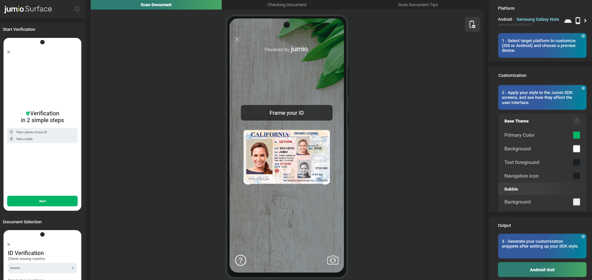

# ID Verification & Fastfill SDK for Android
Jumio’s ID Verification allows businesses to establish the genuine identity of their users by verifying government-issued IDs in real-time. ID Verification is used by financial service organizations and leading brands to create trust for safe onboarding, money transfers, and user authentication.

## Table of Contents
- [Release Notes](#release-notes)
- [Setup](#setup)
- [Dependencies](#dependencies)
- [Initialization](#initialization)
- [Configuration](#configuration)
- [Customization](#customization)
- [SDK Workflow](#sdk-workflow)
- [Custom UI](#custom-ui)
- [Callback](#callback)
- [Javadoc](https://jumio.github.io/mobile-sdk-android/)

## Release Notes
Please refer to our [Change Log](changelog.md) for more information. Current SDK version: 3.9.1

For breaking technical changes, please read our [transition guide](transition-guide_id-verification-fastfill.md)

## Setup
The [basic setup](../README.md#basics) is required before continuing with the following setup for ID Verification.

## Dependencies
Below there is a list of dependencies the application will need to work in Android. Some modules are mandatory, others are optional. If an optional module is __not linked__, some functionalities such as certain methods may not be available, but the library size will be reduced. The [Sample app](../sample/JumioMobileSample/) apk size with the products ID Verification, BAM, Document Verification and Authentication included is currently around __17 MB__.

```
dependencies {
    // mandatory
    implementation "com.jumio.android:core:3.9.1@aar"       // Jumio Core library
    implementation "com.jumio.android:nv:3.9.1@aar"         // Netverify library

    implementation "androidx.appcompat:appcompat:1.2.0"
    implementation "androidx.cardview:cardview:1.0.0"
    implementation "androidx.room:room-runtime:2.2.6"
    implementation "androidx.constraintlayout:constraintlayout:2.0.4"
    implementation "androidx.core:core-ktx:1.3.2"

    implementation "com.google.android.material:material:1.2.1"

    implementation "org.jetbrains.kotlinx:kotlinx-serialization-core:1.0.0"
    implementation "org.jetbrains.kotlinx:kotlinx-serialization-json:1.0.0"

    // not mandatory
    implementation "com.jumio.android:iproov:3.9.1@aar"       // Face Liveness library (iProov)
    implementation ("com.iproov.sdk:iproov:6.3.1"){           // Face Liveness library (iProov)
		    exclude group: 'org.json', module:'json'
	  }                                                         

    implementation "com.jumio.android:zoom:3.9.1@aar"             // Face Liveness library (ZoOm)
    implementation "com.facetec:zoom-authentication:8.12.1@aar"   // Face Liveness library (ZoOm)

    implementation "com.jumio.android:nv-barcode:3.9.1@aar"   // Barcode scanning
    implementation "com.jumio.android:nv-barcode-vision:3.9.1@aar"        // Barcode scanning alternative (reduced size)
    implementation "com.google.android.gms:play-services-vision:20.1.3"   // Barcode scanning alternative

    implementation "com.jumio.android:nv-mrz:3.9.1@aar"       // MRZ scanning
    implementation "com.jumio.android:nv-ocr:3.9.1@aar"       // Template matcher
    implementation "com.jumio.android:dv:3.9.1@aar"           // Document verification library
    implementation "com.jumio.android:auth:3.9.1@aar"         // Authentication library
    implementation "com.jumio.android:bam:3.9.1@aar"          // BAM checkout library

    implementation "com.jumio.android:nv-nfc:3.9.1@aar"       // eMRTD scanning
    implementation "org.jmrtd:jmrtd:0.7.24"                   // eMRTD Scanning
    implementation "org.ejbca.cvc:cert-cvc:1.4.6"             // eMRTD Scanning
    implementation "org.bouncycastle:bcprov-jdk15on:1.67"     // eMRTD Scanning
    implementation "net.sf.scuba:scuba-sc-android:0.0.18"     // eMRTD Scanning
}
```
__Note:__ "Mandatory" libraries in this case are needed for a minimal runnable SDK implementation. All libraries marked "not mandatory" are optional in the sense that they improve the scanning experience and supported documents, including additional ID type options that can be left out if they are not needed. Version numbers may vary.

#### Certified Liveness Vendor
Jumio offers the choice between two Certified Liveness vendors to determine liveness:

* iProov
* ZoOm

The SDK can only use one vendor at a time. Switching vendors during runtime is not possible. If both dependencies are linked in the same project, Jumio SDK will use iProov.

__Using iProov:__
```
implementation "com.jumio.android:iproov:3.9.1@aar"       
implementation ("com.iproov.sdk:iproov:6.3.1"){
    exclude group: 'org.json', module:'json'
}
```

iProov currently depends on okhttp 3.8.1, but also supports okhttp 4.x versions (Please refer to [Known Issues](known_issues.md#Issues-with-okhttp3-dependency-using-iproov) for detailed information.)

__Using ZoOm:__
```
implementation "com.jumio.android:zoom:3.9.1@aar"     
implementation "com.facetec:zoom-authentication:8.12.1@aar"
```

#### Barcode Alternative
As an alternative to the `com.jumio.android:nv-barcode` dependency, you can substitute the  `com.jumio.android:nv-barcode-vision` library together with the `com.google.android.gms:play-services-vision` library. If this combination is used in the application, the following lines have to be added to the application tag in the AndroidManifest.xml to avoid merge issues:
```
<meta-data
			android:name="com.google.android.gms.vision.DEPENDENCIES"
			android:value="barcode"
			tools:replace="android:value"/>
```
#### Operationality
In case you are using the [barcode alternative](#barcode-alternative) detailed above, the operationality of the Google Mobile Vision API can be checked with the following SDK method (see [NetverifyFragment](../sample/JumioMobileSample/src/main/java/com/jumio/sample/java/netverify/NetverifyFragment.java)  in Sample app):
```
GoogleVisionStatus NetverifySDK.isMobileVisionOperational(Activity activity, int requestCode);
```
__Note:__ The operationality check is only necessary if `com.google.android.gms:play-services-vision` is used.

This method returns an enum [GoogleVisionStatus](https://jumio.github.io/mobile-sdk-android/com/jumio/nv/NetverifySDK.GoogleVisionStatus.html) which can have the following 3 values:
* __OPERATIONAL__: API is up-to-date and can be used
* __NOT_OPERATIONAL__: API is not available
* __DIALOG_PENDING__: API is available but an user-resolvable error occured. The system dialog for the resolvable error is displayed (see [Google API reference](https://developers.google.com/android/reference/com/google/android/gms/common/GoogleApiAvailability))

In case of __DIALOG_PENDING__, the `requestCode` provided in the method above can used to react to the result of the dialog in the method `onActivityResult()` as follows (see [MainActivity](../sample/JumioMobileSample/src/main/java/com/jumio/sample/java/MainActivity.java)  in Sample app)):
```
@Override
	protected void onActivityResult(int requestCode, int resultCode, Intent data) {
		if (requestCode == NetverifyFragment.GOOGLE_VISION_REQUEST_CODE) {
			// Handle the system dialog result - try to initialize the SDK again if the error was resolved
		}
	}
```

### Others

#### ID Usage Within BAM
If you use ID Verification or Fastfill together with BAM Checkout in your app, add the following dependency:

```
implementation "com.jumio.android:bam:3.9.1@aar"
```

#### Root Detection
Applications implementing the SDK shall not run on rooted devices. Use either the below method or a self-devised check to prevent usage of SDK scanning functionality on rooted devices.
```
NetverifySDK.isRooted(Context context);
```

#### Device Supported Check
Call the method `isSupportedPlatform()` to check if the device platform is supported by the SDK.

```
NetverifySDK.isSupportedPlatform();
```

## Initialization
Using the SDK requires an activity declaration in your `AndroidManifest.xml`.

```
<activity
	android:theme="@style/Theme.Netverify"
	android:hardwareAccelerated="true"
	android:name="com.jumio.nv.NetverifyActivity"
	android:configChanges="orientation|screenSize|screenLayout|keyboardHidden"/>
```

You can specify your own theme (see chapter [Customization](#customization)). The orientation can be sensor based or locked with the attribute `android:screenOrientation`.

### Tutorials
* [Getting started (Video):](https://share.vidyard.com/watch/oAUXU1EWXco1mPUePz7Ue6) How to clone the repository and configure your Jumio credentials  
* [Introduction (Video):](https://share.vidyard.com/watch/nqUmPAaqG4bMy4Wh5wb9Kn) How to initialize the SDK, run the sample on your Android device, and test the identity verification user journey

Log into your Jumio customer portal. You can find your customer API token and API secret on the __Settings__ page under __API credentials__ tab. To create an instance for the SDK, perform the following call as soon as your activity is initialized.

```
private static String YOURAPITOKEN = ""; 
private static String YOURAPISECRET = "";

NetverifySDK netverifySDK = NetverifySDK.create(yourActivity, YOURAPITOKEN, YOURAPISECRET, JumioDataCenter.US);
```
Make sure that your customer API token and API secret are correct, specify an instance
of your activity and provide a reference to identify the scans in your reports (max. 100 characters or `null`). If your customer account is in the EU data center, use `JumioDataCenter.EU` instead. Alternatively, use `JumioDataCenter.SG` for Singapore.

__Note:__ We strongly recommend storing all credentials outside of your app!

## Configuration

### Tutorial
[Configuring behavior (Video):](https://share.vidyard.com/watch/BPT2jB51oUgkvRaAuKVb3q) How to configure the behavior of the app using SDK parameters

### ID Verification
Use ID Verification to receive a verification status and verified data points (see [Callback for ID Verification](https://github.com/Jumio/implementation-guides/blob/master/netverify/callback.md#callback-for-netverify)). Ensure that your customer account is allowed to use this feature. A callback URL can be specified for individual transactions (for constraints see chapter [Callback URL](https://github.com/Jumio/implementation-guides/blob/master/netverify/callback.md#callback-url)). This setting overrides any callback URL you have set in the Jumio Customer Portal.

__Note:__ Not possible for accounts configured as Fastfill only.
```
netverifySDK.setCallbackUrl("YOURCALLBACKURL");
```

__Note:__ The callback URL must not contain sensitive data like PII (Personally Identifiable Information) or account login.


Set the following setting to switch to Fastfill mode (which performs data extraction only):
```
netverifySDK.setEnableVerification(false);
```
Identity Verification is automatically enabled if it is activated for your account. Set the following setting to disable Identity Verification on a transaction level:
```
netverifySDK.setEnableIdentityVerification(false);
```

__Note:__ Identity Verification requires portrait orientation in your app.

### Preselection
You can specify issuing country  (using [ISO 3166-1 alpha-3](https://en.wikipedia.org/wiki/ISO_3166-1_alpha-3) country codes), ID type(s) and/or document variant to skip their selection during the scanning process. In the example down below Austria ("AUT") has been preselected, as well as a specific document variant (PLASTIC), and added PASSPORT and DRIVER_LICENSE as preselected document types. When all three parameters are preselected, the document selection screen in the SDK can be skipped entirely.

```
netverifySDK.setPreselectedCountry("AUT");
netverifySDK.setPreselectedDocumentVariant(NVDocumentVariant.PLASTIC);

ArrayList<NVDocumentType> documentTypes = new ArrayList<>();
documentTypes.add(NVDocumentType.PASSPORT);
documentTypes.add(NVDocumentType.DRIVER_LICENSE);
netverifySDK.setPreselectedDocumentTypes(documentTypes);
```
__Note:__ Fastfill does not support paper IDs, except German ID cards.

### Transaction Identifiers
The customer internal reference allows you to identify the scan (max. 100 characters).

```
netverifySDK.setCustomerInternalReference("YOURSCANREFERENCE");
```
Use the following property to identify the scan in your reports (max. 100 characters).
```
netverifySDK.setReportingCriteria("YOURREPORTINGCRITERIA");
```
You can also set a unique identifier for each user (max. 100 characters).

```
netverifySDK.setUserReference("USERREFERENCE");

```
__Note:__ Transaction identifiers must not contain sensitive data like PII (Personally Identifiable Information) or account login.

### Jumio Watchlist Screening
[Jumio Screening](https://www.jumio.com/screening/) is supported on the Jumio Android SDK. The following SDK method is used to set watchlist screening on transaction level. Enable to override the default search, or disable watchlist screening for this transaction.
```
netverifySDK.setWatchlistScreening(NVWatchlistScreening.ENABLED);
```
This method can be used to define the search profile for watchlist screening:
```
netverifySDK.setWatchlistSearchProfile("YOURPROFILENAME");
```

### Analytics Service
Use the following setting to explicitly send debug information to Jumio.
```
netverifySDK.setSendDebugInfoToJumio(true);
```

__Note:__ Only set this property to true if you are asked by Jumio Customer Service.

When `setSendDebugInfoToJumio()` is enabled, you receive a list of the current DebugSessionID by using `getDebugID()`. This method should be called either shortly after initializing or before dismissing the SDK.

```
netverifySDK.getDebugID();
```

### Offline Scanning
If you want to use the SDK in offline mode, please contact Jumio Customer Service at support@jumio.com or https://support.jumio.com. Once this feature is enabled for your account, you can find your offline token in your Jumio customer portal on the __Settings__ page in the __API credentials__ tab.

```
netverifySDK.create(rootActivity, YOUROFFLINETOKEN, COUNTRYCODE)
```

__Note:__ COUNTRYCODE is an optional parameter and can also be passed as `null`. In this case, no country is preselected in the SDK.

Possible countries: [ISO 3166-1 alpha-3](http://en.wikipedia.org/wiki/ISO_3166-1_alpha-3) country code, see also the [__Preselection__](#preselection) section above.

For offline scanning, use the *nv-barcode-vision library* instead of the *nv-barcode libary* and add the following meta-data tags to your `AndroidManifest.xml`:

```
<meta-data
			android:name="com.google.android.gms.version"
			android:value="@integer/google_play_services_version" />
<meta-data
			android:name="com.google.android.gms.vision.DEPENDENCIES"
			android:value="barcode"
			tools:replace="android:value"/>
```

### Miscellaneous
In case Fastfill is used (enableVerification=false), data extraction can be limited to be executed on device only by enabling `setDataExtractionOnMobileOnly`
```
netverifySDK.setDataExtractionOnMobileOnly(true);
```

Use `setCameraPosition` to configure the default camera (front or back).
```
netverifySDK.setCameraPosition(JumioCameraPosition.FRONT);
```

## Customization

### Customization Tool
[Jumio Surface](https://jumio.github.io/surface-android/) is a web tool that offers the possibility to apply and visualize, in real-time, all available customization options for the ID Verification and Fastfill SDK as well as an export feature to import the applied changes straight into your codebase.

[](https://jumio.github.io/surface-android/)

Use the tab __Customize SDK__ to check out all the screens and adapt the look & feel of the SDK to your needs.

The tab __XML Output__ visualizes all the colors that can be customized. As visualized in the code there, the SDK can be customized to fit your application's look and feel by specifying `Theme.Netverify` as a parent style and overriding attributes within this theme.

After customizing the SDK, you can copy the code from the theme `CustomNetverifyTheme` to your Android app `styles.xml` file.

### Tutorial
[Customizing appearance (Video):](https://share.vidyard.com/watch/rEkMfyhjRXb1G7ffYUioLK) How to customize the look and feel of your application using the Jumio Surface tool

__Customize iProov:__   

iProov appearance can be customized using:
```
<style name="CustomIproov" parent="Iproov.Customization">
```
This style has to be added to your main custom theme using:

```
<style name="CustomNetverifyTheme" parent="Theme.Netverify">
  ...
  <item name="iproov_customization">@style/CustomIproov</item>
  ...
</style>
```

__Customize Zoom:__   

Zoom appearance can be customized using:
```
<style name="CustomZoom" parent="Zoom.Customization">
<style name="CustomZoomLowLight" parent="Zoom.Customization.Lowlight">
```

One or both of these styles have to be added to your main custom theme using:

```
<style name="CustomNetverifyTheme" parent="Theme.Netverify">
  ...
  <item name="zoom_customization">@style/CustomZoom</item>
  <item name="zoom_customization_lowlight">@style/CustomZoomLowLight</item>
  ...
</style>
```

__Note:__ Using the surface tool will provide you with XML Output for both themes. Please make sure to customize accordingly and remove the styles you won't use.

### Customize Look and Feel
There are two possibilities for applying the customized theme that was explained in the previous chapter:
* Customizing theme in AndroidManifest
* Customizing theme at runtime

#### Customizing Theme in AndroidManifest
Apply the `CustomNetverifyTheme` that you defined before by replacing `Theme.Netverify` in the `AndroidManifest.xml:`
```
<activity
            android:name="com.jumio.nv.NetverifyActivity"
            android:theme="@style/CustomNetverifyTheme"
						... />
```

#### Customizing Theme at Runtime
To customize the theme at runtime, overwrite the theme that is used for ID Verification in the manifest by calling the following property. Use the resource ID of a customized theme that uses  `Theme.Netverify` as parent.

```
netverifySDK.setCustomTheme(CUSTOMTHEME);
```
__Note:__ Customizations should be applied before the SDK is initialized.

## SDK Workflow

### Initialization
Use the `initiate()` method to preload the SDK and avoid the loading spinner after the SDK start, be notified of successful initialization, successful scans, and error situations.  
```
netverifySDK.initiate(new NetverifyInitiateCallback() {
	@Override
	public void onNetverifyInitiateSuccess() {
		// YOURCODE
	}
	@Override
	public void onNetverifyInitiateError(String errorCode, String errorMessage, boolean retryPossible) {
		// YOURCODE
	}
});
```
To show the SDK, call the respective method below within your activity or fragment.

Activity: `netverifySDK.start();`
Fragment: `startActivityForResult(netverifySDK.getIntent(), NetverifySDK.REQUEST_CODE);`

__Note:__ The default request code is 200. To use another code, override the public static variable `NetverifySDK.REQUEST_CODE` before displaying the SDK.

### Working With Fastfill
Implement the standard `onActivityResult()` method in your activity or fragment for successful scans (`Activity.RESULT_OK`) and user cancellation notifications (`Activity.RESULT_CANCELED`). Call `netverifySDK.destroy()` once you received the result and don't need the instance anymore. If you want to scan multiple documents, you don't need to call delete on the netverifySDK instance. Simply check if the internal resources are deallocated by calling `netverifySDK.checkDeallocation(<NetverifyDeallocationCallback>)`. Once this callback is executed, it is safe to start another workflow. This check is optional and should only be called once the SDK has returned a result and another document scan needs to be performed.

```
protected void onActivityResult(int requestCode, int resultCode, Intent data) {
	if (requestCode == NetverifySDK.REQUEST_CODE) {
		if (resultCode == Activity.RESULT_OK) {
			// OBTAIN PARAMETERS HERE
			// YOURCODE
		} else if (resultCode == Activity.RESULT_CANCELED) {
			// String scanReference = data.getStringExtra(NetverifySDK.EXTRA_SCAN_REFERENCE);
			// String errorMessage = data.getStringExtra(NetverifySDK.EXTRA_ERROR_MESSAGE);
			// String errorCode = data.getStringExtra(NetverifySDK.EXTRA_ERROR_CODE);
			// YOURCODE
		}
		// CLEANUP THE SDK AFTER RECEIVING THE RESULT
		// if (netverifySDK != null) {
		// 	netverifySDK.destroy();
		//      netverifySDK.checkDeallocation(deallocationCallback)
		// 	netverifySDK = null;
		// }
	}
}
```

### Retrieving Information
The following tables give information on the specification of all document data parameters and errors.

#### Class ___NetverifyDocumentData___
|Parameter | Type  	| Max. length    | Description     |
|:-------------------|:----------- 	|:-------------|:-----------------|
|selectedCountry|	String|	3|	[ISO 3166-1 alpha-3](http://en.wikipedia.org/wiki/ISO_3166-1_alpha-3) country code as provided or selected|
|selectedDocumentType|	NVDocumentType |	|	PASSPORT, DRIVER_LICENSE, IDENTITY_CARD or VISA as provided or selected|
|idNumber|	String|	100	|Identification number of the document|
|personalNumber|	String|	14|	Personal number of the document|
|issuingDate|	Date|	|	Date of issue|
|expiryDate| Date|	|	Date of expiry|
|issuingCountry|	String|	3|	Country of issue as [ISO 3166-1 alpha-3](https://en.wikipedia.org/wiki/ISO_3166-1_alpha-3) country code|
|lastName|	String|	100	|Last name of the customer|
|firstName|	String|	100	|First name of the customer|
|dob|	Date|		|Date of birth|
|gender|	NVGender|		| Gender M, F or X|
|originatingCountry|	String|	3|	Country of origin as [ISO 3166-1 alpha-3](https://en.wikipedia.org/wiki/ISO_3166-1_alpha-3) country code|
|addressLine|	String|	64	|Street name|
|city|	String|	64	|City|
|subdivision|	String|	3|	Last three characters of [ISO 3166-2:US](https://en.wikipedia.org/wiki/ISO_3166-2:US) or [ISO 3166-2:CA](https://en.wikipedia.org/wiki/ISO_3166-2:CA) subdivision code	|
|postCode|	String|	15|	Postal code	|
|mrzData|	NetverifyMrzData|		|MRZ data, see table below|
|optionalData1|	String|	50|	Optional field of MRZ line 1|
|optionalData2|	String|	50	|Optional field of MRZ line 2|
|placeOfBirth|	String|	255	|Place of Birth	|
|extractionMethod|	NVExtractionMethod| |Extraction method used during scanning (MRZ, OCR, BARCODE, BARCODE_OCR or NONE) |
|imageData|	NetverifyImageData|	|Wrapper class for accessing image data for all scan sides from an ID verification session in case this is enabled by your Account Manager. See [NetverifyImageData](https://jumio.github.io/mobile-sdk-android/com/jumio/nv/NetverifyImageData.html) for details on how to retrieve the images|


#### Class ___NetverifyMrzData___
|Parameter  |Type 	| Max. length | Description      |
|:----------|:------|:------------|:-----------------|
|format|	NVMRZFormat|		|
|line1|	String|	50|	MRZ line 1	|
|line2|	String| 50|	MRZ line 2	|
|line3|	String|	50|	MRZ line 3	|
|idNumberValid|	boolean | | True if ID number check digit is valid, otherwise false	|
|dobValid| boolean | | True if date of birth check digit is valid, otherwise false	|
|expiryDateValid|	boolean| | True if date of expiry check digit is valid or not available, otherwise false |
|personalNumberValid	| boolean | |	True if personal number check digit is valid or not available, otherwise false |
|compositeValid| boolean | | True if composite check digit is valid, otherwise false	|

#### Error Codes
List of all **_error codes_** that are available via the `code` property of the `NetverifyError` object. The first letter (A-J) represents the error case. The remaining characters are represented by numbers that contain information helping us understand the problem situation([x][yyyy]).

|Code        	  | Message  | Description      |
| :--------------:|:---------|:-----------------|
|A[x][yyyy]| We have encountered a network communication problem | Retry possible, user decided to cancel |
|B[x][yyyy]| Authentication failed | Secure connection could not be established, retry impossible |
|C[x]0401| Authentication failed | API credentials invalid, retry impossible |
|E[x]0000| No Internet connection available | Retry possible, user decided to cancel |
|F00000| Scanning not available at this time, please contact the app vendor | Resources cannot be loaded, retry impossible |
|G00000| Cancelled by end-user | No error occurred |
|H00000| The camera is currently not available | Camera cannot be initialized, retry impossible |
|I00000| Certificate not valid anymore. Please update your application | End-to-end encryption key not valid anymore, retry impossible |
|J00000| Transaction already finished | User did not complete SDK journey within session lifetime |
|N00000| Scanning not available at this time, please contact the app vendor | Required images are missing to finalize the acquisition |

__Note:__ Please always include the whole code when filing an error related issue to our support team.

## Custom UI
ID Verification can be also implemented as a __custom scan view.__ This means that only the scan view (including the scan overlays) are provided by the SDK.
The handling of the lifecycle, document selection, readability confirmation, intermediate callbacks, and all other steps necessary to complete a scan have to be handled by the client application that implements the SDK.

The following sequence diagram outlines the components, callbacks and user flow for a basic ID Verification:


**Note:** The new 3D face liveness capturing technology is not optimized for tablets. When using Identity Verification, the face scanner will fallback to a simple face capturing functionality instead. Portrait orientation support is required in your app.

To use the custom scan view with a plain scanning user interface, specify an instance of your class which implements the [NetverifyCustomSDKInterface](https://jumio.github.io/mobile-sdk-android/com/jumio/nv/custom/NetverifyCustomScanInterface.html). You will receive a [NetverifyCustomSDKController](https://jumio.github.io/mobile-sdk-android/com/jumio/nv/custom/NetverifyCustomSDKController.html) object.

```
NetverifyCustomSDKController netverifyCustomSDKController = sdk.start(yourNetverifyCustomSDKInterface);
```

Upon `onNetverifyCountriesReceived` within *yourNetverifyCustomSDKInterface*, specify country, document type, and document variant to receive all relevant scan parts for the specific document. For example:

```
@Override
public void onNetverifyCountriesReceived(HashMap<String, NetverifyCountry>
countryList, String userCountryCode) {
    // YOURCODE
    // List<ScanSide> netverifyScanSides = netverifyCustomSDKController.setDocumentConfiguration(netverifyCountries.get("USA"), NVDocumentType.PASSPORT, NVDocumentVariant.PLASTIC);
}
```

**[NetverifyCountry](https://jumio.github.io/mobile-sdk-android/com/jumio/nv/custom/NetverifyCountry.html)** methods:
```
public String getIsoCode();
public Set<NVDocumentType> getDocumentTypes();
public Set<NVDocumentVariant> getDocumentVariants(NVDocumentType documentType);
```

**[NVDocumentType](https://jumio.github.io/mobile-sdk-android/com/jumio/nv/data/document/NVDocumentType.html)** values: `PASSPORT`, `VISA`, `ID_CARD`, `DRIVER_LICENSE`

**[NVDocumentVariant](https://jumio.github.io/mobile-sdk-android/com/jumio/nv/data/document/NVDocumentVariant.html)** values: `PAPER`, `PLASTIC`

**[NetverifyScanMode](https://jumio.github.io/mobile-sdk-android/com/jumio/nv/custom/NetverifyScanMode.html)** values: `BARCODE`, `FACE_MANUAL`, `FACE_IPROOV`, `FACE_ZOOM`, `MANUAL`, `MRZ`, `NFC`, `OCR_CARD`, `OCR_TEMPLATE`

**[NVScanSide](https://jumio.github.io/mobile-sdk-android/com/jumio/core/data/document/ScanSide.html)** values: `FRONT`, `BACK`, `FACE`

`onNetverifyUserConsentRequried()` within *yourNetverifyCustomSDKInterface* is invoked when the end-user’s consent to Jumio’s privacy policy is legally required. [`setUserConsented()`](https://jumio.github.io/mobile-sdk-android/com/jumio/nv/custom/NetverifyCustomSDKController.html#setUserConsented--) needs to be called after the end-user has accepted.

After `onNetverifyResourcesLoaded()` within *yourNetverifyCustomSDKInterface*, start scanning by providing a ScanSide from the list above (`FRONT`, `BACK`, `FACE`), an instance of the class `NetverifyCustomScanView` and `NetverifyCustomConfirmationView`, and an instance of your class which implements the `NetverifyCustomScanInterface`. You will receive a `NetverifyCustomScanPresenter` object.

### NetverifyCustomScanView Presentation
Add your `NetverifyCustomScanView` to your layout and specify desired layout attributes using
* a specific __width,__ and set height as wrap_content
* or a specific __height,__ and set width as wrap_content
* or set __width__ and __height__ to match_parent (full screen).

Using width or height as wrap_content, the `NetverifyCustomScanView` attribute ratio needs to be set to any float value between screen width/screen height (e.g. portrait 720/1280 = ~0.6) and 4:3 (1.33). If your `NetverifyCustomScanView` is added to your layout via xml, specify the namespace below to access the custom attribute *yourNameSpace:ratio*. Face scans should only be done in portrait orientation with a recommended ratio of 0.7 or smaller.
```
xmlns:yourNameSpace="http://schemas.android.com/apk/lib/com.jumio.mobile.sdk"
```
The position and image of the close button for face scanning can also be customized. Please have a look at the [`NetverifyCustomScanView`](https://jumio.github.io/mobile-sdk-android/com/jumio/nv/custom/NetverifyCustomScanView.html)

The position of the branding logo within the `NetverifyCustomScanView` can be adjusted by setting a top margin. See method
[`setBrandingLogoTopMargin(int topMargin)`](https://jumio.github.io/mobile-sdk-android/com/jumio/nv/custom/NetverifyCustomScanView.html#setBrandingLogoTopMargin-int-)

To customize the overlay inside the `NetverifyCustomScanView` there need to be some style attributes defined in the current them. Please have a look at our [Sample app](../sample/JumioMobileSample/src/main/res/values/styles.xml#L12) and make sure you have every attribute starting with `netverify_` and `face_` defined.

### NetverifyCustomScanViewController
Upon `onNetverifyCameraAvailable()` within *yourNetverifyCustomScanInterface*, you can perform the following actions using the `netverifyCustomScanViewController`:

* Get the active scan mode
* Get the help text for the active scan mode
* Check if front and back camera available
* Check if front camera used
* Switch between front and back camera
* Check if flash available
* Check if flash enabled
* Switch flash mode (on or off)
* Check if scan fallback is possible
* Switch from default scan mode (MRZ or bar code) to fallback - remember to get the new scan mode and help text with the available getters after that
* Stop/Retry card scanning
* Pause/Resume extraction - the camera preview keeps running in the meantime

### Retrieving the Current Help Animation
[`NetverifyCustomScanPresenter.getHelpAnimation()`](https://jumio.github.io/mobile-sdk-android/com/jumio/nv/custom/NetverifyCustomScanPresenter.html#getHelpAnimation-com.jumio.nv.custom.NetverifyCustomAnimationView-) can be used to get the specific help animation for the currently active scan mode. An instance of [`NetverifyCustomAnimationView`](https://jumio.github.io/mobile-sdk-android/com/jumio/nv/custom/NetverifyCustomAnimationView.html) needs to be passed where the animation is rendered in.

### Take Picture Manually
Call `showShutterButton()` to determine if the image will be taken manually. If so, display your shutter button and call `takePicture()` once clicked.

### Activity Lifecycle Handling
To handle the activity lifecycle correctly, call `pause` and `resume` from the `NetverifyCustomSDKController` and `NetverifyCustomScanPresenter` if currently active. Also make sure to keep instances of `NetverifySDK`, `NetverifyCustomSDKController` and `NetverifyCustomScanPresenter` static and call their `recreate` functions in case the hosting activity gets recreated.

### Handling Camera Session
Implement the following methods within
* *NetverifyCustomScanInterface* for camera, extraction, confirmation view
and special notifications.
* *NetverifyCustomSDKInterface* for general SDK notifications.

Upon `onNetverifyPresentConfirmationView`, you can hide the scan view and show the confirmation view (asking user to confirm the image), retry, and/or confirm the scan. The [NetverifyConfirmationType](https://jumio.github.io/mobile-sdk-android/com/jumio/nv/custom/NetverifyConfirmationType.html) defines the type of confirmation that is displayed to the user.
* `GENERIC` refers to the quality of the document. The user should confirm if everything in the picture is readable and glare-free.
* `CHECK_DOCUMENT_SIDE` refers to the scanned side of the document. The user should confirm that the scanned side matches the requested one.

**Note:** *yourNetverifyCustomScanView* can be added to your layout by specifying any desired layout attributes, see [Layout CustomScanView](####layout-customscanview) above.

Upon `onNetverifyFaceInLandscape()`, notify the user that he should rotate the device to portrait orientation to continue with face scanning, since face scanning is not possible in landscape orientation.

Upon `onNetverifyShowLegalAdvice()`, it is necessary to display the provided legal advice to the user.

Upon `onNetverifyDisplayBlurHint()`, it is necessary to  notify the user that the image is blurry and therefore can't be taken. (This method is available for manual image capturing only.)

Upon `onNetverifyScanForPartFinished()`, call `netverifyCustomScanViewController.destroy()` to release all resources before scanning the next part, until all parts are scanned. Once completed, call `netverifyCustomSDKController.finish()` to finish the scan.

Upon `onNetverifyScanForPartCanceled`, the scan for this part has been canceled by the SDK and can be retried.

__Fastfill US driver license scan:__
Upon `onNetverifyNoUSAddressFound()`, if after a Fastfill US Driver License back side scan in barcode mode no US address was found, you can start a front side scan in OCR mode as a fallback to receive the address (if needed) and/or confirm the scan.

__NFC:__
`getNetverifyCustomNfcInterface()` is called when the NFC scan is getting prepared. If no NFC scan should be done, `null` can be returned here. Please check the documentation for [`NetverifyCustomNfcInterface`](https://jumio.github.io/mobile-sdk-android/com/jumio/nv/nfc/custom/NetverifyCustomNfcInterface.html)

Upon `onNetverifyStartNfcExtraction()`, the NFC scan can be started and controlled with the provided [`NetverifyCustomNfcPresenter`](https://jumio.github.io/mobile-sdk-android/com/jumio/nv/nfc/custom/NetverifyCustomNfcPresenter.html).
The NFC help animation can be retrieved from the `NetverifyCustomNfcPresenter` via method `getHelpAnimation(NetverifyCustomAnimationView customAnimationView)`.
Please check out the NFC handling in our Sample app in class [`NetverifyCustomScanFragment`](https://github.com/Jumio/mobile-sdk-android/blob/master/sample/JumioMobileSample/src/main/java/com/jumio/sample/kotlin/netverify/customui/NetverifyCustomScanFragment.kt)
Once the phone is positioned on the NFC chip of a Passport, NFC scanning starts automatically.

### Retrieving Information in Custom UI

#### Result and Error Handling
Instead of using the standard method `onActivityResult()`, implement the following methods within *yourNetverifyCustomSDKInterface* for successful scans and error notifications:

The method `onNetverifyFinished(Bundle data)` has to be implemented to handle data after a successful scan.

The method `onNetverifyError(String errorCode, String errorMessage, boolean retryPossible, String scanReference)` has to be implemented to handle data after an unsuccessful scan. You can show the error message and/or call `netverifyCustomSDKController.retry()` if a retry is possible.

__Note__: Error codes are listed [here](#error-codes).

Please refer to the section [Retrieving information](#retrieving-information) to see more about returning extracted data.

#### Clean Up
After handling the result, it is very important to clean up the SDK by calling  `netverifyCustomSDKController.destroy()` and `netverifySDK.destroy()`. If you want to scan multiple documents, you don't need to call delete the netverifySDK instance. Simply check if the internal resources are deallocated by calling `netverifySDK.checkDeallocation(<NetverifyDeallocationCallback>)`. Once this callback is executed, it is safe to start another workflow. This check is optional and should only be called once the SDK has returned a result and another document scan needs to be performed.

## Callback
To get information about callbacks, __Netverify Retrieval API,__ __Netverify Delete API,__ Global ID Verification settings, and more, please refer to our [page with server related information](https://github.com/Jumio/implementation-guides/blob/master/netverify/callback.md).
