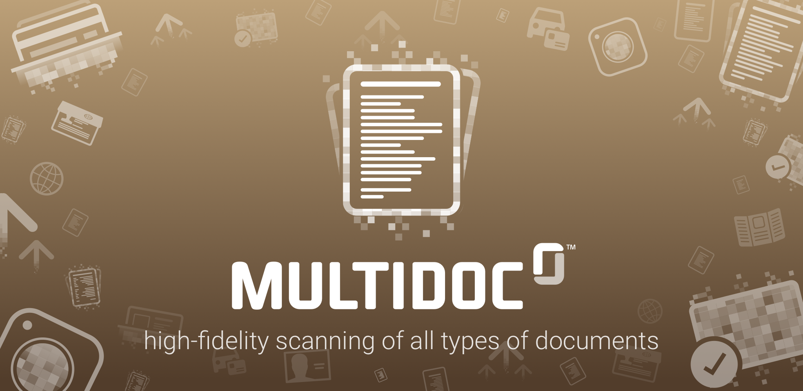

# Netverify Multi Document Mobile SDK for Android
Netverify Multi Document Mobile is a powerful solution to enable capturing various types (Utility Bill, Bank statement and many others) of your customer's documents in your mobile application within seconds, also supporting data extraction from US social security cards, UK Utility Bills and French Bank Statements.

## Table of Content

- [Release notes](#release-notes)
- [Setup](#setup)
- [Integration](#integration)
- [Configuration](#configuration)
- [Customization](#customization)
- [SDK Workflow](#sdk-workflow)
- [Callback](#callback)

## Release notes
For changes in the technical area, please read our [transition guide](transition-guide_multi-document.md).

#### Additions
* Device root check functionality

## Setup
The [basic setup](../README.md#basic-setup) is required before continuing with the following setup for MultiDocument.

Using the SDK requires an activity declaration in your AndroidManifest.xml.

```
<activity
	android:theme="@style/Theme.MultiDocument"
	android:hardwareAccelerated="true"
	android:name="com.jumio.bam.BamActivity"
	android:configChanges="orientation|screenSize|screenLayout|keyboardHidden"/>
```

You can specify your own theme (see [Customization](#customizing-look-and-feel) chapter). The orientation can be sensor based or locked with the attribute `android:screenOrientation`.


## Integration

### Dependencies

| Dependency        | Mandatory           | Description       |
| ---------------------------- |:-------------:|:-----------------|
| com.jumio.android:core:2.5.0@aar                   | x | Jumio Core library|
| com.jumio.android:md:2.5.0@aar                     | x | Multi Document library |
|com.android.support:appcompat-v7:25.1.0             | x | Android native library|
|com.android.support:support-v4:25.1.0               | x | Android native library|
|com.jumio.android:javadoc:2.5.0                     |   | Jumio SDK Javadoc|

If an optional module is not linked, the scan method is not available but the library size is reduced.

Applications implementing the SDK shall not run on rooted devices. Use either the below method or a self-devised check to prevent usage of SDK scanning functionality on rooted devices.
```
MultiDocumentSDK.isRooted(Context context);
```

Call the method `isSupportedPlatform` to check if the device is supported.
```
MultiDoucmentSDK.isSupportedPlatform();
```

Check the Android Studio sample projects to learn the most common use.

## Initialization
To create an instance for the SDK, perform the following call as soon as your activity is initialized.

```
private static String YOURAPITOKEN = ""; 
private static String YOURAPISECRET = "";

MultiDocumentSDK netverifySDK = MultiDocumentSDK.create(yourActivity, YOURAPITOKEN, YOURAPISECRET, JumioDataCenter.US);
```
Make sure that your merchant API token and API secret are correct, specify an instance
of your activity and provide a reference to identify the scans in your reports (max. 100 characters or `null`). If your merchant account is in the EU data center, use `JumioDataCenter.EU` instead.

__Note:__ Log into your Jumio merchant backend, and you can find your merchant API token and API secret on the "Settings" page under "API credentials". We strongly recommend you to store credentials outside your app.

## Configuration

### Document type
Use `setType` to pass the document type.
```
multiDocumentSDK.setType("DOCUMENTTYPE");
```

Possible types:

*  BS (Bank statement)
*  IC (Insurance card)
*  UB (Utility bill, front side)
*  CAAP (Cash advance application)
*  CRC (Corporate resolution certificate)
*  CCS (Credit card statement)
*  LAG (Lease agreement)
*  LOAP (Loan application)
*  MOAP (Mortgage application)
*  TR (Tax return)
*  VT (Vehicle title)
*  VC (Voided check)
*  STUC (Student card)
*  HCC (Health care card)
*  CB (Council bill)
*  SENC (Seniors card)
*  MEDC (Medicare card)
*  BC (Birth certificate)
*  WWCC (Working with children check)
*  SS (Superannuation statement)
*  TAC (Trade association card)
*  SEL (School enrolment letter)
*  PB (Phone bill)
*  USSS (US social security card)
*  SSC (Social security card)
*  CUSTOM (Custom document type)

#### Custom Document Type
Use the following method to pass your custom document code. Maintain your custom document code within your Jumio merchant backend under "Settings" - "Multi Documents" - "Custom".
```
multiDocumentSDK.setCustomDocumentCode("YOURCUSTOMDOCUMENTCODE");
```

### Country
The country needs to be in format [ISO-3166-1 alpha 3](http://en.wikipedia.org/wiki/ISO_3166-1_alpha-3) or XKX for Kosovo.
```
multiDocumentSDK.setCountry("USA");
```

### Transaction identifiers

Use the following property to identify the scan in your reports (max. 100 characters).
```
multiDocumentSDK.setMerchantReportingCriteria("YOURREPORTINGCRITERIA");
```

A callback URL can be specified for individual transactions constraints see chapter [Callback URL](#callback-url)). This setting overrides your Jumio merchant settings.
```
multiDocumentSDK.setCallbackUrl("YOURCALLBACKURL");
```

You can also set an additional information parameter (max. 255 characters).

__Note:__ The additional information should not contain sensitive data like PII (Personally Identifiable Information) or account login.
```
multiDocumentSDK.setAdditionalInformation("ADDITIONALINFORMATION");
```


### Miscellaneous
Use the following property to identify the scan in your reports (max. 100 characters).
```
multiDocumentSDK.setMerchantScanReference("YOURSCANREFERENCE");
```

You can also set a customer identifier (max. 100 characters).
```
multiDocumentSDK.setCustomerId("CUSTOMERID");
```

__Note:__ The customer ID and merchant scan reference should not contain sensitive data like PII (Personally Identifiable Information) or account login.

Use setCameraPosition to configure the default camera (front or back).
```
multiDocumentSDK.setCameraPosition(JumioCameraPosition.FRONT);
```

Use the following method to disable the help screen before scanning:
```
multiDocumentSDK.setShowHelpBeforeScan(false);
```

Use setDocumentName to override the document label on Help screen.
```
multiDocumentSDK.setDocumentName(“YOURDOCNAME”);
```

## Customization

### Customizing look and feel
The SDK can be customized to fit your application’s look and feel by specifying `Theme.MultiDocument` as a parent style of your own theme. Click on the element `Theme.MultiDocument` in the manifest while holding Ctrl and Android Studio will display the available items.

### Customizing theme at runtime

To customize the theme at runtime, overwrite the theme that is used for Netverify in the manifest by adding the line of code below. Use the resource id of a customized theme that uses `Theme.Netverify` as parent.
```
multiDocumentSDK.setCustomTheme(CUSTOMTHEME);
```

## SDK Workflow

### Starting the SDK

To show the SDK, call the respective method below within your activity or fragment.

Activity: `MultiDocumentSDK.start();` <br/>
Fragment: `startActivityForResult(multiDocumentSDK.getIntent(),MultiDocumentSDK.REQUEST_CODE);`

__Note:__ The default request code is 200. To use another code, override the public static variable `MultiDocumentSDK.REQUEST_CODE` before displaying the SDK.

### Retrieving information

Implement the standard `onActivityResult` method in your activity or fragment for successful scans (`Activity.RESULT_OK`) and user cancellation notifications (`Activity.RESULT_CANCELED`). Call `multiDocumentSDK.destroy()` once you received the result.

```
protected void onActivityResult(int requestCode, int resultCode, Intent data) {
	if (requestCode == MultiDocumentSDK.REQUEST_CODE) {
		if (resultCode == Activity.RESULT_OK) {
			// OBTAIN PARAMETERS HERE
			// YOURCODE
		} else if (resultCode == Activity.RESULT_CANCELED) {
			// String scanReference = data.getStringExtra(MultiDocumentSDK.EXTRA_SCAN_REFERENCE);
			// int errorCode = data.getIntExtra(MultiDocumentSDK.EXTRA_ERROR_CODE, 0);
			// String errorMessage = data.getStringExtra(MultiDocumentSDK.EXTRA_ERROR_MESSAGE);
			// YOURCODE
		}
		// multiDocumentSDK.destroy();
	}
}
```

Class **_Error codes_**:

|Code        			| Message   | Description    |
| :--------------:|:----------|:---------------|
|100<br/>110<br/>130<br/>140<br/>150<br/>160| We have encountered a network communication problem | Retry possible, user decided to cancel |
|210<br/>220| Authentication failed | API credentials invalid, retry impossible |
|230| No Internet connection available | Retry possible, user decided to cancel |
|250| Cancelled by end-user | No error occurred |
|260| The camera is currently not available | Camera cannot be initialized, retry impossible |
|280| Certificate not valid anymore. Please update your application | End-to-end encryption key not valid anymore, retry impossible |

## Callback
To get information about callbacks, Netverify Retrieval API, Netverify Delete API and Global Netverify settings and more, please read our [page with server related information](integration_callback.md).

## Copyright

&copy; Jumio Corp. 268 Lambert Avenue, Palo Alto, CA 94306
