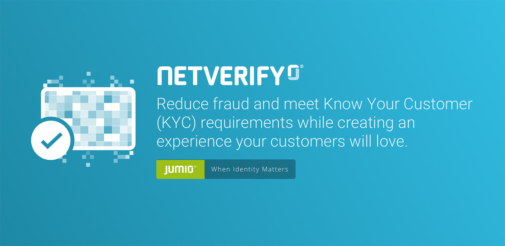

# Fastfill & Netverify SDK for Android
Jumio’s Netverify® ID Verification allows businesses to establish the genuine identity of their users by verifying government-issued IDs in real-time. ID Verification is used by financial service organizations and leading brands to create trust for safe onboarding, money transfers, and user authentication.

## Table of Content

- [Release notes](#release-notes)
- [Setup](#setup)
- [Dependencies](#dependencies)
- [Initialization](#integration)
- [Configuration](#configuration)
- [Customization](#customization)
- [SDK Workflow](#sdk-workflow)
- [Custom UI](#custom-ui)
- [Callback](#callback)
- [Javadoc](https://jumio.github.io/mobile-sdk-android/)

## Release notes
For technical changes, please read our [transition guide](transition-guide_netverify-fastfill.md) SDK version: 3.4.0

## Setup
The [basic setup](../README.md#basic-setup) is required before continuing with the following setup for Netverify.

Using the SDK requires an activity declaration in your `AndroidManifest.xml`.

```
<activity
	android:theme="@style/Theme.Netverify"
	android:hardwareAccelerated="true"
	android:name="com.jumio.nv.NetverifyActivity"
	android:configChanges="orientation|screenSize|screenLayout|keyboardHidden"/>
```

You can specify your own theme (see chapter [Customization](#customization)). The orientation can be sensor based or locked with the attribute `android:screenOrientation`.

If you are using eMRTD scanning, the following lines are needed in your `proguard-rules.pro` file:

```
-keep class net.sf.scuba.smartcards.IsoDepCardService {*;}
-keep class org.jmrtd.** { *; }
-keep class net.sf.scuba.** {*;}
-keep class org.bouncycastle.** {*;}
-keep class org.ejbca.** {*;}

-dontwarn java.nio.**
-dontwarn org.codehaus.**
-dontwarn org.ejbca.**
-dontwarn org.bouncycastle.**
-dontwarn org.jmrtd.PassportService
-dontwarn net.sf.scuba.**
```

If you want to use offline scanning for Fastfill please contact your Jumio Customer Success Manager.

## Dependencies

If an optional module is __not linked__, the __scan method is not available__ but the library size is reduced.
The [Sample app](https://github.com/Jumio/mobile-sdk-android/blob/master/sample/JumioMobileSample/) apk size with the products Netverify, BAM, Document Verification and Authentication included is currently __27.44 MB__.

|Dependency        | Mandatory           | Description            | Size (Jumio libs only) |
| ---------------- |:-------------------:|:------------------------|:---------:|
|com.jumio.android:core:3.4.0@aar                     | x | Jumio Core library		                         			 | 4.10 MB |
|com.jumio.android:nv:3.4.0@aar                       | x | Netverify library 		                         			 | 524.34 KB |
|androidx.appcompat:appcompat:1.1.0                   | x | Android appcompat library	                           | - |
|androidx.cardview:cardview:1.0.0                     | x | Android cardview library (Netverify only)	           | - |
|androidx.room:room-runtime:2.2.1                     | x | Android database object mapping library	         		 | - |
|androidx.constraintlayout:constraintlayout:1.1.3     | x | Android constraint layout library 			             | - |
|com.google.android.gms:play-services-vision:18.0.0   |   | Barcode Scanning 			                 							 | - |
|com.jumio.android:face:3.4.0@aar                     |   | Face library	                                 			 | 91.37 KB |
|com.facetec:zoom-authentication:8.0.11@aar            |   | Zoom face scanning library	                         | 9.00 MB |
|com.google.android.material:material:1.0.0           |   | Android material design library	                 		 | - |
|com.jumio.android:javadoc:3.4.0                      |   | Jumio SDK Javadoc			                 							 | - |
|com.jumio.android:nv-barcode:3.4.0@aar               |   | US / CAN Barcode Scanning                            | 3.13 MB |
|com.jumio.android:nv-barcode-vision:3.4.0@aar        |   | US / CAN Barcode Scanning Alternative (reduced size) | 38.88 KB |
|com.jumio.android:nv-mrz:3.4.0@aar                   |   | MRZ scanning                                         | 2.09 MB |
|com.jumio.android:nv-nfc:3.4.0@aar                   |   | eMRTD Scanning                                       | 771.16 KB |
|org.bouncycastle:bcprov-jdk15on:1.61                 |   | eMRTD Scanning                                       | - |
|net.sf.scuba:scuba-sc-android:0.0.18                 |   | eMRTD Scanning                                       | - |
|com.jumio.android:nv-ocr:3.4.0@aar                   |   | Template Matcher                                     | 1.07 MB |

#### Dependency conflicts
If the dependency `com.jumio.android:nv-barcode-vision` is used in the application, the following lines have to be added to the application tag in the AndroidManifest.xml to avoid merge issues (see [AndroidManifest.xml](https://github.com/Jumio/mobile-sdk-android/blob/master/sample/JumioMobileSample/src/main/AndroidManifest.xml) in Sample app):
```
<meta-data
			android:name="com.google.android.gms.vision.DEPENDENCIES"
			android:value="barcode"
			tools:replace="android:value"/>
```

#### Operationality
The operationality of the Google Mobile Vision API can be checked with the following SDK method (see [NetverifyFragment](https://github.com/Jumio/mobile-sdk-android/blob/master/sample/JumioMobileSample/src/main/java/com/jumio/sample/java/NetverifyFragment.java)  in Sample app):
```
GoogleVisionStatus NetverifySDK.isMobileVisionOperational(Activity activity, int requestCode);
```
This method returns an enum [GoogleVisionStatus](https://jumio.github.io/mobile-sdk-android/com/jumio/nv/NetverifySDK.GoogleVisionStatus.html) which can have the following 3 values:
* __OPERATIONAL__: API is up-to-date and can be used
* __NOT_OPERATIONAL__: API is not available
* __DIALOG_PENDING__: API is available but an user-resolvable error occured. The system dialog for the resolvable error is displayed (see [Google API reference](https://developers.google.com/android/reference/com/google/android/gms/common/GoogleApiAvailability))

In case of __DIALOG_PENDING__, the `requestCode` provided in the method above can used to react to the result of the dialog in the method `onActivityResult()` as follows (see [MainActivity](https://github.com/Jumio/mobile-sdk-android/blob/master/sample/JumioMobileSample/src/main/java/com/jumio/sample/java/MainActivity.java)  in Sample app)):
```
@Override
	protected void onActivityResult(int requestCode, int resultCode, Intent data) {
		if (requestCode == NetverifyFragment.GOOGLE_VISION_REQUEST_CODE) {
			// Handle the system dialog result - try to initialize the SDK again if the error was resolved
		}
	}
```

### Others

#### Netverify usage with BAM
If you use Netverify and BAM Checkout in your app, add the following dependency:

```
implementation "com.jumio.android:bam:3.4.0@aar"
```

#### Root detection
Applications implementing the SDK shall not run on rooted devices. Use either the below method or a self-devised check to prevent usage of SDK scanning functionality on rooted devices.
```
NetverifySDK.isRooted(Context context);
```

#### Device supported check
Call the method `isSupportedPlatform` to check if the device platform is supported by the SDK.

```
NetverifySDK.isSupportedPlatform();
```

## Initialization
To create an instance for the SDK, perform the following call as soon as your activity is initialized.

```
private static String YOURAPITOKEN = ""; 
private static String YOURAPISECRET = "";

NetverifySDK netverifySDK = NetverifySDK.create(yourActivity, YOURAPITOKEN, YOURAPISECRET, JumioDataCenter.US);
```
Make sure that your customer API token and API secret are correct, specify an instance
of your activity and provide a reference to identify the scans in your reports (max. 100 characters or `null`). If your customer account is in the EU data center, use `JumioDataCenter.EU` instead.

__Note:__ Log into your Jumio customer portal, and you can find your customer API token and API secret on the "Settings" page under "API credentials". We strongly recommend you to store credentials outside your app.

## Configuration

### ID verification

By default the Jumio SDK enables Netverify which performs a full ID verification in the default mode.

Use ID verification to receive a verification status and verified data positions (see [Callback for Netverify](https://github.com/Jumio/implementation-guides/blob/master/netverify/callback.md#callback-for-netverify)). Ensure that your customer account is allowed to use this feature. A callback URL can be specified for individual transactions (for constraints see chapter [Callback URL](https://github.com/Jumio/implementation-guides/blob/master/netverify/callback.md#callback-url)). This setting overrides any callback URL you have set in the Jumio Customer Portal.

__Note:__ Not possible for accounts configured as Fastfill only.
```
netverifySDK.setCallbackUrl("YOURCALLBACKURL");
```
Set the following setting to switch to Fastfill mode (which performs data extraction only)
```
netverifySDK.setEnableVerification(false);
```
Identity Verification is automatically enabled if it is activated for your account.
__Note:__ Identity Verification requires portrait orientation in your app.
Set the following setting to disable Identity Verification on a transaction level:
```
netverifySDK.setEnableIdentityVerification(false);
```

### Preselection

You can specify issuing country  ([ISO 3166-1 alpha-3](https://en.wikipedia.org/wiki/ISO_3166-1_alpha-3) country code), ID type(s) and/or document variant to skip their selection during the scanning process.<br />
__Note:__ Fastfill does not support paper IDs, except German ID cards.
```
netverifySDK.setPreselectedCountry("AUT");
netverifySDK.setPreselectedDocumentVariant(NVDocumentVariant.PLASTIC);

ArrayList<NVDocumentType> documentTypes = new ArrayList<>();
documentTypes.add(NVDocumentType.PASSPORT);
documentTypes.add(NVDocumentType.DRIVER_LICENSE);
netverifySDK.setPreselectedDocumentTypes(documentTypes);
```

### Transaction identifiers

The customer internal reference allows you to identify the scan (max. 100 characters).

__Note:__ Must not contain sensitive data like PII (Personally Identifiable Information) or account login.
```
netverifySDK.setCustomerInternalReference("YOURSCANREFERENCE");
```
Use the following property to identify the scan in your reports (max. 100 characters).
```
netverifySDK.setReportingCriteria("YOURREPORTINGCRITERIA");
```
You can also set a user reference (max. 100 characters).

__Note:__ The user reference must not contain sensitive data like PII (Personally Identifiable Information) or account login.
```
netverifySDK.setUserReference("USERREFERENCE");
```

### eMRTD

Use `setEnableEMRTD` to read the NFC chip of an eMRTD.
```
netverifySDK.setEnableEMRTD (true);
```
__Note:__ Not available for Fastfill as it is a Netverify feature.

### Analytics Service

Use the following setting to explicitly send debug information to Jumio.
```
netverifySDK.setSendDebugInfoToJumio(true);
```

__Note:__ Only set this property to true if you are asked by Jumio Customer Service.

You receive a list of the current DebugSessionID by using getDebugID. This method can be called either after initializing or before dismissing the SDK.

```
netverifySDK.getDebugID();
```

### Offline scanning

If you want to use Fastfill in offline mode please contact Jumio Customer Service at support@jumio.com or https://support.jumio.com. Once this feature is enabled for your account, you can find your offline token in your Jumio customer portal on the "Settings" page under "API credentials".

```
netverifySDK.create(rootActivity, YOUROFFLINETOKEN, COUNTRYCODE)
```

__Note:__ COUNTRYCODE is an optional parameter and can also be passed as `null`. In this case no country is preselected in the SDK.

Possible countries: [ISO 3166-1 alpha-3](http://en.wikipedia.org/wiki/ISO_3166-1_alpha-3) country code

Use the nv-barcode-vision library instead of the nv-barcode libary and add the following meta-data tags to your `AndroidManifest.xml`:

```
<meta-data
			android:name="com.google.android.gms.version"
			android:value="@integer/google_play_services_version" />
<meta-data
			android:name="com.google.android.gms.vision.DEPENDENCIES"
			android:value="barcode"
			tools:replace="android:value"/>
```

### Watchlist screening
[Jumio Screening](https://www.jumio.com/screening/) is supported on the Jumio Android SDK. The following SDK method is used to set watchlist screening on transaction level. Enable to override the default search, or disable watchlist screening for this transaction.
```
netverifySDK.setWatchlistScreening(NVWatchlistScreening.ENABLED);
```
This method can be used to define the search profile for watchlist screening:
```
netverifySDK.setWatchlistSearchProfile("YOURPROFILENAME");
```
### Miscellaneous

In case Fastfill is used (enableVerification=false), data extraction can be limited to be executed on device only by enabling `setDataExtractionOnMobileOnly`
```
netverifySDK.setDataExtractionOnMobileOnly(true);
```

Use `setCameraPosition` to configure the default camera (front or back).
```
netverifySDK.setCameraPosition(JumioCameraPosition.FRONT);
```

## Customization

### Customization tool
[Jumio Surface](https://jumio.github.io/surface-android/) is a web tool that offers the possibility to apply and visualize, in real-time, all available customization options for Netverify / Fastfill SDK as well as an export feature to import the applied changes straight into your codebase.

Use the tab __"Customize SDK"__ to check out all the screens and adapt the look & feel of the SDK to your needs.

The tab __"XML Output"__ visualizes all the colors that can be customized. As visualized in the code there, the SDK can be customized to fit your application's look and feel by specifying `Theme.Netverify` as a parent style and overriding attributes within this theme.

After customizing the SDK, you can copy the code from the theme `CustomNetverifyTheme` to your Android app `styles.xml` file.

### Customize look and feel
There are 2 possibilities for applying the customized theme that was explained in the previous chapter:
* Customizing theme in AndroidManifest
* Customizing theme at runtime

#### Customizing theme in AndroidManifest
Apply the `CustomNetverifyTheme` that you defined before by replacing `Theme.Netverify` in the AndroidManifest.xml:
```
<activity
            android:name="com.jumio.nv.NetverifyActivity"
            android:theme="@style/CustomNetverifyTheme"
						... />
```

#### Customizing theme at runtime
To customize the theme at runtime, overwrite the theme that is used for Netverify in the manifest by calling the following property. Use the resource id of a customized theme that uses Theme.Netverify as parent.

```
netverifySDK.setCustomTheme(CUSTOMTHEME);
```

## SDK Workflow

### Starting the SDK

Use the initiate method to preload the SDK and avoid the loading spinner after the SDK start.
```
netverifySDK.initiate(new NetverifyInitiateCallback() {
	@Override
	public void onNetverifyInitiateSuccess() {
		// YOURCODE
	}
	@Override
	public void onNetverifyInitiateError(String errorCode, String errorMessage, boolean retryPossible) {
		// YOURCODE
	}
});
```
To show the SDK, call the respective method below within your activity or fragment.

Activity: `netverifySDK.start();` <br/>
Fragment: `startActivityForResult(netverifySDK.getIntent(), NetverifySDK.REQUEST_CODE);`

__Note:__ The default request code is 200. To use another code, override the public static variable `NetverifySDK.REQUEST_CODE` before displaying the SDK.


### Retrieving information (Fastfill)

Implement the standard `onActivityResult` method in your activity or fragment for successful scans (`Activity.RESULT_OK`) and user cancellation notifications (`Activity.RESULT_CANCELED`). Call `netverifySDK.destroy()` once you received the result and you don't need the instance anymore. If you want to scan multiple documents, you don't need to call delete on the netverifySDK instance. In that case, please check if the internal resources are deallocated by calling `netverifySDK.checkDeallocation(<NetverifyDeallocationCallback>)`. Once this callback is executed, it is safe to start another workflow. This check is optional and should only be called once the SDK has returned a result and another document scan needs to be performed.

```
protected void onActivityResult(int requestCode, int resultCode, Intent data) {
	if (requestCode == NetverifySDK.REQUEST_CODE) {
		if (resultCode == Activity.RESULT_OK) {
			// OBTAIN PARAMETERS HERE
			// YOURCODE
		} else if (resultCode == Activity.RESULT_CANCELED) {
			// String scanReference = data.getStringExtra(NetverifySDK.EXTRA_SCAN_REFERENCE);
			// String errorMessage = data.getStringExtra(NetverifySDK.EXTRA_ERROR_MESSAGE);
			// String errorCode = data.getStringExtra(NetverifySDK.EXTRA_ERROR_CODE);
			// YOURCODE
		}
		// CLEANUP THE SDK AFTER RECEIVING THE RESULT
		// if (netverifySDK != null) {
		// 	netverifySDK.destroy();
		//      netverifySDK.checkDeallocation(deallocationCallback)
		// 	netverifySDK = null;
		// }
	}
}
```

#### NetverifyDocumentData

|Parameter | Type  	| Max. length    | Description     |
|:-------------------|:----------- 	|:-------------|:-----------------|
|selectedCountry|	String|	3|	[ISO 3166-1 alpha-3](http://en.wikipedia.org/wiki/ISO_3166-1_alpha-3) country code as provided or selected|
|selectedDocumentType|	NVDocumentType |	|	PASSPORT, DRIVER_LICENSE, IDENTITY_CARD or VISA as provided or selected|
|idNumber|	String|	100	|Identification number of the document|
|personalNumber|	String|	14|	Personal number of the document|
|issuingDate|	Date|	|	Date of issue|
|expiryDate| Date|	|	Date of expiry|
|issuingCountry|	String|	3|	Country of issue as [ISO 3166-1 alpha-3](https://en.wikipedia.org/wiki/ISO_3166-1_alpha-3) country code|
|lastName|	String|	100	|Last name of the customer|
|firstName|	String|	100	|First name of the customer|
|dob|	Date|		|Date of birth|
|gender|	NVGender|		| Gender M, F or X|
|originatingCountry|	String|	3|	Country of origin as [ISO 3166-1 alpha-3](https://en.wikipedia.org/wiki/ISO_3166-1_alpha-3) country code|
|addressLine|	String|	64	|Street name|
|city|	String|	64	|City|
|subdivision|	String|	3|	Last three characters of [ISO 3166-2:US](https://en.wikipedia.org/wiki/ISO_3166-2:US) or [ISO 3166-2:CA](https://en.wikipedia.org/wiki/ISO_3166-2:CA) subdivision code	|
|postCode|	String|	15|	Postal code	|
|mrzData|	NetverifyMrzData|		|MRZ data, see table below|
|optionalData1|	String|	50|	Optional field of MRZ line 1|
|optionalData2|	String|	50	|Optional field of MRZ line 2|
|placeOfBirth|	String|	255	|Place of Birth	|
|extractionMethod|	NVExtractionMethod| |Extraction method used during scanning (MRZ, OCR, BARCODE, BARCODE_OCR or NONE) |
|emrtdStatus|	EMRTDStatus	| |	Verification status of an eMRTD scan VERIFIED (eMRTD scanned and authenticated), DENIED (eMRTD scanned and not authenticated) or NOT_AVAILABLE (no NFC on device or eMRTD feature disabled), NOT_PERFORMED (NFC disabled on device)|

#### NetverifyMrzData

|Parameter  |Type 	| Max. length | Description      |
|:----------|:------|:------------|:-----------------|
|format|	NVMRZFormat|		|
|line1|	String|	50|	MRZ line 1	|
|line2|	String| 50|	MRZ line 2	|
|line3|	String|	50|	MRZ line 3	|
|idNumberValid|	boolean| |	True if ID number check digit is valid, otherwise false	|
|dobValid	|boolean | |True if date of birth check digit is valid, otherwise false	|
|expiryDateValid|	boolean| |		True if date of expiry check digit is valid or not available, otherwise false|
|personalNumberValid	|boolean| |		True if personal number check digit is valid or not available, otherwise false|
|compositeValid|	boolean| |		True if composite check digit is valid, otherwise false	|

#### Error codes

|Code        			| Message  | Description      |
| :--------------:|:---------|:-----------------|
|A[x][yyyy]| We have encountered a network communication problem | Retry possible, user decided to cancel |
|B[x][yyyy]| Authentication failed | Secure connection could not be established, retry impossible |
|C[x]0401| Authentication failed | API credentials invalid, retry impossible |
|D[x]0403| Authentication failed | Wrong API credentials used, retry impossible|
|E[x]0000| No Internet connection available | Retry possible, user decided to cancel |
|F00000| Scanning not available this time, please contact the app vendor | Resources cannot be loaded, retry impossible |
|G00000| Cancelled by end-user | No error occurred |
|H00000| The camera is currently not available | Camera cannot be initialized, retry impossible |
|I00000| Certificate not valid anymore. Please update your application | End-to-end encryption key not valid anymore, retry impossible |
|J00000| Transaction already finished | User did not complete SDK journey within session lifetime|

The first letter (A-J) represents the error case. The remaining characters are represented by numbers that contain information helping us understand the problem situation([x][yyyy]). Please always include the whole code when filing an error related issue to our support team.

## Custom UI

Netverify can be also implemented as a custom scan view. This means that only the scan view (including the scan overlays) are provided by the SDK.
The handling of the lifecycle, document selection, readability confirmation, intermediate callbacks, and all other steps necessary to complete a scan have to be handled by the client application that implements the SDK.

**Note:** The new 3D face liveness capturing technology is not optimised for tablets. When using Identity Verification, the selfie scanner will fallback to a simple face capturing functionality instead. Portrait orientation support is required in your app.

To use the custom scan view with a plain scanning user interface, specify an instance of your class which implements the [NetverifyCustomSDKInterface](https://jumio.github.io/mobile-sdk-android/com/jumio/nv/custom/NetverifyCustomScanInterface.html). You will receive a [NetverifyCustomSDKController](https://jumio.github.io/mobile-sdk-android/com/jumio/nv/custom/NetverifyCustomSDKController.html) object.

```
NetverifyCustomSDKController netverifyCustomSDKController = sdk.start(yourNetverifyCustomSDKInterface);
```

Upon `onNetverifyCountriesReceived` within *yourNetverifyCustomSDKInterface*, specify country, document type, and document variant to receive all relevant scan parts for the specific document.

```
@Override
public void onNetverifyCountriesReceived(HashMap<String, NetverifyCountry>
countryList, String userCountryCode) {
    // YOURCODE
    // List<ScanSide> netverifyScanSides = netverifyCustomSDKController.setDocumentConfiguration(netverifyCountries.get("USA"), NVDocumentType.PASSPORT, NVDocumentVariant.PLASTIC);
}
```

**[NetverifyCountry](https://jumio.github.io/mobile-sdk-android/com/jumio/nv/custom/NetverifyCountry.html)** methods:
```
public String getIsoCode();
public Set<NVDocumentType> getDocumentTypes();
public Set<NVDocumentVariant> getDocumentVariants(NVDocumentType documentType);
```

**[NVDocumentType](https://jumio.github.io/mobile-sdk-android/com/jumio/nv/data/document/NVDocumentType.html)** values: `PASSPORT`, `ID_CARD`, `DRIVER_LICENSE`

**[NVDocumentVariant](https://jumio.github.io/mobile-sdk-android/com/jumio/nv/data/document/NVDocumentVariant.html)** values: `PAPER`, `PLASTIC`

**[NetverifyScanMode](https://jumio.github.io/mobile-sdk-android/com/jumio/nv/custom/NetverifyScanMode.html)** values: `MRZ`, `BARCODE`, `FACE`, `MANUAL`, `OCR_CARD`, `OCR_TEMPLATE`

**[NVScanSide](https://jumio.github.io/mobile-sdk-android/com/jumio/core/data/document/ScanSide.html)** values: `FRONT`, `BACK`, `FACE`

After `onNetverifyResourcesLoaded` within *yourNetverifyCustomSDKInterface*, start scanning by providing a ScanSide from the list, instances of the class `NetverifyCustomScanView` and `NetverifyCustomConfirmationView`, and an instance of your class which implements the `NetverifyCustomScanInterface`. You will receive a `NetverifyCustomScanPresenter` object.


Add your NetverifyCustomScanView to your layout and specify desired layout attributes using
* a certain width, and height as wrap_content
* or a certain height, and width as wrap_content
* or width and height as match_parent (full screen).


Using width or height as wrap_content, the NetverifyCustomScanView attribute ratio needs to be set to any float value between screen width/screen height (e.g. portrait 720/1280 = ~0.6) and 4:3 (1.33). If your NetverifyCustomScanView is added to your layout via xml, specify the namespace below to access the custom attribute *yourNameSpace:ratio*. Face scans should only be done in portrait orientation with a recommended ratio of 0.7 or smaller.
```
xmlns:yourNameSpace="http://schemas.android.com/apk/lib/com.jumio.mobile.sdk"
```

Upon `onNetverifyCameraAvailable` within *yourNetverifyCustomScanInterface*, you can perform the following actions using the netverifyCustomScanViewController:

* Get the active scan mode
* Get the help text for the active scan mode
* Check if front and back camera available
* Check if front camera used
* Switch between front and back camera
* Check if flash available
* Check if flash enabled
* Switch flash mode (on or off)
* Check if scan fallback is possible
* Switch from default scan mode (MRZ or bar code) to fallback - remember to get the new scan mode and help text with the available getters after that
* Stop/Retry card scanning
* Pause/Resume extraction - the camera preview keeps running in the meantime


Call `showShutterButton` to determine if the image will be taken manually. If so, display your shutter button and call `takePicture()` once clicked.

To handle the activity lifecycle correctly, call `pause` and `resume` from the `NetverifyCustomSDKController` and `NetverifyCustomScanPresenter` if currently active.

Implement the following methods within
* NetverifyCustomScanInterface for camera, extraction, confirmation view
and special notifications.
* NetverifyCustomSDKInterface for general SDK notifications.

Upon `onNetverifyPresentConfirmationView`, you can hide the scan view and show the confirmation view (asking user to confirm the image), retry, and/or confirm the scan. The [NetverifyConfirmationType](https://jumio.github.io/mobile-sdk-android/com/jumio/nv/custom/NetverifyConfirmationType.html) defines the reason for the confirmation that needs to be displayed to the user.
* `GENERIC` the quality of the document
* `CHECK_DOCUMENT_SIDE` - if the scanned side matches the requested one

**Note:** *yourNetverifyCustomScanView* can be added to your layout by specifying any desired layout attributes.

Upon `onNetverifyNoUSAddressFound` after a Fastfill US Driver License back side scan in barcode mode, you can start a front side scan in OCR mode (fallback) to receive the address (if needed) and/or confirm the scan.

Upon `onNetverifyFaceInLandscape`, notify the user that he should rotate the device to portrait orientation to continue with face scanning.

Upon `onNetverifyShowLegalAdvice`, it is necessary to display the provided legal advice to the user.

Upon `onNetverifyDisplayBlurHint`, it is necessary to  notify the user that the image is blurry and therefore can't be taken. (Manual image capturing only)

Upon `onNetverifyScanForPartFinished`, call `netverifyCustomScanViewController.destroy()` to release all resources before scanning the next part, until all parts are scanned. Once completed, call `netverifyCustomSDKController.finish()` to finish the scan.

Upon `onNetverifyScanForPartCanceled`, the scanning for this part has been canceled by the SDK and can be retried.

`getNetverifyCustomNfcInterface()` is called when the NFC scan is getting prepared. If no NFC scan should be done, Null can be returned here. Please check the documentation for [NetverifyCustomNfcInterface](https://jumio.github.io/mobile-sdk-android/com/jumio/nv/nfc/custom/NetverifyCustomNfcInterface.html)

Upon `onNetverifyStartNfcExtraction`, the NFC scan can be started and controlled with the provided [NetverifyCustomNfcPresenter](https://jumio.github.io/mobile-sdk-android/com/jumio/nv/nfc/custom/NetverifyCustomNfcPresenter.html). Once an eId is provided NFC scanning starts automatically.

The position and image of the close button for face scanning can be customized. Please have a look at the [NetverifyCustomScanView](https://jumio.github.io/mobile-sdk-android/com/jumio/nv/custom/NetverifyCustomScanView.html)

### Retrieving information

#### Result & Error handling
Instead of using the standard method `onActivityResult`, implement the following methods within *yourNetverifyCustomSDKInterface* for successful scans and error notifications:

The method `onNetverifyFinished(NetverifyDocumentData documentData, String scanReference)` has to be implemented to handle data after successful scans.

Upon `onNetverifyError(String errorCode, String errorMessage, boolean retryPossible, String scanReference)`, you can show the error message and/or call `netverifyCustomSDKController.retry()` if retryPossible.

**Note**: Error codes are listed [here](#error-codes).

#### Clean up
After handling the result, it is very important to clean up the SDK by calling  `netverifyCustomSDKController.destroy()` and `netverifySDK.destroy()`. If you want to scan multiple documents, you don't need to call delete on the netverifySDK instance. In that case, please check if the internal resources are deallocated by calling `netverifySDK.checkDeallocation(<NetverifyDeallocationCallback>)`. Once this callback is executed, it is safe to start another workflow. This check is optional and should only be called once the SDK has returned a result and another document scan needs to be performed.

## Callback

To get information about callbacks, Netverify Retrieval API, Netverify Delete API, Global Netverify settings, and more, please read our [page with server related information](https://github.com/Jumio/implementation-guides/blob/master/netverify/callback.md).
