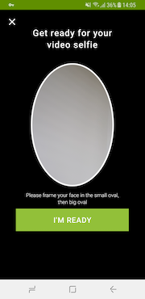
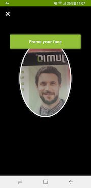
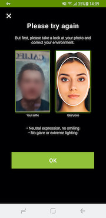

# Integration With Zoom

## Table of Contents
- [Zoom Dependencies](#zoom-dependencies)
- [Removing Zoom Library](#removing-zoom-library)
- [Zoom Customization](#Zoom-customization)
  - [Overwrite Default Styles](#overwrite-default-styles)
  - [Set the Customized Attributes](#set-the-customized-attributes)
  - [Updated Screens for Zoom Face Scanning 3.7.2](#updated-screens-for-zoom-face-scanning-3.7.2)
  - [Reference the New Styles](#reference-the-new-styles)
  - [Custom UI](#custom-ui)
- [Jumio Support](#jumio-support)

## Zoom Dependencies
Below there is a list of dependencies the application will need to make Zoom work in Android. If one of the modules is __not linked__, some functionalities such as certain methods may not be available.
```
implementation "com.facetec:zoom-authentication:8.12.1@aar"     // Zoom face scanning library
implementation "com.jumio.android:zoom:3.9.1@aar                // Face library
```

## Removing Zoom Library
 When removing the Zoom library, it is necessary to remove the face library too, as well as adding a dummy drawable `face_ic_clear` to prevent build issues.

 __Please remove:__
```
implementation "com.facetec:zoom-authentication:8.12.1@aar"     // Zoom face scanning library  
implementation "com.jumio.android:zoom:3.9.1@aar"               // Face library
```

## Zoom Customization
Starting with 3.8.0 we added a more granular customization for all the Zoom screens in the SDK. It is possible to create a customization for normal light condition and for low light ones. The customization can also easily be done with our [Surface tool](https://jumio.github.io/surface-android/).

### Overwrite Default Styles
The custom styles need to be generated with the default styles as parent
```
<style name="CustomZoom" parent="Zoom.Customization">
    ...
</style>
<style name="CustomZoomLowLight" parent="Zoom.Customization.Lowlight">
    ...
</style>
```

### Set the Customized Attributes
Both of these styles can include the same set of attributes
```
    <item name="zoom_frameBackground">@color/jumio_black</item>
    <item name="zoom_overlayBackground">@color/jumio_black</item>

    <item name="zoom_scanOverlayFeedbackText">@color/jumio_white</item>
    <item name="zoom_scanOverlayFeedbackBackground">@color/jumio_primary</item>
    <item name="zoom_scanOverlayProgress">@color/jumio_primary</item>
    <item name="zoom_scanOverlayOval">@color/jumio_white</item>

    <item name="zoom_resultBackground">@color/jumio_black</item>
    <item name="zoom_resultForeground">@color/jumio_primary</item>
    <item name="zoom_resultActivityIndicator">@color/jumio_primary</item>
    <item name="zoom_resultAnimationBackground">@color/jumio_white</item>
    <item name="zoom_resultAnimationForeground">@color/jumio_primary</item>
    <item name="zoom_uploadProgressTrack">@color/jumio_primary</item>
    <item name="zoom_uploadProgressFill">@color/jumio_white</item>

    <item name="zoom_guidanceBackground">@color/jumio_black</item>
    <item name="zoom_guidanceForeground">@color/jumio_white</item>
    <item name="zoom_guidanceButtonTextNormal">@color/jumio_white</item>
    <item name="zoom_guidanceButtonTextHighlight">@color/jumio_white</item>
    <item name="zoom_guidanceButtonTextDisabled">@color/jumio_white</item>
    <item name="zoom_guidanceButtonBackgroundNormal">@color/jumio_primary</item>
    <item name="zoom_guidanceButtonBackgroundHighlight">@color/jumio_primary_light</item>
    <item name="zoom_guidanceButtonBackgroundDisabled">@color/jumio_grey500</item>
    <item name="zoom_guidanceButtonBorder">@android:color/transparent</item>
    <item name="zoom_guidanceReadyScreenOvalFill">@android:color/transparent</item>
    <item name="zoom_guidanceRetryScreenOvalStroke">@color/jumio_white</item>
    <item name="zoom_guidanceReadyScreenTextBackground">@color/jumio_black</item>
    <item name="zoom_guidanceRetryScreenImageBorder">@color/jumio_primary</item>

    <item name="zoom_close_button_resource">@drawable/zoom_close_white</item>
```
The SDK comes with two close button resources - zoom_close_white and zoom_close_black - please decide based on the zoom_overlayBackground color which one makes more sense. The low light style will ignore the values in zoom_frameBackground and zoom_overlayBackground and will always use white instead.

### Reference the New Styles
After that, the new styles can be referenced from the Netverify or Authentication style
```
<style name="CustomNetverifyTheme" parent="Theme.Netverify">
    ...
    <item name="zoom_customization">@style/CustomZoom</item>
    <item name="zoom_customization_lowlight">@style/CustomZoomLowLight</item>
    ...
</style>
<style name="CustomAuthenticationTheme" parent="Theme.Authentication">
    ...
    <item name="zoom_customization">@style/CustomZoom</item>
    <item name="zoom_customization_lowlight">@style/CustomZoomLowLight</item>
    ...
</style>
```

### Custom UI
If you integrate custom ui you can also adjust the position of the close button in your style
```
<style name="AppTheme" parent="Theme.AppCompat.Light.DarkActionBar">
    ...
    <item name="zoom_close_button_top">16dp</item>
    <item name="zoom_close_button_left">16dp</item>
    <item name="zoom_close_button_width">12dp</item>
    <item name="zoom_close_button_height">12dp</item>
    ...
</style>
```

### Updated Screens for Zoom Face Scanning 3.7.2
As of __version 3.7.2__, the screens for face scanning have been updated. There are three new screens available: An __upfront help view__, the actual __Zoom scan view__ for face scanning like before, and an __error / help view__ in case of problems:

    

The background color of the screens can be customized using the parameter `face_scanOverlayBackground`, pictured __black__ above. All foreground elements, text and the help screen overlay can be customized using `face_scanOverlayOval`, pictured __white__ above, and button backgrounds as well as progress text can be customized using `face_scanOverlayProgress`, pictured __green__ above.
```
<item name="face_scanOverlayBackground">@color/jumio_black</item> // background of all Zoom screens
<item name="face_scanOverlayOval">@color/jumio_white</item> // all foreground elements, texts, overlay on help screen
<item name="face_scanOverlayProgress">@color/jumio_primary</item> // button background on upfront help and as a secondary color to "face_scanOverlayOval", otherwise primary color is used by default
```

The parameters `face_scanOverlayFeedbackText`, as well as `face_scanOverlayFeedbackBackground` remain __unchanged.__ The same goes for all `face_helpXXXXX` attributes.

As of 7.3.2, the attribute `face_helpProgressString` is deprecated and can be remove

__Please notice__: If you decide to not use Zoom and you do not link the face dependency, then you also need to remove the customizations. Otherwise build erros will occur due to missing attribute definitions.

## Jumio Support
The Jumio development team is constantly striving to optimize the size of our frameworks while increasing functionality, to improve your KYC and to fight fraud. If you have any further questions, please reach out to our [support team](mailto:support@jumio.com).
