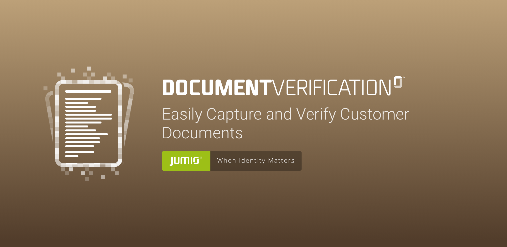

# Transition guide for Document Verification SDK

## 2.7.0
* Removed SDK method `setShowHelpBeforeScan(boolean)` because the collapsed help view is now constantly visible during scanning.
* Additional Proguard rules for the Samsung Camera SDK have to be added:
```
-keep class com.samsung.** { *; }
-keep class com.samsung.**$* { *; }
-dontwarn com.samsung.**
```

## 2.6.1
No backward incompatible changes.

## 2.6.0
#### Changes in SDK Api
* Add DocumentVerificationSDK method `isRooted(Context)` for device root-check before starting the SDK

## 2.5.0
No backward incompatible changes.

## 2.4.0
No backward incompatible changes.

## 2.3.0
No backward incompatible changes.

## Copyright

&copy; Jumio Corp. 268 Lambert Avenue, Palo Alto, CA 94306
