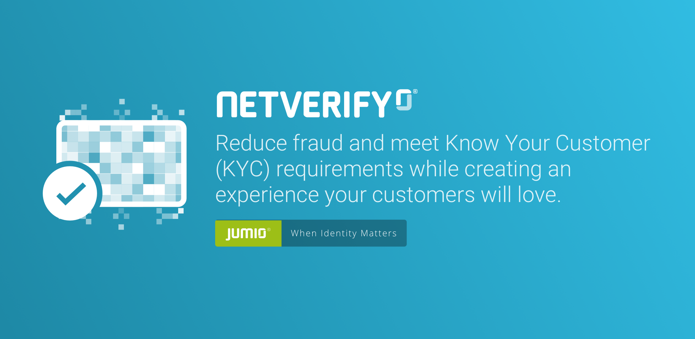

# Transition guide for Netverify & Fastfill SDK

This section only covers the breaking technical changes that should be considered when updating from the previous version.

## 3.2.0
#### Dependency change
*  ~~androidx.appcompat:appcompat:1.0.0~~ is replaced by androidx.appcompat:appcompat:1.0.2
*  ~~com.facetec:zoom-authentication-hybrid:7.0.9~~ is replaced by com.facetec:zoom-authentication-hybrid:7.0.12

#### API changes in NetverifyCustomScanInterface
A new parameter [NetverifyCancelReason](https://jumio.github.io/mobile-sdk-android/com/jumio/nv/custom/NetverifyCancelReason.html) was added to [NetverifyCustomScanInterface$onNetverifyScanForPartCanceled](https://jumio.github.io/mobile-sdk-android/com/jumio/nv/custom/NetverifyCustomScanInterface.html#onNetverifyScanForPartCanceled-com.jumio.core.data.document.ScanSide-NetverifyCancelReason-)

#### Watchlist Screening
Two new methods for handling watchlist screening have been added. Please refer to the [Netverify guide](/docs/integration_bam-checkout.md#watchlist-screening)
```
netverifySDK.setWatchlistScreening(NVWatchlistScreening.ENABLED);
netverifySDK.setWatchlistSearchProfile("YOURPROFILENAME");
```

#### Additional functions in NetverifyCustomScanInterface
For the new NFC scanning functionality in custom ui, there has been some additions in [NetverifyCustomScanInterface](https://jumio.github.io/mobile-sdk-android/com/jumio/nv/custom/NetverifyCustomScanInterface.html):
`getNetverifyCustomNfcInterface()` should return an instance of [NetverifyCustomNfcInterface](https://jumio.github.io/mobile-sdk-android/com/jumio/nv/nfc/custom/NetverifyCustomNfcInterface.html) or Null
`onNetverifyStartNfcExtraction(NetverifyCustomNfcPresenter)` is called when the NFC scanning can be started. The NFC scanning is controlled with the provided instance of [NetverifyCustomNfcPresenter](https://jumio.github.io/mobile-sdk-android/com/jumio/nv/nfc/custom/NetverifyCustomNfcPresenter.html)

#### Customization
The following customization attribute have been added: `netverify_scanOverlayFill`

#### New Fastfill offline token required
Due to a license model update in our Barcode implementation, it's necessary to regenerate the offline token when updating to version 3.2.0  

#### Close button customization in custom ui
The position and image of the close button for face scanning can now be customized. Please have a look at the [NetverifyCustomScanView](https://jumio.github.io/mobile-sdk-android/com/jumio/nv/custom/NetverifyCustomScanView.html)

#### Custom ui help animation support
[NetverifyCustomScanPresenter$getHelpAnimation](https://jumio.github.io/mobile-sdk-android/com/jumio/nv/custom/NetverifyCustomScanPresenter.html#getHelpAnimation-com.jumio.nv.custom.NetverifyCustomAnimationView-) has been added to get the specific help animation in case the scan part is canceled. An instance of  [NetverifyCustomAnimationView](https://jumio.github.io/mobile-sdk-android/com/jumio/nv/custom/NetverifyCustomAnimationView.html) needs to be passed where the animation is rendered in.

## 3.1.0
#### Dependency change
*  ~~com.madgag.spongycastle:prov:1.58.0.0~~ is replaced by org.bouncycastle:bcprov-jdk15on:1.61
*  Proguard rules containing *org.spongycastle* have been replaced with *org.bouncycastle*
*  ~~com.facetec:zoom-authentication-hybrid:7.0.5~~ is replaced by com.facetec:zoom-authentication-hybrid:7.0.9

## 3.0.0
#### Renamed dependency nv-face to face
The dependency `com.jumio.android:nv-face` was renamed to `com.jumio.android:face`, reflecting the internal restructuring of the dependencies that was necessary for adding the new product Authentication

#### Renamed public API methods and parameters
The following methods and the related parameters have been renamed to ensure consistency across all platforms
* `setRequireFaceMatch(..)` -> `setEnableIdentityVerification(..)`
* `setRequireVerification(..)` -> `setEnableVerification(..)`
* `setMerchantReportingCriteria(..)` -> `setReportingCriteria(..)`
* `setMerchantIdScanReference(..)` -> `setCustomerInternalReference(..)`
* `setCustomerId(..)` -> `setUserReference(..)`

#### Additional property in NetverifyCustomScanView
`setMode(..)` must be called before the view is used. Possible values: NetverifyCustomScanView.MODE_ID or NetverifyCustomScanView.MODE_FACE


## 2.15.0
#### Added Room
Dependencies that have been added to the SDK:
+ androidx.room:room-runtime:2.0.0

#### Added 3D Liveness
###### Dependency changes
* com.jumio.android:nv-face:2.15.0@aar
* com.facetec:zoom-authentication-hybrid:7.0.2@aar
* ~~com.jumio.android:nv-liveness:2.14.0@aar~~ The old liveness module is not supported anymore

The Facetec Maven repository also needs to be added: maven { url 'http://maven.facetec.com' }

###### Localization
Please have a look at the [strings-jumio-sdk.xml](https://github.com/Jumio/mobile-sdk-android/blob/master/sample/JumioMobileSample/src/main/res/values/strings-jumio-sdk.xml) for all the new added strings prefixed with `zoom_`.
The following strings have been removed: `netverify_scanview_liveness_follow_hint`, `netverify_scanview_liveness_move_closer`, `netverify_scanview_liveness_move_back`, `netverify_scanview_liveness_description`, `netverify_helpview_full_description_liveness_glasses`, `netverify_helpview_full_description_liveness_cap` and `netverify_helpview_full_description_liveness_light`.

###### Customization
The following customization attributes have been added: `netverify_scanOverlayFaceBackground`, `netverify_scanOverlayFaceFeedbackText`, `netverify_scanOverlayFaceFeedbackBackground`, `netverify_scanOverlayFaceProgress`, `netverify_scanOverlayFaceOval`
The following customization attributes have been removed: `netverify_scanOverlayLivenessValid`, `netverify_scanOverlayLivenessInvalid`, `netverify_scanOverlayLivenessBackground`, `netverify_scanOverlayLivenessText`

###### Proguard
The following lines need to be added in your `proguard-rules.pro` file for 3D Liveness:
```
-keep class com.facetec.zoom.** { *; }
-dontwarn javax.annotation.Nullable
```

## 2.14.0
#### Migrate to AndroidX
The support library was migrated to [`AndroidX`](https://developer.android.com/jetpack/androidx/). As the developer page outlines, this is a mandatory step since all new Support Library development and maintenance will occur in the AndroidX library. This [`migration guide`](https://developer.android.com/jetpack/androidx/migrate) shows you how to migrate your application to AndroidX.

Check out the changed dependencies in the  [`dependencies section`](https://github.com/Jumio/mobile-sdk-android/blob/master/docs/integration_netverify-fastfill.md#dependencies) or in the [`build.gradle`](https://github.com/Jumio/mobile-sdk-android/blob/master/sample/JumioMobileSample/build.gradle) of the sample application.
The mapping for all support libraries is listed in section "Artifact mappings" [here](https://developer.android.com/jetpack/androidx/migrate)

Dependencies that changed in the SDK:
+ com.android.support:appcompat-v7:27.1.1 -> androidx.appcompat:appcompat:1.0.0
+ com.android.support:cardview-v7:27.1.1 -> androidx.cardview:cardview:1.0.0
+ com.android.support:design:27.1.1 -> com.google.android.material:material:1.0.0
- com.android.support:support-v4:27.1.1 -> androidx.legacy:legacy-support-v4:1.0.0 (was merged by AndroidX and can be therefore be fully removed)

#### Default Settings
The default values for [`requireVerification`](https://jumio.github.io/mobile-sdk-android/com/jumio/nv/NetverifySDK.html#setRequireVerification-boolean-) and [`requireFaceMatch`](https://jumio.github.io/mobile-sdk-android/com/jumio/nv/NetverifySDK.html#setRequireFaceMatch-boolean-) were changed to `true`. Please make sure that they are explicitly set to false in case a scan in Fastfill mode should be performed.

## 2.13.0
#### API change in NetverifyDocumentData
The function `getMiddleName()` has been removed. If a middle name is available, it will be concatinated with the first name.

#### Removed deprecated ABIs mips, mips64 and armeabi
These ABIs were deprecated in recent NDK toolsets as mentioned here - https://developer.android.com/ndk/guides/abis and are not used any more.

## 2.12.1
#### Fixed a problem in which the user could get stuck in the Selfie capturing process

## 2.12.0
#### Fallback for Google Vision not operational added
A fallback to manual image picker will now be used if Google Vision is not operational due to problems on the device. This guarantees the face workflow to be finished despite problems with the availablility of the Google Play services. Details are also described in [sub-chapter operationality](integration_netverify-fastfill.md#operationality).
The method `netverifySDK.isMobileVisionOperational` remains in the SDK but doesn't need to be checked now necessarily.

#### New SDK localizations added
In addition to English, the translations for the languages Chinese (Simplified), Dutch, Frensh, German and Spanish have been added.

#### Remove unused strings for localization
Along with the additional languages, we removed some Strings that were unused in the SDK. The following keys have been removed: `netverify_confirmation_snackbar_help_default`, `netverify_accessibility_select_your_country`, `netverify_accessibility_action_double_click`, `netverify_accessibility_select_your_country`, `netverify_scan_options_country_title`, `netverify_overlay_liveness_advice` and `netverify_scan_options_preselected_hint`.

#### Additional information method removed
SDK method `netverifySDK.setAdditionalInformation` has been removed.

#### New callback in NetverifyCustomScanInterface
`onNetverifyDisplayBlurHint()` was added for custom scan view.

## 2.11.0
#### New error scheme
The schema for `errorCode` changed and it's type is now String instead of Integer.
Read more detailed information on this in chapter [Error codes](/docs/integration_netverify-fastfill.md#error-codes)

## 2.10.1
No backward incompatible changes.

## 2.10.0
* SDK updated to Android plugin for gradle 3.0 - https://developer.android.com/studio/build/gradle-plugin-3-0-0-migration.html
* Minimum API level was raised from Android 4.1 (API level 16) to Android 4.4 (API level 19)

## 2.9.0

#### Changes in SDK code
* New cardview dependency was added `com.android.support:cardview-v7:26.1.0` for the screen redesign. This dependency is mandatory for Netverify
* Multidex is now mandatory, follow the steps Android Developers guide https://developer.android.com/studio/build/multidex.html#mdex-gradle to enable it if necessary in your app.
* Additional Proguard rules for the updated Barcode Scanner have to be added:
```
-keep class com.microblink.** { *; }
-keep class com.microblink.**$* { *; }
-dontwarn com.microblink.**
```
* SDK method for checking the Google Mobile Vision API operationality was added (see method documentation in [NetverifyFragment](https://github.com/Jumio/mobile-sdk-android/blob/master/sample/JumioMobileSample/src/main/java/com/jumio/sample/NetverifyFragment.java) in the Sample app))
```
GoogleVisionStatus NetverifySDK.isMobileVisionOperational(Activity activity, int requestCode);
```
The usage is explained in the Netverify guide [sub-chapter operationality](integration_netverify-fastfill.md#operationality)

#### Changes in localizable strings
Multiple additions and changes in regards to the new selection screen.

#### Changes in Customization
Additions and changes in regards to the new selection screen (see XML output in [Surface Tool](https://jumio.github.io/surface-android/)).
Attributes added for replacing the previous selection screen: `netverify_scanOptionsItemHeaderBackground`, `netverify_scanOptionsItemForeground` and `netverify_scanOptionsItemBackground`.

## 2.8.0
* Dependency `com.jumio.android:nv-liveness:2.8.0@aar` is mandatory now.

## 2.7.0
* New Dependency `com.jumio.android:nv-liveness:2.7.0@aar` was added for face-liveness functionality.
* Dependency `com.google.android.gms:play-services-vision` is now mandatory required because of added functionality.
* Change SDK method `setEnableEpassport(boolean)` to `setEnableEMRTD(boolean)` beacause of to the support for NFC ID documents.
* If the dependencies `com.jumio.android:nv-liveness` and `com.jumio.android:nv-barcode-vision` are both used in the application, the following lines have to be added to the application tag in the AndroidManifest.xml to avoid merge issues.
```
<meta-data
			android:name="com.google.android.gms.vision.DEPENDENCIES"
			android:value="barcode, face"
			tools:replace="android:value"/>
```

* Additional Proguard rules for the Samsung Camera SDK have to be added:
```
-keep class com.samsung.** { *; }
-keep class com.samsung.**$* { *; }
-dontwarn com.samsung.**
```

## 2.6.1
No backward incompatible changes.

## 2.6.0

#### Changes in SDK Api
* Removed SDK method `setShowHelpBeforeScan(boolean)` because the collapsed help view is now constantly visible during scanning.
* Add NetverifySDK method `isRooted(Context)` for device root-check before starting the SDK

#### Changes in localizable strings
Multiple additions and changes in regards to the new guidance / help screen.

#### Changes in Customization
Additions and changes in regards to the new guidance / help screen.

## 2.5.0
No backward incompatible changes.

## 2.4.0

#### Remove okHttp
The build.gradle was adapted to support standard UrlConnection for replacing okHttp

#### Changes in Customization
Override the theme that is used for Netverify in the manifest by calling `netverifySDK.setCustomTheme(CUSTOMTHEMEID)`. Use the resource id of a customized theme that uses `Theme.Netverify` as parent.
Additions and changes for customization options for the launch of the surface tool.

#### Provide possibility to avoid loading spinner after SDK start
Use the following method to initialize the SDK before displaying it
```
netverifySDK.initiate(new NetverifyInitiateCallback() {
 @Override
 public void onNetverifyInitiateSuccess() {
 }
 @Override
 public void onNetverifyInitiateError(int errorCode, int errorDetail, String errorMessage, boolean retryPossible) {
 }
});
 ```
#### Removed name match feature
Name matching by comparing a provided name with the extracted name from a document was removed. The method `setName("FIRSTNAME LASTNAME")` in the NetverifySDK was removed.

## 2.3.0
#### Changes in Customization
Additions for the customization options to support the configuration of all scan overlays.


## Copyright

&copy; Jumio Corp. 268 Lambert Avenue, Palo Alto, CA 94306
